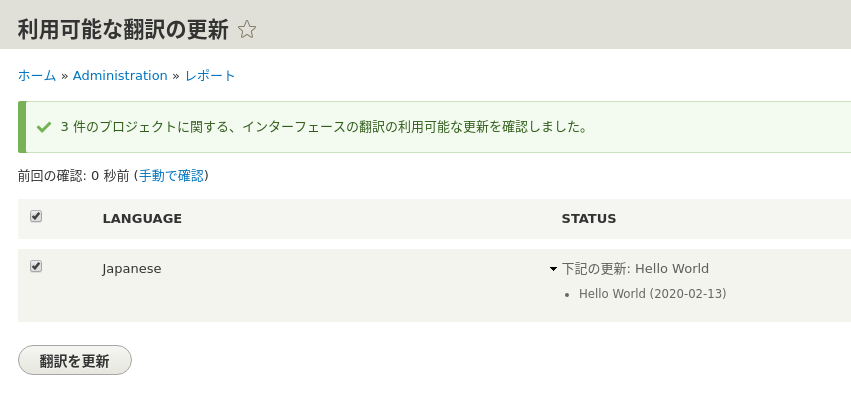
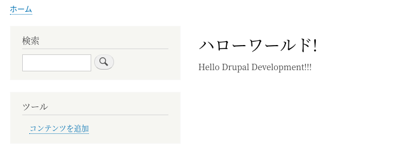
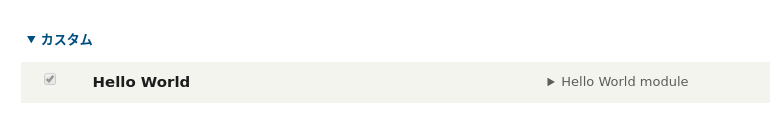
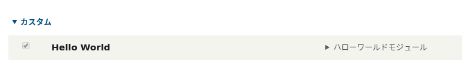

<!-- _class: lead -->
# 2.9 文字列の翻訳

---

Drupalは非常に強力な翻訳機能をコアで提供しています。

TBD

---

このセクションで解説する内容は、Drupalの翻訳機能についての基本的な理解があることが前提となります。自信がない方は先に以下の記事を参照してください。
- [【Drupal 8入門】コンテンツの翻訳と多言語設定（前編）](https://thinkit.co.jp/article/10080)
- [【Drupal 8入門】コンテンツの翻訳と多言語設定（後編）](https://thinkit.co.jp/article/10081)

また、事前準備として [【Drupal 8入門】コンテンツの翻訳と多言語設定（前編）](https://thinkit.co.jp/article/10080) の「言語の判定と選択の設定」までを実施し、日本語ロケールの追加およびデフォルト言語が日本語になるように設定しておいてください。

---

<!-- _class: lead -->
## 翻訳情報の定義

---

Drupalの翻訳機能は内部的に [Gettext](https://www.php.net/manual/en/book.gettext.php) を利用しています。

ソースコードで翻訳文字列を管理する場合は、まずは `{module_name}.info.yml` にプロジェクト名(モジュール名)とGettextに準拠した翻訳ファイルのパスを宣言する必要があります。

---

それでは早速開発していきましょう。 `hello_world.info.yml` に以下を追加してください。

```yml
'interface translation project': hello_world
'interface translation server pattern': modules/custom/hello_world/translations/%language.po
```

`interface translation project` にはプロジェクト名を設定します。

`interface translation server pattern` には翻訳ファイルのパスを設定します。`%language` は言語コードで展開されます。例えば、日本語の場合は、 `ja` に展開されて翻訳ファイルが検索されます。


---

その他の翻訳情報の定義に関する仕様については [Interface translation properties](https://api.drupal.org/api/drupal/core%21modules%21locale%21locale.api.php/group/interface_translation_properties/) を参照してください。

---

次に `modules/custom/hello_world/translations/ja.po` を追加しましょう。

```txt
msgid ""
msgstr ""

msgid "Hello World module"
msgstr "ハローワールドモジュール"

msgid "Hello World!"
msgstr "ハローワールド!"
```

---

`Hello World module` は `hello_world.info.yml` の `description` で、 `Hello World!` は `hello_world.routing.yml` の `_title` でそれぞれ参照されています。これらのコードの参照部分も再度確認しておきましょう。

[Gettext](https://en.wikipedia.org/wiki/Gettext) の仕様についてはDrupalに特有の部分はありませんので解説は割愛します。

それでは、キャッシュをクリアしてから 「環境設定 > 地域と言語 > User interface translation > 設定」(/admin/config/regional/translate/settings) に進んで、「今更新をチェックします。」のリンクをクリックしてください。

---

先ほどの `hello_world.info.yml` の変更により、新しい翻訳があることが検出されます。



「翻訳を更新」を押して翻訳情報を取り込んでください。

---

それでは、正しく翻訳されているか確認してみましょう。 `/hello` にアクセスすると以下のようにタイトルが翻訳されています。



---

次に `/admin/modules` にアクセスしてください。



おや、翻訳されていませんね。。

`.yml` の中の文字列を翻訳する場合、値はクォートする必要があります。`hello_world.info.yml` 内の `description` の値を次のようにシングルクォートで括りましょう。

```yml
description: 'Hello World module'
```

---

キャッシュをクリアして、再度 `/admin/modules` にアクセスしてください。



上記のように表示されれば成功です。

---

<!-- _class: lead -->
## PHPのソースコード内で参照している文字列を翻訳する

TBD.

---

## まとめ

TBD
https://www.drupal.org/docs/8/api/translation-api/overview

---

## ストレッチゴール

TBD
