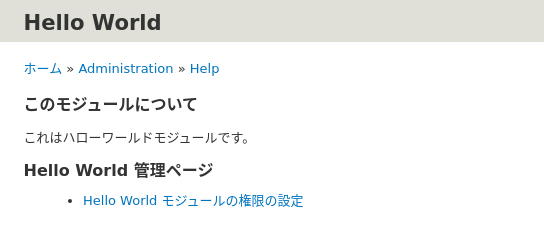
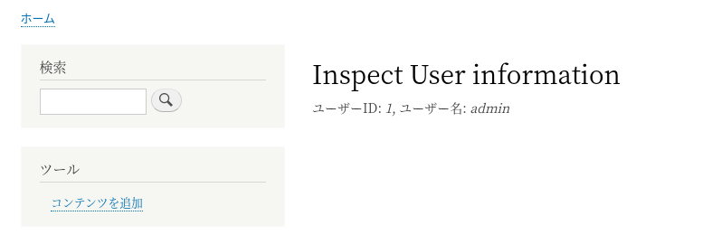

<!-- _class: lead -->
# 2.9 文字列の翻訳

---

Drupalは100近いの言語に対応した非常に強力な翻訳機能をコアで提供しています。

翻訳文字列は管理UIから書き換えることもできますが、もちろんコードで管理することもできます。

このセクションでは、モジュールが出力する文字列を翻訳可能にし、翻訳文字列をコードで管理する方法を解説します。

---

このセクションで解説する内容は、Drupalの翻訳機能についての基本的な理解があることが前提となります。自信がない方は先に以下の記事を参照してください。
- [【Drupal 8入門】コンテンツの翻訳と多言語設定（前編）](https://thinkit.co.jp/article/10080)
- [【Drupal 8入門】コンテンツの翻訳と多言語設定（後編）](https://thinkit.co.jp/article/10081)

また、事前準備として [【Drupal 8入門】コンテンツの翻訳と多言語設定（前編）](https://thinkit.co.jp/article/10080) の「言語の判定と選択の設定」までを実施し、日本語ロケールの追加およびデフォルト言語が日本語になるように設定しておいてください。

---

<!-- _class: lead -->
## 2.9.1 翻訳情報の定義

---

Drupalの翻訳機能は内部的に [Gettext](https://www.php.net/manual/en/book.gettext.php) を利用しています。

ソースコードで翻訳文字列を管理する場合は、まずは `{module_name}.info.yml` にプロジェクト名とGettextに準拠した翻訳ファイルのパスを宣言する必要があります。

---

それでは早速開発していきましょう。 `hello_world.info.yml` に以下を追加してください。

```yml
'interface translation project': hello_world
'interface translation server pattern': modules/custom/hello_world/translations/%language.po
```

`interface translation project` にはプロジェクト名(モジュール名)を設定します。

`interface translation server pattern` には翻訳ファイルのパスを設定します。`%language` は言語コードで展開されます。例えば、日本語の場合は、 `ja` に展開されて翻訳ファイルが検索されます。


---

その他の翻訳情報の定義に関する仕様は [Interface translation properties](https://api.drupal.org/api/drupal/core%21modules%21locale%21locale.api.php/group/interface_translation_properties/) を参照してください。

---

次に `modules/custom/hello_world/translations/ja.po` を追加しましょう。

```txt
msgid ""
msgstr ""

msgid "Hello World module"
msgstr "ハローワールドモジュール"

msgid "Hello World!"
msgstr "ハローワールド!"
```

---

`Hello World module` は `hello_world.info.yml` の `description` で、 `Hello World!` は `hello_world.routing.yml` の `_title` でそれぞれ参照されています。これらのコードの参照部分も再度確認しておきましょう。

[Gettext](https://en.wikipedia.org/wiki/Gettext) の仕様についてはDrupalに特有の部分はありませんので解説は割愛します。

それでは、キャッシュをクリアしてから 「環境設定 > 地域と言語 > User interface translation > 設定」(/admin/config/regional/translate/settings) に進んで、「今更新をチェックします。」のリンクをクリックしてください。

---

先ほどの `hello_world.info.yml` の変更により、新しい翻訳があることが検出されます。


「翻訳を更新」を押して翻訳情報を取り込んでください。

---

それでは、正しく翻訳されているか確認してみましょう。 `/hello` にアクセスすると以下のようにタイトルが翻訳されています。


---

次に `/admin/modules` にアクセスしてください。


お使いの環境がDrupal 8.8より以前のバージョンの場合は、この画像のように翻訳されていないと思います。この場合、`.yml` の中の文字列を翻訳する場合は値をクォートする必要があります。`hello_world.info.yml` 内の `description` の値を次のようにシングルクォートで括りましょう。

```yml
description: 'Hello World module'
```

---

キャッシュをクリアして、再度 `/admin/modules` にアクセスしてください。


上記のように表示されれば成功です。

実装は割愛しますが、`{module_name}.permissions.yml` についても同様に翻訳することが可能です。

なお、Drupal 8.9ではクォートしなくても翻訳されるため、この対応は必要ありません。

---

<!-- _class: lead -->
## 2.9.2 PHPのソースコード内で参照している文字列を翻訳する

---

`.yml` 内の文字列を翻訳する場合は、値をシングルクォートして対応する翻訳ファイルを用意すれば良いことが分かりました。

次にPHPのソースコード内の文字列を翻訳してみましょう。

---

<!-- _class: lead -->
### 2.9.2.1 .module 内の文字列の翻訳

---

先のセクションで解説したとおり、 `.module` で定義される関数はスコープがグローバルです。

グローバルなスコープで利用できる [t](https://api.drupal.org/api/drupal/core%21includes%21bootstrap.inc/function/t/) という翻訳用のヘルパー関数が用意されているので、 `.module` 内での翻訳にはこの関数を利用します。

実は、このヘルパー関数は 2.3章で実装した `hook_help` ですでに利用されています。

---

```php
/**
 * Implements hook_help().
 */
function hello_world_help($route_name, RouteMatchInterface $route_match) {
  switch ($route_name) {
    case 'help.page.hello_world':
      $output = '';
      $output .= '<h3>' . t('About') . '</h3>';
      $output .= '<p>' . t('This is an hello world module.') . '</p>';
      return $output;
    default:
  }
}
```

---

それでは、hook_helpで `t` を使っている2箇所を翻訳していきます。

`modules/custom/hello_world/translations/ja.po` に次の定義を追加しましょう。

```txt
msgid "About"
msgstr "このモジュールについて"

msgid "This is an hello world module."
msgstr "これはハローワールドモジュールです。"
```

---

追加したら、先と同様の手順で `/admin/reports/translations` から翻訳データを取り込んでください。

取り込みが完了したらキャッシュをクリアし、 `/admin/help/hello_world` にアクセスしてください。以下のように表示されれば成功です。



---

<!-- _class: lead -->
### 2.9.2.2 .module 以外での文字列の翻訳

---

次にコントローラーのコードの中の文字列を翻訳していきます。

HelloWorldController のベースクラスである [ControllerBase](https://github.com/drupal/drupal/blob/8.8.0/core/lib/Drupal/Core/Controller/ControllerBase.php#L43) を見てみましょう。[StringTranslationTrait](https://api.drupal.org/api/drupal/core%21lib%21Drupal%21Core%21StringTranslation%21StringTranslationTrait.php/trait/StringTranslationTrait) というTraitが利用されています。

このように、Drupalが提供する多くのベースクラスには [StringTranslationTrait](https://api.drupal.org/api/drupal/core%21lib%21Drupal%21Core%21StringTranslation%21StringTranslationTrait.php/trait/StringTranslationTrait) が組み込まれています。

このTraitは [StringTranslationTrait::t](https://api.drupal.org/api/drupal/core%21lib%21Drupal%21Core%21StringTranslation%21StringTranslationTrait.php/function/StringTranslationTrait%3A%3At/) というメソッドを持っているため、`.module` の時とほぼ同様のコードで翻訳が可能です。

---

それでは、`HelloWorldController::inspectUser` が出力するメッセージを翻訳してみましょう。このメソッドのコードを以下のように変更してください。

---

```php
  /**
   * Inspect user information.
   */
  public function inspectUser(AccountInterface $user = NULL) {
    if (\Drupal::moduleHandler()->moduleExists("devel")) {
      dpm($user);
    }

    return [
      "#markup" => $this->t(
        "User id: %user_id, username: %user_name",
        ["%user_id" => $user->id(), '%user_name' => $user->getAccountName()]
      ),
    ];
  }
```

---

先に解説したとおり、ベースクラスで `StringTranslationTrait` が組み込まれているため、 `$this->t` で文字列を翻訳することができます。

このメソッドが出力するメッセージは、URLのパスに応じてユーザーIDとユーザー名の部分が動的に変化します。

このような場合、該当箇所をプレースホルダーにしておき、`StringTranslationTrait::t` の第二引数にプレースホルダーに対応する値を渡します。

---

今回の例では、 `%user_id`, `%user_name` というプレースホルダーを定義しました。プレースホルダーのプレフィックス(`%` の部分)は単なる名前の一部ではなく、エスケープの有無などの動作的な意味合いを持ちます。全部で以下の3つのプレフィックスが利用可能です。

- @variable
- %variable
- :variable

---

今回のケースではどのプレフィックスを使っても問題ありませんが、出力するデータに任意のユーザー入力が含まれるケースなどでは、適切なプレフィックスを利用してサニタイズを行う必要があります。

詳細は [FormattableMarkup::placeholderFormat
](https://api.drupal.org/api/drupal/core%21lib%21Drupal%21Component%21Render%21FormattableMarkup.php/function/FormattableMarkup%3A%3AplaceholderFormat/) を参照してください。

---

それでは `modules/custom/hello_world/translations/ja.po` に先ほどのコードの変更に対応する定義を追加しましょう。

```txt
msgid "User id: %user_id, username: %user_name"
msgstr "ユーザーID: %user_id, ユーザー名: %user_name"
```

---

追加したら、先と同様の手順で `/admin/reports/translations` から翻訳データを取り込んでください。

取り込みが完了したらキャッシュをクリアし、 `/inspect_user/1` にアクセスしてください。以下のように表示されれば成功です。



---

なお、`StringTranslationTrait::t` では最終的に以下のようなコードが実行されます。


```php
\Drupal::service('string_translation')->translateString($this);
```

つまり、このメソッドの振る舞いは `string_translation` というサービスで外部から差し替え可能という事になります。これがコントローラーのコードで `t` ではなく `$this->t` を使う理由です。

---

## まとめ

このセクションでは文字列の翻訳について解説しました。

翻訳可能な実装にしておくと、多言語対応以外に表記レベルの仕様変更にも柔軟に対応できます。

本コンテンツではこのセクションの解説の都合で翻訳に対応しないコードを実装してきましたが、実際のプロダクトでは最初から翻訳可能なように実装しておきましょう。

翻訳機能(Translation API)の詳細な仕様については [Translation API overview](https://www.drupal.org/docs/8/api/translation-api/overview) を参照してください。

---

なお、[Translation template extractor](https://www.drupal.org/project/potx) というモジュールを使うと、ソースコードを解析して `.po` ファイルを自動生成してくれます。

しかし、Drupal 8には正式に対応しておらず精度も完璧ではないため、実際のプロダクト開発で利用する場合は十分に注意してください。

---

## ストレッチゴール

1. 既存のhello_worldモジュールの実装で翻訳可能な部分を全て翻訳してください。
2. 本セクションで `About` という文字列を翻訳しました。この文字列は `/admin/help/node` など他のモジュールのヘルプページでも使われており、コアのデフォルトの翻訳に `アバウト` という既存の定義が存在します。つまり、本セクションの実装により他のUIに対して副作用が発生しています。この副作用が解消されるように翻訳の実装を修正してください。
