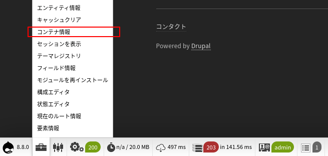
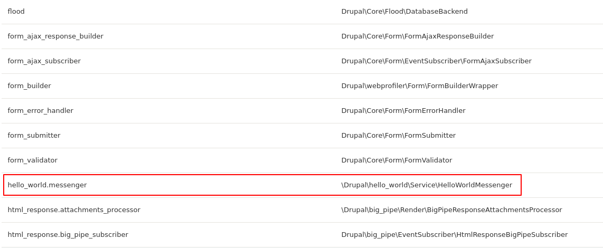

<!-- _class: lead -->
# 2.10 サービスの実装とDependecy Injection

---

このセクションでは、サービスやDIのインターフェースを使って、hello_worldモジュールの機能をモダンな設計に変更します。

ある程度経験がある開発者の方であればお気づきだったかもしれませんが、このセクションの解説を行うために、敢えてこれらの機能を使わずに実装を行ってきました。

このセクションで変更する全ての内容はリファクタリングであり、モジュールの振る舞いには何の変化もありません。しかし、セクションの最後にはコードの見通しが良くなり、メンテナンスや拡張性が大きくに向上しているはずです。

---

それでは、

1. コントローラーが持っているロジックを別クラスに切り出す
2. 切り出したクラスをサービス化してstaticに利用する
3. Dependecy Injectionを利用する

という3段階のリファクタリングを順に行っていきます。

---

<!-- _class: lead -->
## 2.10.1 サービスを使う2つの方法

---

Drupalでサービスを利用する方法は大きく2つあります。

1つ目は、以下のようにstaticにサービスを取得する方法です。

```php
$service = \Drupal::service('hello_world.messenger');
```

この方法は、主に `.module` など外部からサービスへの依存を注入できない場合に利用します。

---

Drupalのコアだけでも非常に多数のサービスが実装されています。

これらのサービスの取得を簡単に行うために、 `\Drupal` クラスには `\Drupal::entityTypeManager()` など、主要なサービスを取得するための多数のヘルパーメソッドが用意されています。

[\Drupal クラスが提供するAPI](https://api.drupal.org/api/drupal/core%21lib%21Drupal.php/class/Drupal/) には一度目を通しておいてください。

---

もう一つの方法は、外部からサービスへの依存を注入する方法、いわゆるDIを使う方法です。

基本的に `.module`  (もしくは「サービスコンテナが初期化される前」にコードが実行される稀なケース)以外でサービスを利用する場合は、こちらの方法を利用してください。

この手法ではコードの実装量は多少増えますが、それに見合ったメリットが確実にあります。

特に、「テストを書く際に依存するサービスをコードを変更せずに差し替えられる」というメリットは、必須レベルで欲しくなるメリットです。

---

<!-- _class: lead -->
## 2.10.2 コントローラーが持っているロジックを別クラスに切り出す

---

それでは、早速実装していきましょう。最初にコントローラーが持っているロジックを別クラスに切り出します。

まずは、ロジックが持つ機能のインターフェースを宣言しましょう。

`web/modules/custom/hello_world/EchoMessageServiceInterface.php` を以下のように実装してください。

---

```php
<?php

namespace Drupal\hello_world;

use Drupal\Core\Session\AccountInterface;
use Drupal\node\NodeInterface;

/**
 * A service interface the echo messages.
 */
interface EchoMessageServiceInterface {

  /**
   * Just say some message.
   *
   * @return string
   *   The hello message.
   */
  public function helloWorld();

  /**
   * Just say something genarated from arguments.
   *
   * @return string
   *   the message genarated from arguments.
   */
  public function saySomething(string $message);

  /**
   * Inspect user information.
   *
   * @return \Drupal\Core\StringTranslation\TranslatableMarkup
   *   An object that, when cast to a string, returns the translated string.
   */
  public function inspectUser(AccountInterface $user);

  /**
   * Inspect node information.
   *
   * @return \Drupal\Core\StringTranslation\TranslatableMarkup
   *   An object that, when cast to a string, returns the translated string.
   */
  public function inspectNode(NodeInterface $node);

}

```

---

ここでは、4つのメソッドをインターフェースとしました。
(`inspectNode` については 2.5章のストレッチゴールを参照)。

次にサービスの実装クラスである `HelloWorldMessenger.php` を追加します。

---

```php
<?php

namespace Drupal\hello_world\Service;

use Drupal\Core\Session\AccountInterface;
use Drupal\Core\StringTranslation\StringTranslationTrait;
use Drupal\hello_world\EchoMessageServiceInterface;
use Drupal\node\NodeInterface;

/**
 * A service that echo messages.
 */
class HelloWorldMessenger implements EchoMessageServiceInterface {

  use StringTranslationTrait;

  /**
   * Just say configured hello message.
   *
   * @inheritDoc
   */
  public function helloWorld() {
    return \Drupal::service('config.factory')->get('hello_world.settings')->get('hello_message');
  }

  /**
   * Just echo back message by from argument.
   *
   * @inheritDoc
   */
  public function saySomething(string $message) {
    return $message;
  }

  // (次のページへ続く)
```

---

```php
  // (前のページからの続き)

  /**
   * Inspect user information.
   *
   * @inheritDoc
   */
  public function inspectUser(AccountInterface $user) {
    if (\Drupal::moduleHandler()->moduleExists("devel")) {
      dpm($user);
    }

    return $this->t(
      "User id: %user_id, username: %user_name",
      ["%user_id" => $user->id(), '%user_name' => $user->getAccountName()]
    );
  }

  /**
   * Inspect node information.
   *
   * @inheritDoc
   */
  public function inspectNode(NodeInterface $node) {
    return $this->t(
      "Node id: %node_id, title: %title",
      ["%node_id" => $node->id(), '%title' => $node->getTitle()]
    );
  }

}

```

---

この時点ではこのクラスはサービスではありませんが、最終的にサービスにするのでnamespaceやコメントに `Service` を含めています。

コントローラーの同名メソッドとの実装の違いは、文字列をarrayでラップして返すかどうかだけです。

最後に、`HelloWorldController` がこのサービスを使うように変更しましょう。

---

```php
<?php

namespace Drupal\hello_world\Controller;

use Drupal\Core\Access\AccessResult;
use Drupal\Core\Controller\ControllerBase;
use Drupal\Core\Routing\RouteMatch;
use Drupal\Core\Session\AccountInterface;
use Drupal\hello_world\Service\HelloWorldMessenger;
use Drupal\node\NodeInterface;
use Symfony\Component\Routing\Route;

/**
 * A example of custom controller.
 */
class HelloWorldController extends ControllerBase {

  /**
   * Just say a configured hello message.
   */
  public function helloWorld() {
    /** @var \Drupal\hello_world\EchoMessageServiceInterface $service */
    $service = new HelloWorldMessenger();

    return [
      "#markup" => $service->helloWorld(),
    ];
  }

  /**
   * Just say something by use param.
   */
  public function saySomething(string $message) {
    /** @var \Drupal\hello_world\EchoMessageServiceInterface $service */
    $service = new HelloWorldMessenger();

    return [
      "#markup" => $service->saySomething($message),
    ];
  }
```

---


```php
  /**
   * Inspect user information.
   */
  public function inspectUser(AccountInterface $user = NULL) {
    /** @var \Drupal\hello_world\EchoMessageServiceInterface $service */
    $service = new HelloWorldMessenger();

    return [
      "#markup" => $service->inspectUser($user),
    ];
  }

  /**
   * Inspect node information.
   */
  public function inspectNode(NodeInterface $node) {
    /** @var \Drupal\hello_world\EchoMessageServiceInterface $service */
    $service = new HelloWorldMessenger();

    return [
      "#markup" => $service->inspectNode($node),
    ];
  }
```

---

それでは、キャッシュをクリアして `/hello`, `say_something/{message}`, `/inspect_user/{user}`, `/inspect_node/{node}` にアクセスしてください。

今までと同じ振る舞いが維持されていればリファクタリングは成功です。

---

<!-- _class: lead -->
## 2.10.3 切り出したクラスをサービス化してstaticに利用する

---

先ほどのコードは `HelloWorldMessenger` という具象クラスに依存しており、 `EchoMessageServiceInterface` を実装した他のクラスを使うように変更するには、コードを書き換える必要があります。

この問題を解決するために `hello_world.messenger` という名前で `HelloWorldMessenger` をサービスとして登録し、利用できるようにしていきます。

---

サービスの定義は `{module_name}.services.yml` というファイルで行います。`hello_world.services.yml` を以下の様に作成してください。

```yml
services:
  hello_world.messenger:
    class: '\Drupal\hello_world\Service\HelloWorldMessenger'
```

---

ルートレベルの要素は必ず `services` にする必要があります。

その子要素はサービス名です。ここでは `hello_world.messenger` としています。サービス名にモジュールの名称を必ずしも含める必要はありませんが、サービス名はシステム全体でユニークにする必要があります。

---

`class` にサービスの実装クラスを指定します。先のコードでは名前空間を `Service` で区切っていますが、サービスの名前空間に制約は特にありません。

Drupalの場合、「このクラスはサービスである」という宣言をするためのPHPのインターフェースは存在しないため、可読性のために `Service` で名前空間を区切っています。

それでは、`HelloWorldController` がこのサービスを使うように変更しましょう。

---

```php
  /**
   * Just say a configured hello message.
   */
  public function helloWorld() {
    /** @var \Drupal\hello_world\EchoMessageServiceInterface $service */
    $service = \Drupal::service('hello_world.messenger');

    return [
      "#markup" => $service->helloWorld(),
    ];
  }

  /**
   * Just say something by use param.
   */
  public function saySomething(string $message) {
    /** @var \Drupal\hello_world\EchoMessageServiceInterface $service */
    $service = \Drupal::service('hello_world.messenger');

    return [
      "#markup" => $service->saySomething($message),
    ];
  }

```

---

```php
  /**
   * Inspect user information.
   */
  public function inspectUser(AccountInterface $user = NULL) {
    /** @var \Drupal\hello_world\EchoMessageServiceInterface $service */
    $service = \Drupal::service('hello_world.messenger');

    return [
      "#markup" => $service->inspectUser($user),
    ];
  }

  /**
   * Inspect node information.
   */
  public function inspectNode(NodeInterface $node) {
    /** @var \Drupal\hello_world\EchoMessageServiceInterface $service */
    $service = \Drupal::service('hello_world.messenger');

    return [
      "#markup" => $service->inspectNode($node),
    ];
  }

```

---

`$services` 変数の代入の実装が変わっただけですね。

それでは、再度キャッシュをクリアして `/hello`, `say_something/{message}`, `/inspect_user/{user}`, `/inspect_node/{node}` にアクセスしてください。

今までと同じ振る舞いが維持されていれば成功です。

最低限のサービスの実装はこれだけになります。意外と簡単でしたね。

---

<!-- _class: lead -->
## 2.10.4 サービスの確認方法

---

実際に開発をしていると、実装のミスでサービスが認識されなかったり、コアやモジュールでどんなサービスが提供されているか知りたい場合があります。

このような場合は、以降に紹介するいくつかの方法で、どのようなサービスが動いているか確認することができます。

---

### 2.10.4.1 {module_name.services.yml} のコードを読む

サービスは `{module_name.services.yml}` で定義されているので、このコードを読むことで、どんなサービスがあるか確認することができます。

また、先に解説したとおり `\Drupal` クラスには頻繁に利用するサービスを取得するためのヘルパーメソッドがあるので、このクラスのAPIを見てみることも有益です。

---

### 2.10.4.2 Develモジュールを有効にし、 /devel/container/service にアクセスする

develモジュールを有効にすると、管理UI (/devel/container/service) からサービスの一覧を確認することができます。

さらにweb profilerモジュールを有効にすると、下部のリンクからのこの機能に簡単にアクセスできるようになります。

---

先ほど実装した `hello_world.messenger` サービスが認識されているか確認してみましょう。web profilerを有効にして「コンテナ情報」(`/devel/container/service` へのリンク)をクリックしてください。



---

以下のように独自に実装したサービスが認識されていることが分かります。



---

### 2.10.4.3 drush(CLI)で確認する

drushの `devel:services` サブコマンドでサービスの一覧を取得できます。しかし、情報量が少ないため、CLIから情報を取得する場合は次に紹介するDrupalConsoleを使う方法を推奨します。

```txt
$ vendor/bin/drush devel:services
- access_arguments_resolver_factory
- access_check.contact_personal
- access_check.cron
...
```

---

### 2.10.4.4 DrupalConsole(CLI)で確認する

DrupalConsoleの `debug:containers` サブコマンドでサービスの一覧を取得できます。

```txt
$ vendor/bin/drupal debug:container
 Service ID                                                        Class Name                                                             
 access_arguments_resolver_factory                                 Drupal\Core\Access\AccessArgumentsResolverFactory                      
 access_check.contact_personal                                     Drupal\contact\Access\ContactPageAccess                                
 access_check.cron                                                 Drupal\system\Access\CronAccessCheck                                   
 access_check.csrf                                                 Drupal\Core\Access\CsrfAccessCheck
 ...
```

---

<!-- _class: lead -->
## 2.10.5 Dependency Injectionによるサービスの注入

---

それでは、最後にDependency Injectionによるサービスの注入を行います。

`HelloWorldController` のコードを以下の様に変更しましょう。

---

```php
<?php

namespace Drupal\hello_world\Controller;

use Drupal\Core\Access\AccessResult;
use Drupal\Core\Controller\ControllerBase;
use Drupal\Core\Routing\RouteMatch;
use Drupal\Core\Session\AccountInterface;
use Drupal\hello_world\EchoMessageServiceInterface;
use Drupal\node\NodeInterface;
use Symfony\Component\DependencyInjection\ContainerInterface;
use Symfony\Component\Routing\Route;

// ...
```

---

```php
/**
 * A example of custom controller.
 */
class HelloWorldController extends ControllerBase {

  /**
   * The messenger service.
   *
   * @var \Drupal\hello_world\EchoMessageServiceInterface
   */
  protected $messenger;

  /**
   * A construtor of HelloWorldController.
   *
   * @param \Drupal\hello_world\EchoMessageServiceInterface $messenger
   *   The messenger service.
   */
  public function __construct(EchoMessageServiceInterface $messenger) {
    $this->messenger = $messenger;
  }

  /**
   * {@inheritDoc}
   */
  public static function create(ContainerInterface $container) {
    return new static(
      $container->get('hello_world.messenger')
    );
  }

  // ...
```

---

```php
  /**
   * Just say a configured hello message.
   */
  public function helloWorld() {
    return [
      "#markup" => $this->messenger->helloWorld(),
    ];
  }

  /**
   * Just say something by use param.
   */
  public function saySomething(string $message) {
    return [
      "#markup" => $this->messenger->saySomething($message),
    ];
  }

  /**
   * Inspect user information.
   */
  public function inspectUser(AccountInterface $user = NULL) {
    return [
      "#markup" => $this->messenger->inspectUser($user),
    ];
  }

  /**
   * Inspect node information.
   */
  public function inspectNode(NodeInterface $node) {
    return [
      "#markup" => $this->messenger->inspectNode($node),
    ];
  }

  // ...
```

---

変更点は以下の通りです。
- 1. `$messenger` をクラスのプロパティとして追加した
- 2. コンストラクタを追加し `$messenger` を初期化した
- 3. `create` というstaticメソッドを追加した

1.と2.は一般的なOOPプログラミングの実装なので特に不明点はありませんね。

では、3.はどうでしょうか？この意味を知るためには、新たにインポートされた `ContainerInterface` クラスと `create` メソッドを詳しく見る必要がありそうです。

---

まずは `ContainerInterface` クラスから見てきましょう。

namespaceを見るとDrupalに特有のものではなく、Symfonyのコンポーネントであることが分かります。コードをざっと見てみましょう。

クラスのコメントから `ContainerInterface`  がサービスコンテナを実装するためのインターフェースであること、`get` メソッドのコメントから引数 `id` を持つサービスを取得できることが分かります。

---

```php
/**
 * ContainerInterface is the interface implemented by service container classes.
 *
 * @author Fabien Potencier <fabien@symfony.com>
 * @author Johannes M. Schmitt <schmittjoh@gmail.com>
 */
interface ContainerInterface extends PsrContainerInterface
{
    // ...

    /**
     * Gets a service.
     *
     * @param string $id              The service identifier
     * @param int    $invalidBehavior The behavior when the service does not exist
     *
     * @return object|null The associated service
     *
     * @throws ServiceCircularReferenceException When a circular reference is detected
     * @throws ServiceNotFoundException          When the service is not defined
     *
     * @see Reference
     */
    public function get($id, $invalidBehavior = self::EXCEPTION_ON_INVALID_REFERENCE);

    // ...
```

---

次に `create` メソッドを見てみましょう。

少しコードを追っていくと、このメソッドは`\Drupal\Core\DependencyInjection\ContainerInjectionInterface` で定義されていることが分かります。

こちらはnamespaceを見てわかるとおり、Drupal特有の実装ですね。コメントを見てみましょう。

---

```php
<?php

namespace Drupal\Core\DependencyInjection;

use Symfony\Component\DependencyInjection\ContainerInterface;

/**
 * Defines a common interface for dependency container injection.
 *
 * This interface gives classes who need services a factory method for
 * instantiation rather than defining a new service.
 */
interface ContainerInjectionInterface {

  /**
   * Instantiates a new instance of this class.
   *
   * This is a factory method that returns a new instance of this class. The
   * factory should pass any needed dependencies into the constructor of this
   * class, but not the container itself. Every call to this method must return
   * a new instance of this class; that is, it may not implement a singleton.
   *
   * @param \Symfony\Component\DependencyInjection\ContainerInterface $container
   *   The service container this instance should use.
   */
  public static function create(ContainerInterface $container);

}

```

---

コメントから、このメソッドが依存関係を元にクラスの新しいインスタンスを生成するファクトリーメソッドであることが分かります。

「ファクトリーメソッドって何だっけ？」という方は 
[Factory method pattern](https://en.wikipedia.org/wiki/Factory_method_pattern) を参照してください。

(Drupal以外のメタな知識はとても重要ですよ！)

---

もし、ここまでの調査に時間がかかったようであれば、ここで一旦進むのを止め、利用しているIDE・エディタ環境を見直してください。

具体的には、クラス名やインターフェース名などを選択して、コードの`Impelementation`, `Type Definition`, `Declaration` などにジャンプできる環境を、構築にコストをかけてでも今すぐ用意しましょう。

この環境があるだけで、このレベルの調査であればほんの数分で終わるはずです。

本コンテンツのトレーニングをする期間だけ考えても、かけたコストに対するリターンは十分にあります。トレーニング終了後にプロダクトの開発を行う期間を含めて考えると、これほど効果の高い投資はありません。

---

では、ここまで調査したことを踏まえ、`HelloWorldController::create` の実装を見ていきましょう。

このメソッドは、`new static` の戻り値を返しています。これは、PHP 5.3から追加された [オブジェクトを作成するためのシンタックス](https://www.php.net/manual/en/language.oop5.basic.php) です。

`new static` の引数には、 `ContainerInterface::get` した値を設定しています。つまり、サービスですね。

`new static` はオブジェクトを生成するため、内部でコンストラクタを呼び出します。つまり、最終的には、`HelloWorldController::__construct` が呼ばれる事になります。

---

このように Drupalでは `ContainerInjectionInterface` を使って依存するサービスを注入します。

解説が長くなりましたが、再度キャッシュをクリアして `/hello`, `say_something/{message}`, `/inspect_user/{user}`, `/inspect_node/{node}` にアクセスしてください。

今までと同じ振る舞いが維持されていれば成功です。

---

## まとめ

このセクションでは、コントローラーが抱えていたロジックをサービスに切り出し、Dependecy Injectionの機能を使ってコントローラーがサービスを利用するように変更しました。

これにより、コントローラーの実装がシンプルになり、サービスの実装に対する依存が少なくなりました。

セクションの前後でコードを見比べてみると、非常に見通しが良くなったことわかると思います。

---

## ストレッチゴール

1. 2.5章で設定したphpcsで `HelloWorldController` のコードをチェックしてください。 `\Drupal calls should be avoided in classes, use dependency injection instead`  という警告がいくつか出ると思います。この警告を解消するために、staticにサービスを参照しているコードをDependecy Injectionを使う実装に修正してください。

---

2. `NullMessenger` というクラスを新たに実装して、`HelloWorldController` がこのサービスを利用するに変更してください。各メソッドの実装では、固定で `null` を文字列として返してください。ただし、hello_worldモジュールがデフォルトで利用するサービスは `HelloWorldMessenger` のまま維持し、`settings.php` 経由で変更するようにしてください (2.6章にヒントがあります)。
