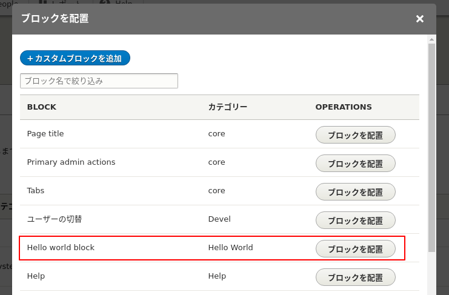
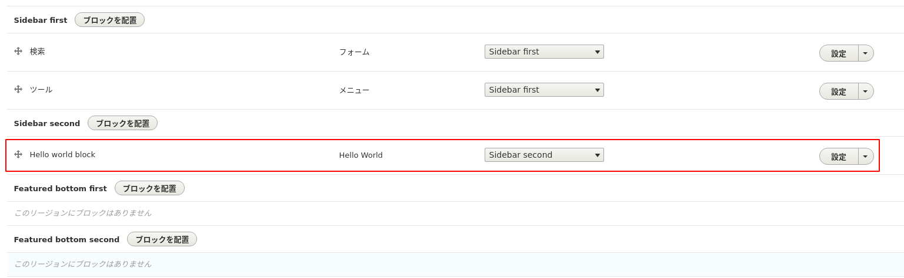
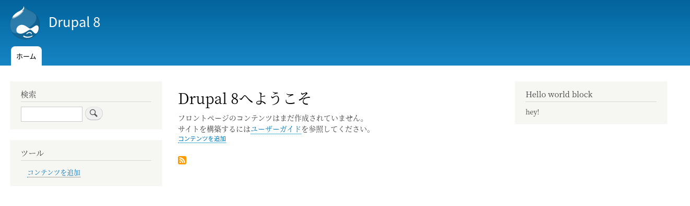
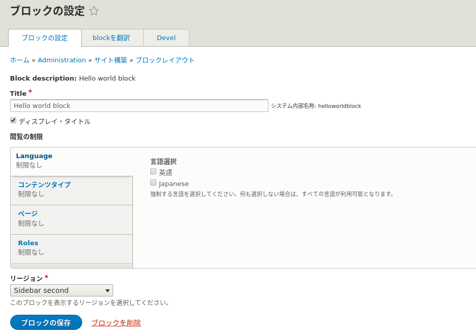
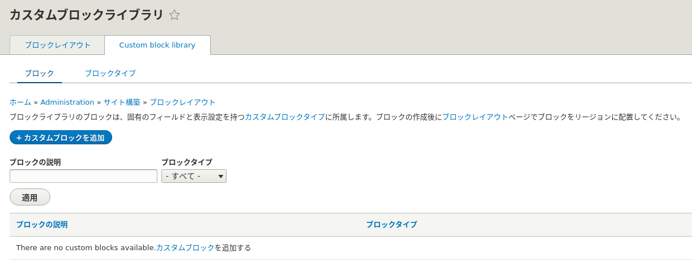

<!-- _class: lead -->
# 2.11 ブロック

---

このセクションでは、ブロックの実装方法を解説します。

ご存知の通り、ブロックはコアの標準機能を使えば管理UIからデータ型の定義もコンテンツ自体も作成することができます。

それでは、なぜわざわざブロックをコードで実装する必要があるのでしょうか？

このセクションを通して、実装方法はもちろんですが、管理UIから動的にブロックを作るべきか、コードで実装すべきかを判断できるようになりましょう。

---

<!-- _class: lead -->
## Block

---

TBD

---

```php
<?php

namespace Drupal\hello_world\Plugin\Block;

use Drupal\Core\Block\BlockBase;
use Drupal\Core\Plugin\ContainerFactoryPluginInterface;
use Drupal\hello_world\EchoMessageServiceInterface;
use Symfony\Component\DependencyInjection\ContainerInterface;

/**
 * Hello World block.
 *
 * @Block(
 *  id = "hello_world_block",
 *  admin_label = @Translation("Hello world block"),
 * )
 */
class HelloWorldBlock extends BlockBase implements ContainerFactoryPluginInterface {

  /**
   * The messenger service.
   *
   * @var \Drupal\hello_world\EchoMessageServiceInterface
   */
  protected $messenger;

  // ...
```

---

```php
  /**
   * Construct.
   *
   * @param array $configuration
   *   A configuration array containing information about the plugin instance.
   * @param string $plugin_id
   *   The plugin_id for the plugin instance.
   * @param string $plugin_definition
   *   The plugin implementation definition.
   * @param \Drupal\hello_world\EchoMessageServiceInterface $messenger
   *   The messenger service.
   */
  public function __construct(array $configuration, $plugin_id, $plugin_definition, EchoMessageServiceInterface $messenger) {
    parent::__construct($configuration, $plugin_id, $plugin_definition);
    $this->messenger = $messenger;
  }

  /**
   * {@inheritdoc}
   */
  public static function create(ContainerInterface $container, array $configuration, $plugin_id, $plugin_definition) {
    return new static(
      $configuration,
      $plugin_id,
      $plugin_definition,
      $container->get('hello_world.messenger')
    );
  }

```

---

```php

  /**
   * {@inheritdoc}
   */
  public function build() {
    $build = [];

    $build[] = [
      '#theme' => 'container',
      '#children' => [
        '#markup' => $this->messenger->helloWorld(),
      ],
    ];

    return $build;
  }

}
```

---


それでは、作成したブロックのコードの動作を確認しましょう。

ブロックの配置の操作については問題ありませんね？

自信がない方は、いったん戻って [【Drupal 8入門】ブロックレイアウトとコンタクトフォーム作成](https://thinkit.co.jp/article/10079) を参照してください。


---

「second sidebar」リージョンに先ほど作成した「Hello world Block」ブロックを配置してください。

---



---



---

ブロックの設定が完了したらトップページにアクセスしましょう。
次のようにブロックが表示されれば成功です。




---

ブロックレイアウトの設定画面を見てみましょう。管理UIからブロックコンテンツを作成したときと同様の設定が出来ることが分かります。



---

次にカスタムブロックライブラリ(ブロックコンテンツの一覧)を見てみましょう。



---

TBD

---

## まとめ

TBD

---

## ストレッチゴール

TBD