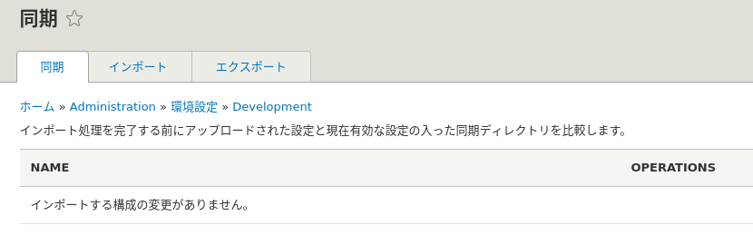
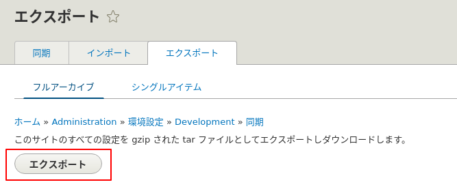
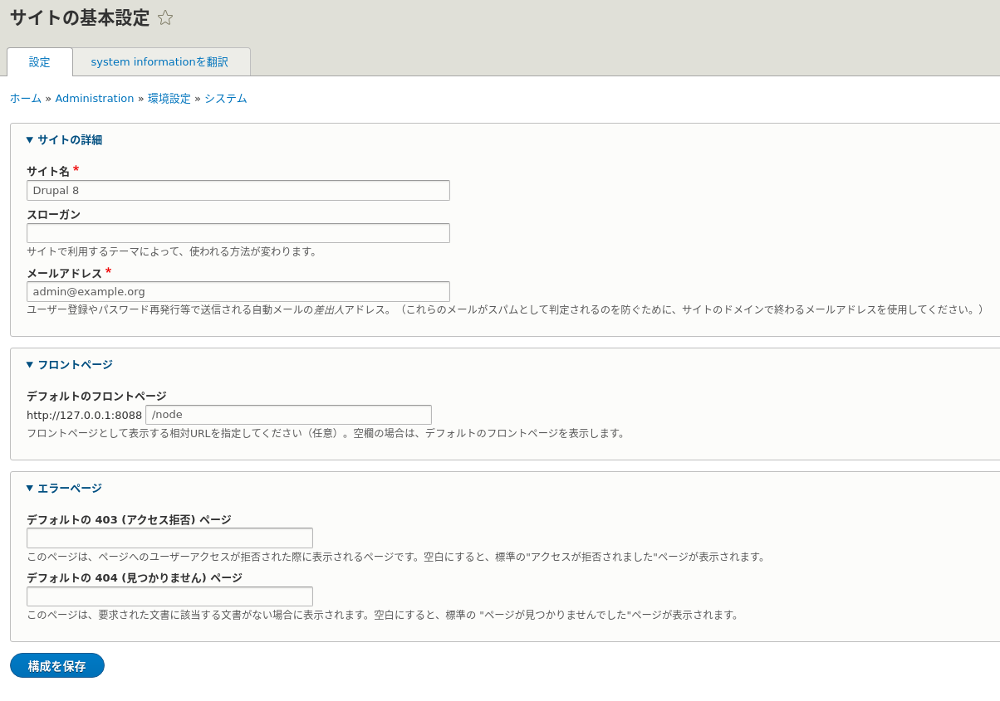
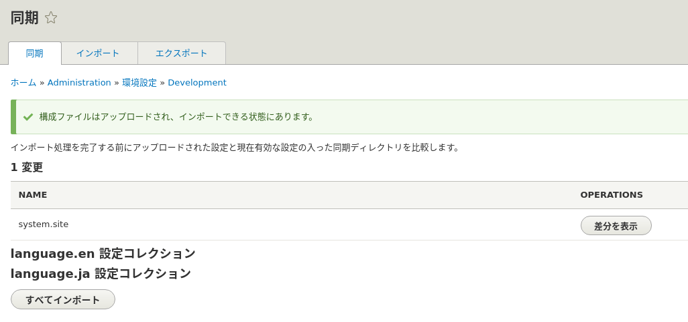
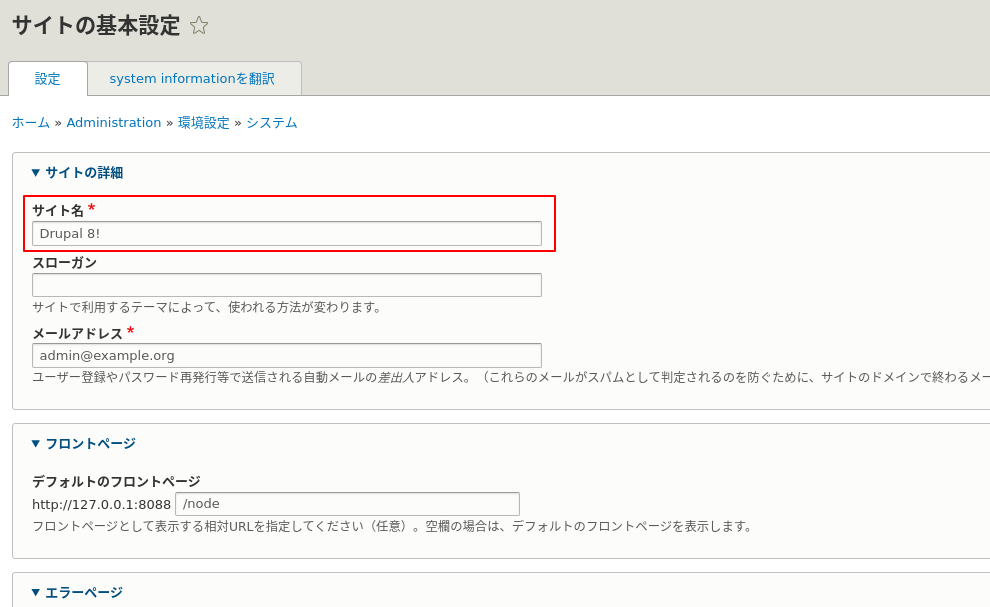
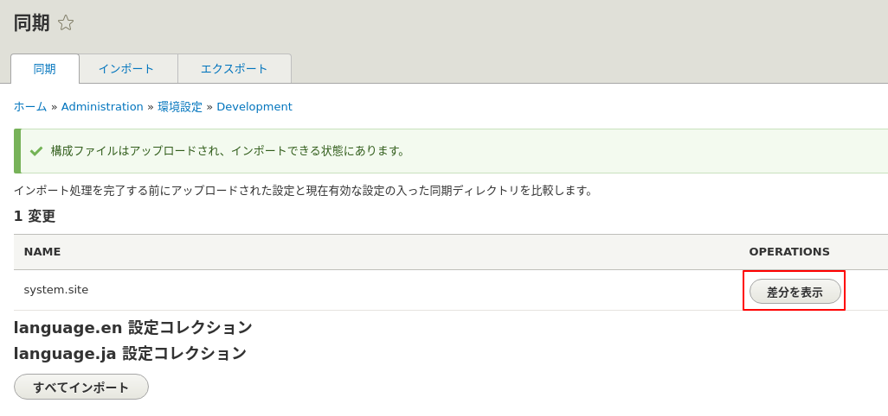
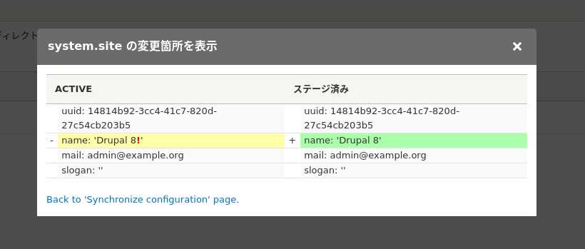
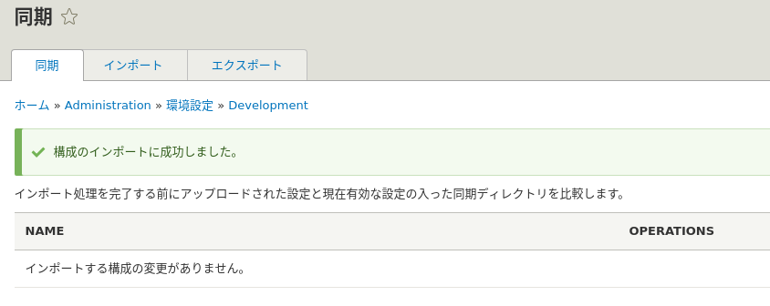
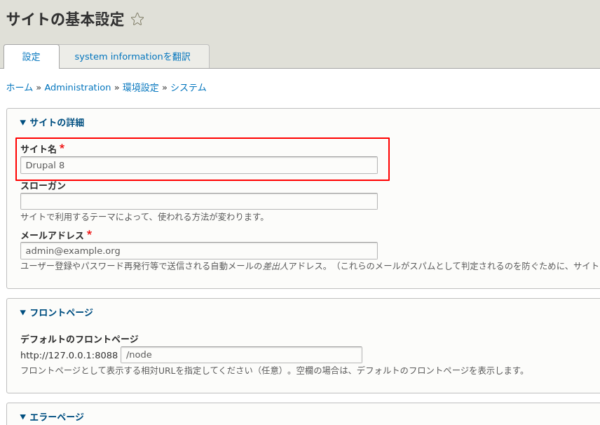

<!-- _class: lead -->
# 2.11 Config Management (1)

---

このセクションでは、Config Managementについて解説します。

Config Managementの本質は「設定のコード化」です。

この機能とgit等のバージョン管理を組み合わせると、dev -> stg -> prodのように異なる環境間で手作業なく設定を同期したり、既存の設定を元に新しい環境を新規に作成することができます。

これは、現代的なシステムに求められるCI/CDを実現するためには必須の要素と言えます。

---

<!-- _class: lead -->
## 2.11.1 Config Managemantの概要

---

Drupalのコンフィグは、パフォーマンス的な理由からデフォルトではデータベースに保存されます。

しかし、全てのコンフィグはymlファイルとしてエクスポート・インポートする事ができます。

Drupalでは、コンフィグのエクスポート・インポートを管理UI・CLIの2つの方法で行うことができます。

---

<!-- _class: lead -->
## 2.11.2 管理UIからコンフィグをエクスポートする

---

それでは、まずは管理UIからコンフィグをエクスポートしてみましょう。

ツールバーから「環境設定 > Development > 同期」(/admin/config/development/configuration) にアクセスしてください。このUIでは、タブ毎に以下の操作を行うことができます。

---

|タブ|説明|
|---|---|
|同期|コードで管理されているコンフィグと現在のコンフィグの差分を表示する。また、コードを正としてコンフィグを同期する。|
|インポート|コード化されたコンフィグをアップロードする|
|エクスポート|コード化されたコンフィグをエクスポートする|

---

「同期」タブを見ると「インポートする構成の変更がありません。」となっています。まだコンフィグをコード化していないため、変更も検出されない状態です(とても危ない状態ですね)。



---

それでは、「エクスポート」タブに移動してコード化されたコンフィグをエクスポートしましょう。

この管理UIには、「フルアーカイブ」と「シングルアイテム」の2つのタブがあります。

「フルアーカイブ」ではシステム全体のコンフィグ、「シングルアイテム」では指定した単一のコンフィグをエクスポートすることができます。

---

「フルアーカイブ」タブに移動して「エクスポート」ボタンを押し、コード化されたコンフィグをエクスポートしましょう。



---

「フルアーカイブ」の場合、コンフィグは `.tar.gz` で圧縮された状態でダウンロードされます。このファイルは、後ほどインポートする際に利用するので保管しておいてください)。

ダウンロードしたファイルを解凍して中身を見てみましょう。

```txt
(パスは自身の環境に合わせて読み替えてください)

$ mkdir -p /tmp/config
$ cd /tmp/config
$ tar zxf /tmp/config-127-0-0-1_8088-2020-03-02-02-37.tar.gz
$ ls -l /tmp/config
total 956
drwxr-xr-x 4 aoyama aoyama    80 Mar  2 11:58 language
-rw------- 1 aoyama aoyama   103 Mar  2 11:37 automated_cron.settings.yml
-rw------- 1 aoyama aoyama   558 Mar  2 11:37 block.block.bartik_account_menu.yml
-rw------- 1 aoyama aoyama   509 Mar  2 11:37 block.block.bartik_branding.yml
...
```

---

多数のymlファイルが含まれていることが分かります。サンプルとして `system.site.yml` を見てみましょう。

```yml
uuid: 14814b92-3cc4-41c7-820d-27c54cb203b5
name: 'Drupal 8'
mail: admin@example.org
slogan: ''
page:
  403: ''
  404: ''
  front: /node
admin_compact_mode: false
weight_select_max: 100
langcode: ja
default_langcode: ja
_core:
  default_config_hash: yTxtFqBHnEWxQswuWvkjE8mKw2t8oKuCL1q8KnfHuGE
```

---

このファイルは `/admin/config/system/site-information` の管理UIの設定に対応します。



---

エクスポートされたymlと同じ値が管理UIで設定されていることが分かりますね。

基本的には、管理UIから設定可能な項目の1つ1つがymlのkeyとvalueのペアに対応しています。

---

ただし、「**必ずしも管理UIで全ての設定項目が開放されているわけではない**」という点に注意しましょう。

このコンフィグの例では、 `admin_compact_mode` や `weight_select_max` などは管理UIからは設定できません。

言い換えると、「**一部の設定値を変更する場合は、管理UIからではなくymlを直接変更する必要がある**」ということになります。

ある程度複雑なシステムを開発する場合、これが必要になるケースもあります。頭の片隅に入れておきましょう。

---
サイト名
それでは、「サイト名」を `Drupal 8!` に変更して保存してください。

次に、再度コンフィグをエクスポートして、もう一度 `system.site.yml` を見てみましょう。手順は先ほどと同様です。

---

`name` キーの値が変更されていることがわかります。

```yml
uuid: 14814b92-3cc4-41c7-820d-27c54cb203b5
name: 'Drupal 8!'
mail: admin@example.org
slogan: ''
page:
  403: ''
  404: ''
  front: /node
admin_compact_mode: false
weight_select_max: 100
langcode: ja
default_langcode: ja
_core:
  default_config_hash: yTxtFqBHnEWxQswuWvkjE8mKw2t8oKuCL1q8KnfHuGE
```

---

<!-- _class: lead -->
## 2.11.3 管理UIからコンフィグをインポートする

---

ここまでで、管理UIから変更した設定がymlファイルとしてエクスポート出来ることが分かりました。次は、コンフィグをインポートしてみましょう。

先ほど「サイト名」を変更しましたが、変更前にエクスポートしたコンフィグをインポートして、「サイト名」が変更前の状態に戻ることを確認していきます。

---

「構成アーカイブ」にエクスポートしたコンフィグを添付して「アップロード」ボタンを押してください。


---

アップロードが成功すると、「同期」タブにリダイレクトされ、以下のように表示されます。



---

メッセージの通り、この状態ではまだアップロードしたコンフィグは反映されていません。

この状態で、一度 `/admin/config/system/site-information` を確認しましょう。変更した「サイト名」がまだそのままの状態になっていることが分かります。

---



---

それでは、 `/admin/config/development/configuration` に戻ってインポートを完了させましょう。

「同期」タブには「コード化されたコンフィグと現在のコンフィグの差分」が表示されます。



---

「差分を表示」をクリックすると、GUI上で差分を確認できます。

左側の `ACTIVE` が `現在の設定値` で、右側の `ステージ済み` が `コードの設定値` になります。つまり、インポートすると左の状態から右の状態に更新されます。



---

ここで、「サイト名」のみが変更されていることを差分を見てしっかり確認してください。

確認できたら「インポート」ボタンを押して、インポートを実行してください。次のように表示されれば成功です。



---

最後に、`/admin/config/system/site-information` で「サイト名」が元に戻っていることを確認しましょう。



---

<!-- _class: lead -->
## 2.11.4 コンフィグの保存先

---

コンフィグファイルの保存先は、`settings.php` の`$config_directories['sync']` で定義されています。

[drupal-composer/drupal-project](https://github.com/drupal-composer/drupal-project) でコードツリーを生成した場合、保存先は `../config/sync` ディレクトリに設定されます。

```php
$config_directories['sync'] = '../config/sync';
```

しかし、drupal.orgアーカイブからサイトを立ち上げると、保存先は `sites/default/files/private/config/sync` となります。

「**コンフィグの保存先は設定可能であり、固定のパスではない**」ということを押さえておきましょう。

---

コンフィグはwebサーバーからアクセスできる必要はありません。そのため、一般的なセキュリティのベストプラクティスに従い「**Webサーバーのドキュメントルートからはアクセスできないパスに配置する**」、つまり、drupal-composer/drupal-projectの設定の方が望ましいと言えます。

Drupalが `.htaccess` を自動生成するためWebサーバーにApacheを利用してれば自動的にアクセス制限されますが、nginxなどを利用する場合は特に注意が必要です。

---

<!-- _class: lead -->
## 2.11.5 CLIからコンフィグをエクスポートする

---

では、同じことを管理UIからではなくCLIから実施してみましょう。

動作確認のために先ほどインポートしたコンフィグファイル、つまり `config/sync` ディレクトリ以下のファイルをまず削除しましょう。

```txt
$ rm -rf config/sync/*
$ ls -l config/sync
total 0
```

---

コンフィグのエクスポートには `drush` の `config:export (cex)` サブコマンドを利用します。ターミナルから以下のようにコマンドを実行してください。

```txt
$ vendor/bin/drush cex
[success] Configuration successfully exported to ../config/sync.
../config/sync
```

---

これで、`config/sync` にコンフィグファイルが生成されます。

```txt
$ ls -l config/sync
   
total 960
drwxrwxr-x 4 aoyama aoyama  4096 Mar  3 13:34 language
-rw-rw-r-- 1 aoyama aoyama   103 Mar  3 13:34 automated_cron.settings.yml
-rw-rw-r-- 1 aoyama aoyama   558 Mar  3 13:34 block.block.bartik_account_menu.yml
...
```

---

少しわかりにくいのですが、このCLIの操作は、管理UIでの「エクスポート」と「アップロード」(インポートは含まれていない点に注意)に相当します。

2つのステップが1つのコマンドで実行できること、エクスポートしたファイルを選択するというアクションがないので操作ミスが起こりにくいこと、自動化に組み込めることがメリットです。

---

<!-- _class: lead -->
## 2.11.6 CLIからコンフィグをインポートする

---

次に、CLIでコンフィグをインポートしてみましょう。

動作確認のために、再度「サイト名」を `Drupal 8!` に変更して保存してください。

これで、「config/sync以下のコンフィグファイル」と「現在の設定」が乖離している状態となります。

インポートを行う前に `/admin/config/development/configuration` にアクセスして、2.11.3 で確認したときと同様にコンフィグに差分があることを確認してください。

---

コンフィグのインポートには `drush` の `config:import (cim)` サブコマンドを利用します。ターミナルから以下のようにコマンドを実行してください。

```txt
$ vendor/bin/drush cim
+------------+-------------+-----------+
| Collection | Config      | Operation |
+------------+-------------+-----------+
|            | system.site | Update    |
+------------+-------------+-----------+

 Import the listed configuration changes? (yes/no) [yes]:
 >
```

差分があるコンフィグの名称と確認ダイアログが表示されます。

---
export
`yes` と入力してインポートを確定させてください。

```txt
 > yes

 [notice] 構成の同期中: update system.site
 [notice] 構成の同期を完了します。
 [success] The configuration was imported successfully.
```

---

`/admin/config/development/configuration` にアクセスして差分がないことと、およびサイト名が「Drupal 8」に戻っていることを確認してください。

---

## まとめ

このセクションではコンフィグマネジメントの基本的な機能を解説しました。

コンフィグをコードで管理することにより、「設定の変更」もCI/CDに組み込んで自動化することが出来るようになります。
