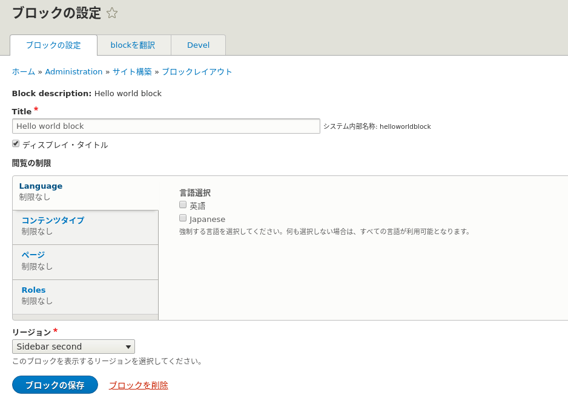

<!-- _class: lead -->
# 2.12 ブロック

---

このセクションでは、ブロックの実装方法を解説します。

ご存知の通り、ブロックはコアの標準機能を使えば管理UIからデータ型の定義もコンテンツ自体も作成することができます。

それでは、なぜわざわざブロックをコードで実装する必要があるのでしょうか？

このセクションを通して、実装方法はもちろんですが、管理UIから動的にブロックを作るべきか、コードで実装すべきかを判断できるようになりましょう。

---

<!-- _class: lead -->
## HelloWorldBlock の実装

---

Drupal 8のブロックは、1章でキーワードとして紹介した「プラグイン」として実装されています。

このセクションの趣旨はプラグイン自体の解説ではありませんが、ブロックの実装に関して必要な部分については解説していきます。

なお、プラグイン自体の解説は次のセクションで行います。

---

早速コードを書いていきましょう。

ブロック（正確にはブロックプラグイン)のnamespaceは、 `\Drupal\{module_name}\Plugin\Block` にする必要があります。

1章で少し説明したように、プラグインには発見可能(Discoverability)という特性がありますが、この特性はこのnamespaceのルールに従うことで実現されています。

それでは、`HelloWorldBlock.php` を次のように実装してください。

---

```php
<?php

namespace Drupal\hello_world\Plugin\Block;

use Drupal\Core\Block\BlockBase;
use Drupal\Core\Plugin\ContainerFactoryPluginInterface;
use Drupal\hello_world\EchoMessageServiceInterface;
use Symfony\Component\DependencyInjection\ContainerInterface;

/**
 * Hello World block.
 *
 * @Block(\
 *  id = "hello_world_block",
 *  admin_label = @Translation("Hello world block"),
 * )
 */
class HelloWorldBlock extends BlockBase implements ContainerFactoryPluginInterface {

  /**
   * The messenger service.
   *
   * @var \Drupal\hello_world\EchoMessageServiceInterface
   */
  protected $messenger;

  // ...
```

---

```php
  /**
   * Construct.
   *
   * @param array $configuration
   *   A configuration array containing information about the plugin instance.
   * @param string $plugin_id
   *   The plugin_id for the plugin instance.
   * @param string $plugin_definition
   *   The plugin implementation definition.
   * @param \Drupal\hello_world\EchoMessageServiceInterface $messenger
   *   The messenger service.
   */
  public function __construct(array $configuration, $plugin_id, $plugin_definition, EchoMessageServiceInterface $messenger) {
    parent::__construct($configuration, $plugin_id, $plugin_definition);
    $this->messenger = $messenger;
  }

  /**
   * {@inheritdoc}
   */
  public static function create(ContainerInterface $container, array $configuration, $plugin_id, $plugin_definition) {
    return new static(
      $configuration,
      $plugin_id,
      $plugin_definition,
      $container->get('hello_world.messenger')
    );
  }

```

---

```php

  /**
   * {@inheritdoc}
   */
  public function build() {
    $build = [];

    $build[] = [
      '#theme' => 'container',
      '#children' => [
        '#markup' => $this->messenger->helloWorld(),
      ],
    ];

    return $build;
  }

}
```

---

それでは、キャッシュをクリアしてから作成したコードの動作を確認しましょう。

ブロックの配置の操作については問題ありませんね？

自信がない方は、いったん戻って [【Drupal 8入門】ブロックレイアウトとコンタクトフォーム作成](https://thinkit.co.jp/article/10079) を参照してください。


---

「second sidebar」リージョンに先ほど作成した「Hello world Block」ブロックを配置してください。

---


---


---

ブロックの設定が完了したらトップページにアクセスしましょう。
次のようにブロックが表示されれば成功です。


---

それでは、コードを解説していきます。

まずはクラスの宣言から見ていきましょう。親クラスは `BlockBase` となっています。独自のブロックを実装する場合、 `BlockBase` を親クラスにする必要があります(※)。`BlockBase` の親クラスを更に辿っていくと、 `PluginBase` から派生していることが分かります。クラスを継承すると関係は [Is-a](https://en.wikipedia.org/wiki/Is-a) となるので、「ブロックはプラグインである」事がコードからも読み取れます。

(※正確には `BlockPluginInterface` を実装すれば親クラスは何でもいいのですが、大抵は車輪の再発明になるだけなので推奨しません)

---

また、クラスに `ContainerFactoryPluginInterface` が実装されていることが分かります。

このインターフェースの定義を見てみましょう。

---

```php
<?php

namespace Drupal\Core\Plugin;

use Symfony\Component\DependencyInjection\ContainerInterface;

/**
 * Defines an interface for pulling plugin dependencies from the container.
 */
interface ContainerFactoryPluginInterface {

  /**
   * Creates an instance of the plugin.
   *
   * @param \Symfony\Component\DependencyInjection\ContainerInterface $container
   *   The container to pull out services used in the plugin.
   * @param array $configuration
   *   A configuration array containing information about the plugin instance.
   * @param string $plugin_id
   *   The plugin ID for the plugin instance.
   * @param mixed $plugin_definition
   *   The plugin implementation definition.
   *
   * @return static
   *   Returns an instance of this plugin.
   */
  public static function create(ContainerInterface $container, array $configuration, $plugin_id, $plugin_definition);

}

```

---

コメントから「(サービス)コンテナからプラグインの依存関係を取得し、プラグインのインスタンスを返すためのインターフェース」であることが分かります。

先のセクションで実装したコードのように、ある機能が動作するために依存する機能が増えていくと、ファクトリーメソッド(create)のインターフェースがどんどん太ってきます。

こうなってしまうと、呼び出し元のコードが共通化できなくなってしまいます。

これを防止するために、「プラグインのファクトリーメソッドはこうしましょう」を定義したものが `ContainerFactoryPluginInterface` です。

---

`create` メソッドの引数の解説については、プラグインのセクションで別途行います。

`__construct` と `create` については先のセクションで解説しましたね。引数の違いはありますが、仕組みは同じです。

`build` は、ブロックコンテンツ自体を返すメソッドです。
コントローラーがコンテンツを返すときと同様に、配列の `#markup` というキーに出力したいデータを指定しています。

---

<!-- _class: lead -->
## ブロックを設定可能にする

---

TBD.

---

ブロックレイアウトの設定画面を見てみましょう。管理UIからブロックコンテンツを作成したときと同様の設定ができることが分かります。



---


次にカスタムブロックライブラリ(ブロックコンテンツの一覧)を見てみましょう。


---

コードで実装したブロックは、カスタムブロックライブラリには表示されません。

これは、「たとえ管理者であってもそのブロックの内容を変更したり、削除したりすることができない」という事を意味します。

別の言葉で言い換えると、「あるブロックコンテンツが固定のIDとコンテンツを常に持っていることが保証される」ということになります。

---

言葉にすると当たり前のようなことに思えますが、ブロックを管理できる権限 (administer blocks もしくは administer site configuration)をいずれかのユーザーが持っているだけで、この前提を守ることはできなくなります。

実際のプロダクトでConfiguration Managementを使って設定をコードで管理するようになると、この前提を守る事がとても難しく、そして重要であることがわかるでしょう。

---

## まとめ

このセクションではモジュールのコードでブロックコンテンツを作成する方法を解説しました。

このセクションの内容だけでは「せっかく管理UIからブロックが作成できるのだから、車輪の再発明をせずに管理UIから作成した方がいいのでは？」と思うかもしれません。

しかし、実際のプロダクトの開発・運用では、それ以外に考慮する必要がある要素がたくさんあります。

---

実際のプロダクト開発と比べると簡単な例ではありますが、このセクションのストレッチゴールで「ブロックをコードで書くとどんなメリットがあるか」を理解するようにしましょう。

---

## ストレッチゴール

1. 管理UIから「Hello!」を表示するブロックコンテツを定義して「second sidebar」リージョンに配置してください(結果として、second sidebar」リージョンには2つのブロックが表示されている状態になります)。
2. 1.を実施後にサイト全体のコンフィグをエクスポートしてください。同じソースコードで別のDrupalサイトを起動し、エクスポートしたコンフィグをインポートしてください。この結果、どのようなエラーが発生するか、なぜそのエラーが発生するかを調査してください。
