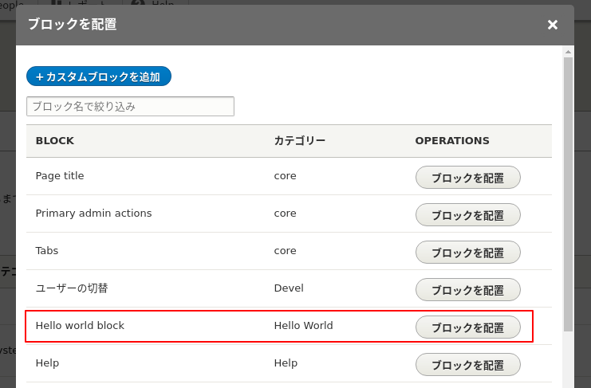
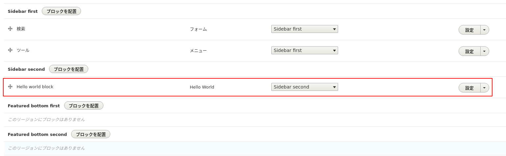
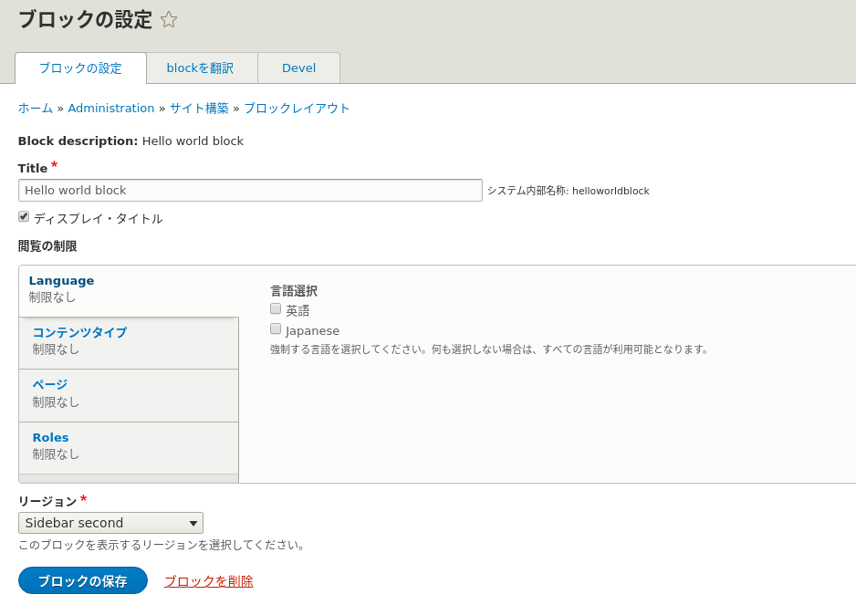
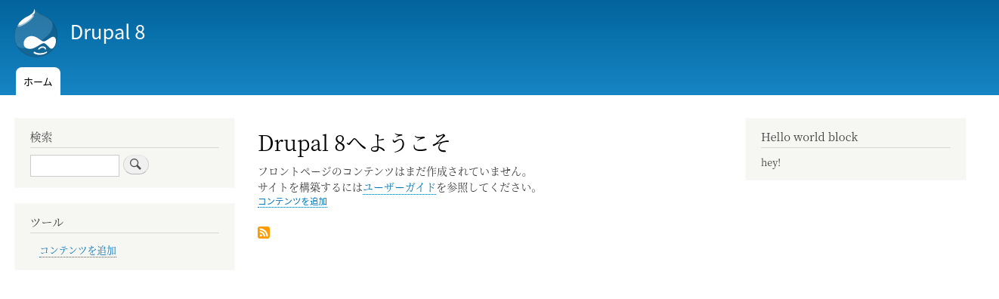
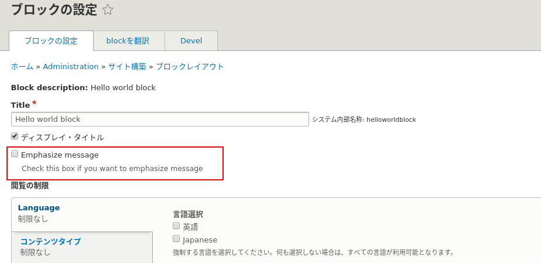
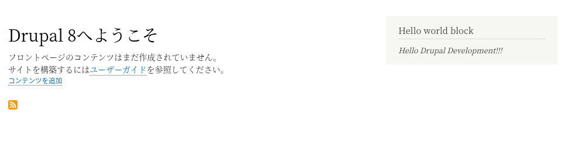
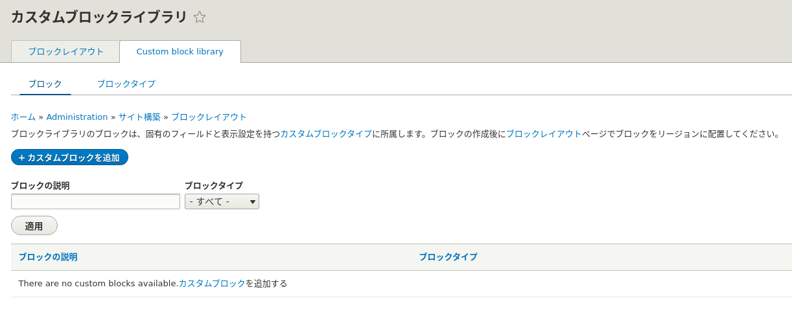

<!-- _class: lead -->
# 2.14 ブロック

---

このセクションでは、ブロックの実装方法を解説します。

ご存知の通り、ブロックはコアの標準機能を使えば管理UIからデータ型の定義もコンテンツ自体も作成することができます。

それでは、なぜわざわざブロックをコードで実装する必要があるのでしょうか？

このセクションを通して、実装方法はもちろんですが、管理UIから動的にブロックを作るべきか、コードで実装すべきかを判断できるようになりましょう。

---

<!-- _class: lead -->
## 2.14.1 ブロック の実装

---

Drupal 8のブロックは、1章でキーワードとして紹介した「プラグイン」として実装されています。

このセクションの趣旨はプラグイン自体の解説ではありませんが、ブロックの実装に関して必要な部分については解説していきます。

なお、プラグイン自体の解説は次のセクションで行います。

---

早速コードを書いていきましょう。

ブロック（正確にはブロックプラグイン)のnamespaceは、 `\Drupal\{module_name}\Plugin\Block` にする必要があります。

1章で少し説明したように、プラグインには発見可能(Discoverability)という特性がありますが、この特性はこのnamespaceのルールに従うことで実現されています。

それでは、`HelloWorldBlock.php` を次のように実装してください。

---

```php
<?php

namespace Drupal\hello_world\Plugin\Block;

use Drupal\Core\Block\BlockBase;
use Drupal\Core\Plugin\ContainerFactoryPluginInterface;
use Drupal\hello_world\EchoMessageServiceInterface;
use Symfony\Component\DependencyInjection\ContainerInterface;

/**
 * Hello World block.
 *
 * @Block(\
 *  id = "hello_world_block",
 *  admin_label = @Translation("Hello world block"),
 * )
 */
class HelloWorldBlock extends BlockBase implements ContainerFactoryPluginInterface {

  /**
   * The messenger service.
   *
   * @var \Drupal\hello_world\EchoMessageServiceInterface
   */
  protected $messenger;

  // ...
```

---

```php
  /**
   * Construct.
   *
   * @param array $configuration
   *   A configuration array containing information about the plugin instance.
   * @param string $plugin_id
   *   The plugin_id for the plugin instance.
   * @param string $plugin_definition
   *   The plugin implementation definition.
   * @param \Drupal\hello_world\EchoMessageServiceInterface $messenger
   *   The messenger service.
   */
  public function __construct(array $configuration, $plugin_id, $plugin_definition, EchoMessageServiceInterface $messenger) {
    parent::__construct($configuration, $plugin_id, $plugin_definition);
    $this->messenger = $messenger;
  }

  /**
   * {@inheritdoc}
   */
  public static function create(ContainerInterface $container, array $configuration, $plugin_id, $plugin_definition) {
    return new static(
      $configuration,
      $plugin_id,
      $plugin_definition,
      $container->get('hello_world.messenger')
    );
  }

```

---

```php

  /**
   * {@inheritdoc}
   */
  public function build() {
    $build = [];

    $build[] = [
      '#theme' => 'container',
      '#children' => [
        '#markup' => $this->messenger->helloWorld(),
      ],
    ];

    return $build;
  }

}
```

---

それでは、キャッシュをクリアしてから作成したコードの動作を確認しましょう。

ブロックの配置の操作については問題ありませんね？

自信がない方は、いったん戻って [【Drupal 8入門】ブロックレイアウトとコンタクトフォーム作成](https://thinkit.co.jp/article/10079) を参照してください。


---

「second sidebar」リージョンに先ほど作成した「Hello world Block」ブロックを配置してください。

---



---



---

ブロックレイアウトの設定画面も見てみましょう。GUIからブロックを作成したときと同様に色々な設定ができる事が分かります。



---

ブロックの設定が完了したらトップページにアクセスしましょう。
次のようにブロックが表示されれば成功です。




---


それでは、コードを解説していきます。

まずはクラスの宣言から見ていきましょう。親クラスは `BlockBase` となっています。独自のブロックを実装する場合、 `BlockBase` を親クラスにする必要があります(※)。`BlockBase` の親クラスを更に辿っていくと、 `PluginBase` から派生していることが分かります。クラスを継承すると関係は [Is-a](https://en.wikipedia.org/wiki/Is-a) となるので、「ブロックはプラグインである」事がコードからも読み取れます。

(※正確には `BlockPluginInterface` を実装すれば親クラスは何でもいいのですが、大抵は車輪の再発明になるだけなので推奨しません)

---

また、クラスに `ContainerFactoryPluginInterface` が実装されていることが分かります。

このインターフェースの定義を見てみましょう。

---

```php
<?php

namespace Drupal\Core\Plugin;

use Symfony\Component\DependencyInjection\ContainerInterface;

/**
 * Defines an interface for pulling plugin dependencies from the container.
 */
interface ContainerFactoryPluginInterface {

  /**
   * Creates an instance of the plugin.
   *
   * @param \Symfony\Component\DependencyInjection\ContainerInterface $container
   *   The container to pull out services used in the plugin.
   * @param array $configuration
   *   A configuration array containing information about the plugin instance.
   * @param string $plugin_id
   *   The plugin ID for the plugin instance.
   * @param mixed $plugin_definition
   *   The plugin implementation definition.
   *
   * @return static
   *   Returns an instance of this plugin.
   */
  public static function create(ContainerInterface $container, array $configuration, $plugin_id, $plugin_definition);

}

```

---

コメントから「(サービス)コンテナからプラグインの依存関係を取得し、プラグインのインスタンスを返すためのインターフェース」であることが分かります。

先のセクションで実装したコードのように、ある機能が動作するために依存する機能が増えていくと、ファクトリーメソッド(create)のインターフェースがどんどん太ってきます。

こうなってしまうと、呼び出し元のコードが共通化できなくなってしまいます。

これを防止するために、「プラグインのファクトリーメソッドはこうしましょう」を定義したものが `ContainerFactoryPluginInterface` です。

---

`create` メソッドの引数の解説については、プラグインのセクションで別途行います。

`__construct` と `create` については先のセクションで解説しましたね。引数の違いはありますが、仕組みは同じです。

`build` は、ブロックコンテンツ自体を返すメソッドです。
コントローラーがコンテンツを返すときと同様に、配列の `#markup` というキーに出力したいデータを指定しています。

---

<!-- _class: lead -->
## 2.14.2 ブロックを設定可能にする

---

2.8章で解説したように、Drupalでは `ConfigFormBase` を継承して設定用の管理UIを作成することができます。

ブロックの設定をこの方法で管理することもできますが、 `BlockPluginInterface` を実装したほうがより効率的にブロックの設定を管理できます。

いくつかのメソッドを実装してHello World Blockに設定を追加してみましょう。

---

ブロックに設定を追加するには `BlockPluginInterface` で定義されている以下の3つのメソッドを実装する必要があります。

- defaultConfiguration
- blockForm
- blockSubmit

それでは「ブロックのメッセージを強調表示する」という振る舞いを設定で変更できるようにしてみましょう。

---

それでは、 `defaultConfiguration` から実装していきます。
まずは `BlockPluginInterface::defaultConfiguration` の定義から見てみましょう。

```php
  /**
   * Gets default configuration for this plugin.
   *
   * @return array
   *   An associative array with the default configuration.
   */
  public function defaultConfiguration();
```

---

設定のデフォルト値を配列で返せば良さそうですね。では、 `HelloWorldBlock::defaultConfiguration` を次のように実装しましょう。

```php
  /**
   * {@inheritDoc}
   */
  public function defaultConfiguration() {
    return [
      'emphasize' => 0,
    ];
  }
```

ここでは `emphasize` というキーで設定を定義しました。

---

次に、 `blockForm` を実装します。

こちらも `BlockPluginInterface::blockForm` の定義から見てみましょう。

---

```php
  /**
   * Returns the configuration form elements specific to this block plugin.
   *
   * Blocks that need to add form elements to the normal block configuration
   * form should implement this method.
   *
   * @param array $form
   *   The form definition array for the block configuration form.
   * @param \Drupal\Core\Form\FormStateInterface $form_state
   *   The current state of the form.
   *
   * @return array
   *   The renderable form array representing the entire configuration form.
   */
  public function blockForm($form, FormStateInterface $form_state);
```

---

設定フォーム用のフォームエレメントを返すインターフェースであることが分かります。

※DrupalのフォームはForm APIという巨大な中間レイヤーの上で動いています。この解説だけで2章全てよりボリュームが大きくなるので、解説は最低限で済ませています。Form APIの詳細な解説は別途行います。

それでは、`blockForm` を次の様に実装しましょう。

---

```php
use Drupal\Core\Form\FormStateInterface;
use Drupal\Core\StringTranslation\StringTranslationTrait;
...

class HelloWorldBlock extends BlockBase implements ContainerFactoryPluginInterface {
  use StringTranslationTrait;
  ...

  /**
   * {@inheritDoc}
   */
  public function blockForm($form, FormStateInterface $form_state) {
    /** @var array $config */
    $config = $this->getConfiguration();

    $form['emphasize'] = [
      '#type' => 'checkbox',
      '#title' => $this->t('Emphasize message'),
      '#description' => $this->t('Check this box if you want to emphasize message'),
      '#default_value' => $config['emphasize'],
    ];

    return $form;
  }
```

---

`emphasize` の設定をチェックボックス要素としてフォームを定義しました。

フォームについては2.4章や2.8章で少し実装してきましたが、自信がない方は一度戻って見直しましょう。

最後に `blockSubmit` を実装します。こちらも `BlockPluginInterface::blockSubmit` の定義から見てみましょう。

---

```php
  /**
   * Adds block type-specific submission handling for the block form.
   *
   * Note that this method takes the form structure and form state for the full
   * block configuration form as arguments, not just the elements defined in
   * BlockPluginInterface::blockForm().
   *
   * @param array $form
   *   The form definition array for the full block configuration form.
   * @param \Drupal\Core\Form\FormStateInterface $form_state
   *   The current state of the form.
   *
   * @see \Drupal\Core\Block\BlockPluginInterface::blockForm()
   * @see \Drupal\Core\Block\BlockPluginInterface::blockValidate()
   */
  public function blockSubmit($form, FormStateInterface $form_state);
```

---

submit時に呼ばれるハンドラーであることは分かりますが、具体的にどのようなコードを書けばいいのかちょっと読み取れないですね。

このような場合は実際に動いているコードを見るのが近道です。具体的には、 `blockSubmit` を実装している別クラスのコードを見れば良さそうですね。

2.10章の時点で、インターフェースの定義から実装クラスに簡単にジャンプできる仕組みは作ってありますね？もし、この準備ができていないなら2.10章の該当部分に戻って環境構築をしてください。

それでは、例として `SystemMenuBlock::blockSubmit` のコードを見てみましょう。

---

```php
  /**
   * {@inheritdoc}
   */
  public function blockSubmit($form, FormStateInterface $form_state) {
    $this->configuration['level'] = $form_state->getValue('level');
    $this->configuration['depth'] = $form_state->getValue('depth');
    $this->configuration['expand_all_items'] = $form_state->getValue('expand_all_items');
  }
```

---

`$form_state` から取得した入力値を `$this->configuration` に保存しているようです。

それでは、 `blockSubmit` を実装しましょう。

```php
  /**
   * {@inheritDoc}
   */
  public function blockSubmit($form, FormStateInterface $form_state) {
    $this->configuration['emphasize'] = $form_state->getValue('emphasize');
  }

```

---

最後に、`emphasize` の設定値で出力するメッセージが変わるようにしましょう。`build` メソッドを以下のように変更してください。

```php
  /**
   * {@inheritdoc}
   */
  public function build() {
    $content = $this->messenger->helloWorld();
    if ($this->configuration['emphasize']) {
      $content = '<em>' . $content . '</em>';
    }

    return [
      '#markup' => $content,
    ];
  }
```

---

これで全ての実装は完了です。

それでは、ブロックレイアウト設定画面を再度見てみましょう。`Emphasize message` という設定項目が追加されています。



---

それでは、`Emphasize message` を有効にして設定を保存し、トップページにアクセスしてください。ブロックのメッセージが `<em>` タグで囲われていれば成功です。



---

<!-- _class: lead -->
## 2.14.3 コードでブロックを定義するメリット

---

最後にカスタムブロックライブラリ(ブロックコンテンツの一覧)を見てみましょう。



---

コードで実装したブロックは、カスタムブロックライブラリには表示されません。

これは、「たとえ管理者であってもそのブロックの内容を変更したり、削除したりすることができない」という事を意味します。

別の言葉で言い換えると、「ブロックコンテンツが固定のIDを持ち常に存在することが保証される」ということになります。

---

言葉にすると当たり前のようなことに思えますが、ブロックを管理できる権限 (administer blocks もしくは administer site configuration)をいずれかのユーザーが持っているだけで、この前提を守ることはできなくなります。

実際のプロダクトでConfiguration Managementを使って設定をコードで管理するようになると、この前提を守る事がとても難しく、そして重要であることがわかるでしょう。

---

## まとめ

このセクションではモジュールのコードでブロックコンテンツを作成する方法を解説しました。

このセクションの内容だけでは「せっかく管理UIからブロックが作成できるのだから、車輪の再発明をせずに管理UIから作成した方がいいのでは？」と思うかもしれません。

しかし、実際のプロダクトの開発・運用では、それ以外に考慮する必要がある要素がたくさんあります。

---

実際のプロダクト開発・運用と比べるととても簡単な例ではありますが、このセクションのストレッチゴールで「ブロックをコードで書くとどんなメリットがあるか」を理解するようにしましょう。

---

## ストレッチゴール

1. 管理UIから「Hello!」を表示するブロックコンテンツを定義して「second sidebar」リージョンに配置してください(結果として、second sidebar」リージョンには2つのブロックが表示されている状態になります)。

---

2. 1.を実施後にサイト全体のコンフィグをエクスポートしてください。

3. 2.の実施後、コードツリー全体を別のディレクトリにコピーし、別のDrupalサイトをエクスポートしたコンフィグを元に新規に作成してください。この結果、サイトは正常に起動しますがブロックに関連するエラーが発生します。どのようなエラーが発生するか、なぜそのエラーが発生するかを調査してください。

なお、本コンテンツ作成時点ではDrupal 8.8.0にバグがあり、既存のコンフィグからサイトを立ち上げるためにはいくつかのパッチを適用する必要があります。詳細は2.12章を参照してください。
