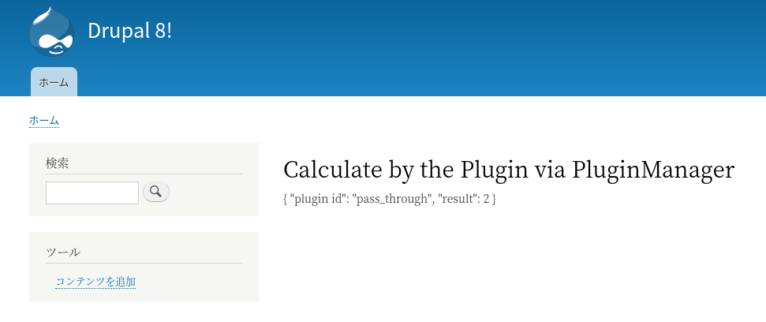

<!-- _class: lead -->
# 2.15 プラグインとプラグインマネージャー

---

前のセクションでは、Drupalのプラグインシステムを利用してブロック(プラグイン)を実装しました。

しかし、ブロックの場合はプラグインとしての振る舞いの多くは親クラスである `BlockBase` で実装されているため、「ブロックの実装方法はわかったけど、ブロックではない独自のプラグインはどうやって作るのか？」という疑問は残っていると思います。

---

1章でも少し紹介したとおり、プラグインを使う大きなメリットとしては以下があります。

- (自動的に)発見可能(Discoverability)である
- 同等の機能を持つ別のプラグインに入れ替え可能である

このセクションでは、独自のプラグインおよびプラグインマネージャーを開発しながら、これらの特徴がどのように実現されているかを解説します。

プラグインについてのドキュメントは [Plugin API](https://www.drupal.org/docs/8/api/plugin-api) にまとまっていますので、必要に応じて参照してください。

---

<!-- _class: lead -->
## 2.15.1 コアが提供するプラグインの例

---

プラグインは、同等の機能を持つ別のプラグインに入れ替え可能な機能です。入れ替え可能かどうかの条件は、「同じプラグインタイプであること」になります。

ちょっとわかりにくいので、Drupalのコアで実装されている例で紹介します。

デフォルトで定義されているArticleコンテンツタイプの「フォームの表示管理」タブ (/admin/structure/types/manage/article/form-display)を開いてください。

---

ご存じの通り、Drupalのエンティティは、「ウィジェット」と呼ばれる機能を使ってフィールド毎に編集画面でどのようなDOMを生成するかを変更することができます。

例えば、「タグ」フィールドのウィジェットは次のように4つの中から入れ替えることができます。


---

ここで指定可能なウィジェットはそれぞれ次のクラスで実装されています。

- 選択リスト: [OptionsSelectWidget](https://github.com/drupal/drupal/blob/8.8.x/core/lib/Drupal/Core/Field/Plugin/Field/FieldWidget/OptionsSelectWidget.php)
- 自動補完: [EntityReferenceAutocompleteWidget](https://github.com/drupal/drupal/blob/8.8.x/core/lib/Drupal/Core/Field/Plugin/Field/FieldWidget/EntityReferenceAutocompleteWidget.php)
- 自動補完(タグスタイル): [EntityReferenceAutocompleteTagsWidget](https://github.com/drupal/drupal/blob/8.8.x/core/lib/Drupal/Core/Field/Plugin/Field/FieldWidget/EntityReferenceAutocompleteTagsWidget.php)
- チェックボックス/ラジオボタン: [OptionsButtonsWidget](https://github.com/drupal/drupal/blob/8.8.x/core/lib/Drupal/Core/Field/Plugin/Field/FieldWidget/OptionsButtonsWidget.php)

---

いずれのクラスも親を辿っていくと `WidgetBase` というクラスになっており、更に親を辿ると `PluginBase` というクラスから派生していることが分かります。

つまり「ウィジェットは全てプラグインとして実装されている」ということになります。

表示画面でフィールド毎の表示設定に利用される「フォーマッター」も、同様に全てプラグインとして実装されています。

(解説は省略しますが、「表示管理」タブにある「フォーマット」で切り替えられる部分がフォーマッターです)

---

エディタで `PluginBase` の派生先のクラスを見てみると、ウィジェットやフォーマッターの他にも、エディタやフィルター、検索機能など非常に多くのものがプラグインとして実装されていることが分かります。

Drupal 7ではフックさえ理解すれば機能の拡張を行うことができましたが、Drupal 8ではプラグインを理解しないとほとんどの機能は拡張できません。

(そしてレガシーなフックはどんどん非推奨になる傾向にあります)

このセクションでプラグインの概念や実装方法をしっかりと押さえておきましょう。

---

<!-- _class: lead -->
## 2.15.2 Tips: Drupalにおけるフロントエンドとバックエンドの境界

---

ところで、編集画面や表示画面の細かな調整は、他のフレームワークではフロントエンド側、つまりテンプレートやjavascriptなどで行う方が一般的です。

しかし、Drupalではこのウィジェットとフォーマッターのレイヤーが存在するため、フロントエンドに関わる部分だとしても、主要な部分をDrupalのプラグインとしてPHPで開発することになる場合も多くあります

「フロントエンド」や「Themeing」と言った言葉から連想するタスクや責任範囲、必要になるスキルは人によって様々だと思いますが、良いプロダクトを開発するためには道具として利用するフレームワークの設計思想をよく理解する必要があります。

---

本来ウィジェットやフォーマッターでするべき実装を、テンプレートで無理やり実現しようとするのは絶対に避けましょう。

フレームワークの作法を無視した実装は、将来的にはユーザーからのクレームや不具合、メンテナンスの破綻に繋がります。

もしあなたがUIの変更に関しての判断を求められる場合、「ちょっとした画面の調整だから、PHPを理解している開発者じゃなくてもできるはずだ」という思い込みは一度捨てましょう。

「どのように設計するのが最適なのか」という視点を常に持ち、不安がある場合は十分に知見のあるエンジニアに相談して判断するようにすることを推奨します。

---

<!-- _class: lead -->
## 2.15.3 プラグイン

---

前置きはこれくらいにして、プラグインの実装に入りましょう。

単純な実装例として、「ある整数値を入力として、何かの演算結果を返す」プラグインを開発します。

---

<!-- _class: lead -->
## 2.15.3.1 プラグインのインターフェース定義

---

最初に、プラグインのインターフェースを`Drupal\hello_world\Plugin\CalculatorInterface` として次のように実装しましょう。

---

```php
<?php

namespace Drupal\hello_world\Plugin;

use Drupal\Component\Plugin\PluginInspectionInterface;

/**
 * A interface of the Calculator.
 */
interface CalculatorInterface extends PluginInspectionInterface {

  /**
   * Calculate with some logic.
   *
   * @params int $val
   *
   * @return int
   *   The result of Calculation.
   */
  public function calculate(int $val);

}

```

---

プラグインの機能は「ある整数値を入力として、何かの演算結果を返す」だけなので、int型の引数を取ってint型の戻り値を返すcalculateというメソッドだけを定義しています。

注目すべきポイントはこのインターフェースが、 `PluginInspectionInterface` から派生している点です。このインターフェースの定義を見てみましょう。

---

```php
<?php

namespace Drupal\Component\Plugin;

/**
 * Plugin interface for providing some metadata inspection.
 *
 * This interface provides some simple tools for code receiving a plugin to
 * interact with the plugin system.
 *
 * @ingroup plugin_api
 */
interface PluginInspectionInterface {

  /**
   * Gets the plugin_id of the plugin instance.
   *
   * @return string
   *   The plugin_id of the plugin instance.
   */
  public function getPluginId();

  /**
   * Gets the definition of the plugin implementation.
   *
   * @return array
   *   The plugin definition, as returned by the discovery object used by the
   *   plugin manager.
   */
  public function getPluginDefinition();

}
```

---

このインタフェースには、プラグインのメタデータを取得することを目的として
- getPluginId
- getPluginDefinition

の2つが宣言されていることが分かります。

それぞれのメソッドの詳細については最後にまとめて解説するので、次に進みましょう。

---

<!-- _class: lead -->
## 2.15.3.2 プラグインのベースクラスの実装

---

次に、プラグインのベースクラスを作成しましょう。

`Drupal\hello_world\Plugin\CalculatorBase` を次のように実装してください。

---

```php
<?php

namespace Drupal\hello_world\Plugin;

use Drupal\Core\Plugin\ContainerFactoryPluginInterface;
use Drupal\Component\Plugin\PluginBase;
use Drupal\hello_world\Plugin\CalculatorInterface;
use Symfony\Component\DependencyInjection\ContainerInterface;

/**
 * A base class of Calculator.
 */
abstract class CalculatorBase extends PluginBase implements CalculatorInterface, ContainerFactoryPluginInterface {

  /**
   * Constructs a \Drupal\Component\Plugin\PluginBase object.
   *
   * @param array $configuration
   *   A configuration array containing information about the plugin instance.
   * @param string $plugin_id
   *   The plugin_id for the plugin instance.
   * @param mixed $plugin_definition
   *   The plugin implementation definition.
   */
  public function __construct(array $configuration, $plugin_id, $plugin_definition) {
    parent::__construct(
      $configuration,
      $plugin_id,
      $plugin_definition
    );
  }
  
  // (続く)
```

---

```php
  /**
   * {@inheritdoc}
   */
  public static function create(
    ContainerInterface $container,
    array $configuration,
    $plugin_id,
    $plugin_definition
  ) {
    return new static(
      $configuration,
      $plugin_id,
      $plugin_definition
    );
  }

}

```

---

親クラスは `PluginBase` となっています。前の章で実装したブロックプラグインも、親を辿るとこのクラスから派生していましたね。

Drupalで独自のプラグインを実装する場合はこのクラスを継承する必要があります。

また、先ほど定義した `CalculatorInterface` を実装するように宣言しています。

`ContainerFactoryPluginInterface` は前の章で解説したとおり、「プラグインのファクトリーメソッドを共通化するためのインターフェース」です。忘れてしまった方は2.14章を再度読み直しましょう。

---

<!-- _class: lead -->
## 2.15.3.3 アノテーションの実装

---

いよいよプラグインの具象クラスを実装しましょう、と行きたいところですが、その前にもう一つ、Drupalのプラグインにとって非常に重要なコンポーネントである `アノテーション` を実装する必要があります。

※正確には、アノテーションは「プラグインを発見可能にする」ためのいくつかある方法の1つなのですが、最も利用されている方法なので今回はこれを採用します。

---

Javaでの開発経験があるエンジニアにとってはおなじみですね。「アノテーションとは？」という解説は本コンテンツではケアしませんので、 [Annotation - Wikipedia](https://en.wikipedia.org/wiki/Annotation#Software_engineering) などを参照してください。

Javaと違いPHPは言語レベルではアノテーションをサポートしていません。そのため、アノテーションの機能は [Doctrine Annotation](https://www.doctrine-project.org/projects/doctrine-annotations/en/1.8/index.html) が提供しています。

---

それでは、今回開発するプラグインのためのアノテーションクラスを作成していきましょう。

`Drupal\hello_world\Annotation\Calculator` を次のように実装してください。

---

```php
<?php

namespace Drupal\hello_world\Annotation;

use Drupal\Component\Annotation\Plugin;

/**
 * Defines a Calculator annotation object.
 *
 * @see \Drupal\hello_world\Plugin\CalculatorPluginManager
 * @see plugin_api
 *
 * @Annotation
 */
class Calculator extends Plugin {

  /**
   * The plugin ID.
   *
   * @var string
   */
  public $id;

  /**
   * The label of the plugin.
   *
   * @var \Drupal\Core\Annotation\Translation
   *
   * @ingroup plugin_translatable
   */
  public $label;

}
```

---

アノテーションクラスは `Drupal\Component\Annotation\Plugin` から派生させる必要があります。

※正確には `AnnotationInterface` を実装していれば親クラスは何でもよいのですが、例によって車輪の再発明になるだけなので `Drupal\Component\Annotation\Plugin` から派生させたほうがいいでしょう。

ここでは、`id` と `label` の2つのプロパティを定義しています。

これでようやく、プラグインの具象クラスが依存する周辺のコンポーネントが全て用意できました。

---

<!-- _class: lead -->
## 2.15.3.4 プラグインの実装

---

それでは、次のように `CaluclatorInterface` を実装した３つの具象クラスを実装しましょう。

- `Drupal\hello_world\Plugin\Calculator\PassThroughCalculator`: 入力値をそのまま返す
- `Drupal\hello_world\Plugin\Calculator\TwiceCalculator`: 入力値を2倍にして返す
- `Drupal\hello_world\Plugin\Calculator\SquareCalculator`: 入力値を2乗して返す

---

```php
<?php

namespace Drupal\hello_world\Plugin\Calculator;

use Drupal\hello_world\Plugin\CalculatorBase;
// phpcs:ignore Drupal.Classes.UnusedUseStatement.UnusedUse
use Drupal\hello_world\Annotation\Calculator;

/**
 * A one of the  implementation of Calculator.
 *
 * @Calculator(
 *   id = "pass_through",
 *   label = @Translation("Pass through calculator")
 * )
 */
class PassThroughCalculator extends CalculatorBase {

  /**
   * {@inheritDoc}
   */
  public function calculate(int $val) {
    return $val;
  }

}

```

---

```php
<?php

namespace Drupal\hello_world\Plugin\Calculator;

use Drupal\hello_world\Plugin\CalculatorBase;
// phpcs:ignore Drupal.Classes.UnusedUseStatement.UnusedUse
use Drupal\hello_world\Annotation\Calculator;

/**
 * A one of the  implementation of Calculator.
 *
 * @Calculator(
 *   id = "twice",
 *   label = @Translation("Twice calculator")
 * )
 */
class TwiceCalculator extends CalculatorBase {

  /**
   * {@inheritDoc}
   */
  public function calculate(int $val) {
    return 2 * $val;
  }

}

```

---

```php
<?php

namespace Drupal\hello_world\Plugin\Calculator;

use Drupal\hello_world\Plugin\CalculatorBase;
// phpcs:ignore Drupal.Classes.UnusedUseStatement.UnusedUse
use Drupal\hello_world\Annotation\Calculator;

/**
 * A one of the  implementation of Calculator.
 *
 * @Calculator(
 *   id = "square",
 *   label = @Translation("Square calculator")
 * )
 */
class SquareCalculator extends CalculatorBase {

  /**
   * {@inheritDoc}
   */
  public function calculate(int $val) {
    return $val * $val;
  }

}

```

---

先に実装した `Calculator` を利用して、クラス宣言のアノテーションで `id` と `label` の2つのメタデータを定義しています。

Doctrineのアノテーションは、クラスだけではなくプロパティなどにも利用できますが、Drupalがプラグインのために利用するのはクラスレベルのアノテーションのみです。

アノテーションの記法自体に馴染みがない方は [Doctrine Annotation](https://www.doctrine-project.org/projects/doctrine-annotations/en/1.8/index.html) を参照してください。

Drupalに特有のシンタックスについては、[The annotation syntax](https://www.drupal.org/docs/8/api/plugin-api/annotations-based-plugins#the-annotation-syntax) に情報がまとまっています。

---

このプラグインがアノテーションを介してどのように動作するかについては、プラグインマネージャーを作成してからまとめて解説します。

---

<!-- _class: lead -->
## 2.15.4 プラグインマネージャーの実装

---

ここまでで３つのプラグインの実装が完了したので、プラグインを制御するプラグインマネージャーを実装していきましょう。

プラグインマネージャーは、Drupalのサービスとして実装する必要があります。「サービスってなんだっけ？」という方は2.10章を読み直してください。

それでは、次の定義を `hello_world.services.yml` の `services` の子要素に追加してください。

---

```yml
  plugin.manager.calculator:
    class: '\Drupal\hello_world\Plugin\CalculatorPluginManager'
    parent: default_plugin_manager
```

`parent` に `default_plugin_manager` が設定されている点に注目してください。これは、あるサービスが親サービスに依存する際に指定するキーです。

これはDrupalに特有のものではないため、詳細は [Symfonyのドキュメント](https://symfony.com/doc/4.4/service_container/parent_services.html) を参照してください。

次に、サービスが参照するプラグインマネージャーのクラスを次のように実装します。

---

```php
<?php

namespace Drupal\hello_world\Plugin;

use Drupal\Core\Cache\CacheBackendInterface;
use Drupal\Core\Extension\ModuleHandlerInterface;
use Drupal\Core\Plugin\DefaultPluginManager;

/**
 * The calculator manager.
 */
class CalculatorPluginManager extends DefaultPluginManager {

  /**
   * Constructs a CalculatorPluginManager object.
   *
   * @param \Traversable $namespaces
   *   An object that implements \Traversable which contains the root paths
   *   keyed by the corresponding namespace to look for plugin implementations.
   * @param \Drupal\Core\Cache\CacheBackendInterface $cache_backend
   *   Cache backend instance to use.
   * @param \Drupal\Core\Extension\ModuleHandlerInterface $module_handler
   *   The module handler to invoke the alter hook with.
   */
  public function __construct(\Traversable $namespaces, CacheBackendInterface $cache_backend, ModuleHandlerInterface $module_handler) {
    parent::__construct(
      'Plugin/Calculator',
      $namespaces,
      $module_handler,
      'Drupal\hello_world\Plugin\CalculatorInterface',
      'Drupal\hello_world\Annotation\Calculator'
    );
    $this->alterInfo('hello_world_calculator_info');
    $this->setCacheBackend($cache_backend, 'hello_world_calculator_info_plugins');
  }

}

```

---

コードを簡単に見てみましょう。

親クラスである `DefaultPluginManager` のコンストラクタを呼び出していますね。親クラスのコンストラクタの定義を見てみましょう。

---

```php
  /**
   * Creates the discovery object.
   *
   * @param string|bool $subdir
   *   The plugin's subdirectory, for example Plugin/views/filter.
   * @param \Traversable $namespaces
   *   An object that implements \Traversable which contains the root paths
   *   keyed by the corresponding namespace to look for plugin implementations.
   * @param \Drupal\Core\Extension\ModuleHandlerInterface $module_handler
   *   The module handler.
   * @param string|null $plugin_interface
   *   (optional) The interface each plugin should implement.
   * @param string $plugin_definition_annotation_name
   *   (optional) The name of the annotation that contains the plugin definition.
   *   Defaults to 'Drupal\Component\Annotation\Plugin'.
   * @param string[] $additional_annotation_namespaces
   *   (optional) Additional namespaces to scan for annotation definitions.
   */
  public function __construct(
    $subdir,
    \Traversable $namespaces,
    ModuleHandlerInterface $module_handler,
    $plugin_interface = NULL,
    $plugin_definition_annotation_name = 'Drupal\Component\Annotation\Plugin',
    array $additional_annotation_namespaces = []) {

    $this->subdir = $subdir;
    $this->namespaces = $namespaces;
    $this->pluginDefinitionAnnotationName = $plugin_definition_annotation_name;
    $this->pluginInterface = $plugin_interface;
    $this->moduleHandler = $module_handler;
    $this->additionalAnnotationNamespaces = $additional_annotation_namespaces;
  }
```

---

このコンストラクタの引数を簡単に解説します。

**$subdir**

マネージャーが管理するプラグインの具象クラスが定義されているディレクトリのパスを指定します。今回のサンプルでは `Plugin/Calculator` ディレクトリにプラグインの具象クラスを作成したため、このパスを指定しています。この引数の値はパスであり、ネームスペースではない点に注意してください。

**$namespaces**

ルートパスが含まれた `\Traversable` オブジェクト。そのまま親クラスのコンストラクタに渡します。

---

**$module_handler**

`ModuleHandlerInterface` のオブジェクト。そのまま親クラスのコンストラクタに渡します。

**$plugin_interface**

プラグインが実装するインターフェース。今回のサンプルコードでは `Drupal\hello_world\Plugin\CalculatorInterface` になります。

---

**$plugin_definition_annotation_name**

プラグインのメタデータが定義されているアノテーションクラス。今回のサンプルコードでは `Drupal\hello_world\Annotation\Calculator` になります。この引数は、プラグインのディスカバリをアノテーション以外の方法で実装している場合は省略することができます。

---

サブクラス側のコンストラクタに戻りましょう。

```php
$this->alterInfo('hello_world_calculator_info');
```

のように `alterInfo` を設定することで、他のモジュールで `hook_hello_world_calculator_info` というフックを実装すると、このプラグインマネージャーの振る舞いを変更することができるようになります。

---

```php
$this->setCacheBackend($cache_backend, 'hello_world_calculator_info_plugins');
```

では、プラグインマネージャーのキャッシュの保存先を設定しています。

Drupal 8のデフォルトの設定では、`$cache_backend` は `DatabaseBackend` になっています。また、プラグインマネージャーのキャッシュは `cache_discovery` に保存されるようになっています。

そのため、次のようなSQLを実行するとキャッシュの内容を確認することができます。

---

```
$ vendor/bin/drush sqlc

sqlite> .mode line
sqlite> .schema cache_discovery
CREATE TABLE cache_discovery (
cid VARCHAR(255) NOT NULL DEFAULT '', 
data BLOB NULL DEFAULT NULL, 
expire INTEGER NOT NULL DEFAULT 0, 
created FLOAT NOT NULL DEFAULT 0, 
serialized INTEGER NOT NULL DEFAULT 0, 
tags TEXT NULL DEFAULT NULL, 
checksum VARCHAR(255) NOT NULL, 
 PRIMARY KEY (cid)
);
CREATE INDEX cache_discovery_expire ON cache_discovery (expire);
CREATE INDEX cache_discovery_created ON cache_discovery (created);
sqlite> select * from cache_discovery where cid = 'hello_world_calculator_info_plugins';
       cid = hello_world_calculator_info_plugins
      data = a:3:{s:5:"twice";a:5:{s:2:"id";s:5:"twice";s:5:"label";O:48:"Drupal\Core\StringTranslation\TranslatableMarkup":3:{s:9:"
    expire = -1
   created = 1586228675.582
serialized = 1
      tags = 
  checksum = 0
```

`data` カラムにプラグインのメタデータやネームスペースが格納されているのが分かりますね。　

---

<!-- _class: lead -->
## 2.15.5 計算結果を表示するルートを追加

---

最後に、実装したプラグインマネージャとプラグインを使って、計算結果を表示するためのルートを追加しましょう。

`hello_world.routing.yml` に以下の定義を追加してください。

```yml
hello_world.calculator:
  path: '/calculate/{val}'
  defaults:
    _controller: '\Drupal\hello_world\Controller\HelloWorldController::calculate'
    _title: 'Calculate by the Plugin via PluginManager'
  requirements:
    _access: 'TRUE'
```

---

今まで何度も同様の実装してきたので、特に不明点はありませんね。

それでは、`HelloWorldController::calculate` を次のように実装してください。

(変更がある箇所の周辺のみ抜粋してサンプルコードを記載します)

---

```php

// ...
use Drupal\hello_world\Plugin\CalculatorPluginManager;
// ...

class HelloWorldController extends ControllerBase {
  // ...

  /**
   * The plugin manager of Caluclator.
   *
   * @var \Drupal\hello_world\Plugin\CalculatorPluginManager
   */
  protected $pluginManager;

  // (続く)
```

---

```php

  /**
   * A construtor of HelloWorldController.
   *
   * @param \Drupal\hello_world\EchoMessageServiceInterface $messenger
   *   The messenger service.
   * @param \Drupal\Core\Config\ConfigFactoryInterface $config_factory
   *   The configuration service.
   */
  public function __construct(
    EchoMessageServiceInterface $messenger,
    ConfigFactoryInterface $config_factory,
    CalculatorPluginManager $plugin_manager
  ) {
    $this->messenger = $messenger;
    $this->configFactory = $config_factory;
    $this->pluginManager = $plugin_manager;
  }

  /**
   * {@inheritDoc}
   */
  public static function create(ContainerInterface $container) {
    return new static(
      $container->get('hello_world.messenger'),
      $container->get('config.factory'),
      $container->get('plugin.manager.calculator')
    );
  }

  // (続く)

```

---

```php
  /**
   * Calculate value by Calculator Plugin at random.
   *
   * @params int $val
   *   Input value of calculation.
   *
   * @return array
   *   Rendered array.
   */
  public function calculate(int $val) {
    /** @var \Drupal\hello_world\Plugin\CalculatorInterface @calculator */
    $calculator = $this->pluginManager->createInstance($this->getCalculatorPluginId());

    $result = [];
    $result['plugin id'] = $calculator->getPluginId();
    $result['result'] = $calculator->calculate($val);

    return [
      "#markup" => json_encode($result, JSON_PRETTY_PRINT),
    ];
  }

  // (続く)
```

---

```php
  /**
   * Get a plugin id of Calculator at random.
   *
   * @return string
   *   Plugin id of Caluclator
   */
  private function getCalculatorPluginId() {
    $seed = random_int(0, 2);

    /** @var string $plugin_id */
    $plugin_id = 'pass_through';

    switch ($seed) {
      case 0:
        $plugin_id = 'twice';
        break;

      case 1:
        $plugin_id = 'square';
        break;

      default:
        $plugin_id = 'pass_through';
        break;
    }

    return $plugin_id;
  }
```

---

変更点の概要は以下になります。

- クラスのプロパティに `$pluginManager` を追加
- ファクトリーメソッドとコンストラクタで `$pluginManager` を初期化するように変更
- `/calculate/{val}` にアクセスされた時に計算結果を返す `calculate` メソッドを追加。`getCalculatorPluginId` の結果を元に計算に利用するプラグインをランダムに決定し、プラグインマネージャーの `createInstance` メソッドでプラグインのインスタンスを生成して結果を出力する。

---

それでは、`/calculate{val}` に何度かアクセスしてみてください。

プラグインのIDと、そのプラグインのロジックに対応した計算結果がランダムに表示されれば成功です。



---

<!-- _class: lead -->
## [Tips] プラグインが認識されないときは

---

アノテーションによるプラグインの自動検出は非常に便利なのですが、typo等のちょっとしたミスでプラグインが認識されないようなバグがよく発生します。

DrupalConsoleの `debug:plugin` サブコマンドを使うと、Drupalが認識しているプラグインのステータスを確認することができるのでぜひ活用してください。

---

```
$ vendor/bin/drupal debug:plugin
 ----------------------------- -------------------------------------------------------------------- 
  Plugin type                   Plugin manager class                                                
 ----------------------------- --------------------------------------------------------------------      
  calculator                    \Drupal\hello_world\Plugin\CalculatorPluginManager

$ vendor/bin/drupal debug:plugin calculator
 -------------- ------------------------------------------------------------ 
  Plugin ID      Plugin class                                                
 -------------- ------------------------------------------------------------ 
  pass_through   Drupal\hello_world\Plugin\Calculator\PassThroughCalculator  
  square         Drupal\hello_world\Plugin\Calculator\SquareCalculator       
  twice          Drupal\hello_world\Plugin\Calculator\TwiceCalculator        
 -------------- ------------------------------------------------------------
```

---

<!-- _class: lead -->
## [Tips] プラグインのコードの自動生成

---

今回は1つずつ理解を進めるためにプラグインに関するコードを１つずつ手動で作成しました。

DrupalConsoleの以下のサブコマンドを使うことで、アノテーションやプラグインのコードの多くを自動生成することができます。
- [generate:plugin:skeleton](https://hechoendrupal.gitbooks.io/drupal-console/en/commands/generate-plugin-skeleton.html)
- [generate:plugin:type:annotation](https://hechoendrupal.gitbooks.io/drupal-console/en/commands/generate-plugin-type-annotation.html) 

この機能は積極的に活用すべきですが、自動生成されたコードには不要な実装が含まれる事も多くあります。生成されたコードの内容は全てしっかりと把握しておきましょう。

---

<!-- _class: lead -->
## 2.15.6 プラグインマネージャーがプラグインを検出する仕組み

---

プラグインマネージャーの `createInstance` メソッドの実体は `Drupal\Core\Plugin\Factory\ContainerFactory` で定義されてします。

このメソッドの中では、次のような処理が行われています。

1. プラグインマネージャーのコンストラクタに設定したパラメータから、自身が管理するプラグインのクラス情報やアノテーションで指定したidなどのメタデータをパースする。
2. createInstanceメソッドの引数で指定されたidと一致するプラグインをパースした情報から検索する

---

3. プラグインが `ContainerFactoryPluginInterface` を実装している場合は `create` メソッドで、その他の場合は直接コンストラクタを実行してプラグインのインスタンスを生成する。

HelloWorldControllerが `createInstance` を呼び出している箇所にブレークポイントを貼り、ステップ実行しながら1-3の動きを確認してみてください。

※かなり簡単に書いていますが、内部実装はもう少し細かく複数のレイヤーに抽象化されています。

---

## まとめ

このセクションでは、プラグインとプラグインマネージャーを実装し、これらがどのように動作しているかを解説しました。

Drupalコアが提供する多くのコンポーネントはプラグインとして実装されています。コンポーネントに対するちょっとした変更であればフックで何とかなるケースもありますが、既存の振る舞いを大きく変更したい場合はプラグインとして実装しなければならないでしょう。

Drupal 8で複雑なシステムを開発するためには避けては通れない要素なので、しっかりと把握しておきましょう。

---

## ストレッチゴール

1. `Calculator` アノテーションに `$radix` プロパティを追加し、ルートパラメータの `{val}` を3で割った余りが `$radix` と一致するプラグインが利用されるように変更してください。`$radix` の値はそれぞれ以下とします。

- `PassThroughCalculator`: 0
- `TwiceCalculator`: 1
- `SquareCalculator`: 2
