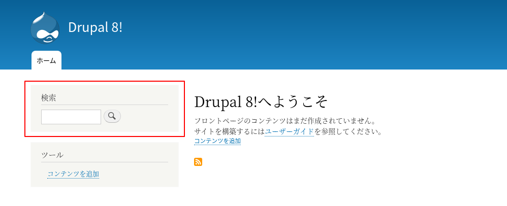
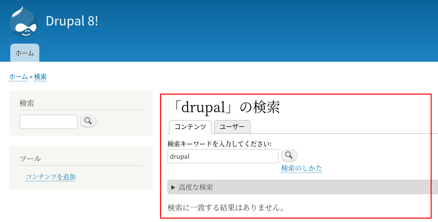
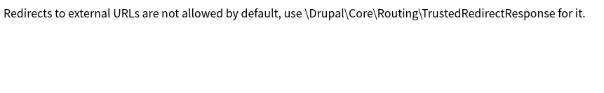

<!-- _class: lead -->
# 2.16 イベントサブスクライバーとリダイレクト

---

このセクションでは、イベントサブスクライバーによるリダイレクトの実装について解説します。

システムがあるリクエストを受け取った時に、別のページにリダイレクトするケースがよくあります。

条件が毎回同じであればアプリケーションではなくWebサーバーなどで実現することもできますが、条件が動的に変化する場合はアプリケーションで実装する必要があります。

---

Drupal 7では、`hook_init` という全てのリクエスト受信時にトリガーされるフックがありました。このフックで条件を判断し、`drupal_goto` をコールすることで動的なリダイレクトを実現するというのが、Drupal 7の典型的な実装例です。

Drupal 8では、このインターフェースは完全に撤廃されました。

その代わりに、Symfonyの [kernel.request](https://symfony.com/doc/current/components/http_kernel.html) イベントに対してイベントハンドラーを登録 (Subscribe)し、リダイレクトを実現することになります。

---

このセクションを読み進めるためには、Drupalがリエクストを受けてからレスポンスを返すまでの一連のシーケンスを把握しておく必要があります。

これは、「1.1.5 リクエストからレスポンスまでの流れ」ですでに解説しています。

忘れてしまった方は、先に進む前にもう一度読み返しておきましょう。

---

<!-- _class: lead -->
# 2.16.1 リダイレクト

---

コードを書き始める前に、Drupal 8でリダイレクトをどのように実装するかを簡単に解説します。

「1.1.5 リクエストからレスポンスまでの流れ」ですでに解説している通り、Drupal 8の一連のライフライクルは、Symfony HttpFoundationコンポーネントの [Request](https://symfony.com/doc/current/components/http_foundation.html#request) を受け取り [Response](https://symfony.com/doc/current/components/http_foundation.html#response) を返すのが基本的な流れになります。

ここまでのセクションでは、コントローラーが返すレスポンスはDrupalの[Render Arrays](https://www.drupal.org/docs/8/api/render-api/render-array) として実装してきました。

コントローラーが返したRender Arraysは、最終的にDrupalコアによってResponseオブジェクトに変換されます。

---

しかし、Render Arraysではなく、コントローラーが直接Responseオブジェクトを返すこともできます。

例えば、以下の様に実装すると、`hello` という文字を含んだブランクページを表示することができます。

```php
return new \Symfony\Component\HttpFoundation\Response('hello');
```

この実装方法はDrupalのテーマレイヤーをバイパスするので、通常のユースケースでは使う必要性はありません。

なぜこの例を提示したかというと、コントローラーでリダイレクトを行う場合も設計としては全く同じだからです。

---

リダイレクトする場合は、単にResponseではなく [RedirectResponse](https://api.drupal.org/api/drupal/vendor%21symfony%21http-foundation%21RedirectResponse.php/class/RedirectResponse/) を返すだけです。

[RedirectResponse](https://github.com/symfony/http-foundation/blob/v4.4.7/RedirectResponse.php#L19) クラスのコードを見ると、Responseクラスのサブクラスであることが分かりますね。

例えば、`/node/1` にリダイレクトする場合は以下のようなコードになります。

```php
return new \Symfony\Component\HttpFoundation\RedirectResponse('node/1');
```

---

Drupalでは、よりセキュリティに考慮したリダイレクトを実現するために、以下のサブクラスが用意されています。実際にプロダクトのコードを書く際は、RedirectResponseではなくこれらのサブクラスを使うほうが良いでしょう。

- [LocalRedirectResponse](https://github.com/drupal/drupal/blob/8.8.0/core/lib/Drupal/Core/Routing/LocalRedirectResponse.php)
- [TrustedRedirectResponse](https://github.com/drupal/drupal/blob/8.8.0/core/lib/Drupal/Core/Routing/TrustedRedirectResponse.php)

---

<!-- _class: lead -->
# 2.16.2 イベントサブスクライバー

---

それでは、イベントサブスクライバーを実装していきます。

Drupal 8をstandard profileでインストールすると、デフォルトでsearchモジュールが有効になっており、左のサイドバーから検索機能が利用できます。



---

このモジュールは、 `/search/node` というパスに検索結果を表示します。



---

hello_worldモジュールにイベントサブスクライバーを実装して、「**anonymousユーザーが /search/node にアクセスした時に https://google.com にリダイレクトする**」ように、イベントサブスクライバーを実装しましょう。

---

イベント処理の中心となるのは `event_dispatcher` サービスです。このサービスは、内部の実装的には `ContainerAwareEventDispatcher` のインスタンスになります。

このサービスは、`Event` クラスのオブジェクトにラッピングされたペイロードをイベント名に応じて制御します。

※別のセクションで独自のevent_dispatcherも開発しますのでお楽しみに！ :smile:

---

`EventSubscriberInterface` を実装したクラスに受信したいイベントとそのコールバックを定義すると、`event_dispatcher` から `Event` のオブジェクトが渡され、データや振る舞いに介入することができます。

イベントサブスクライバーはサービスとして登録します。また、イベントサブスクライバーはサービスの定義の `tags` に `event_subscriber` をセットする必要があります。

---

それでは、`hello_world.services.yml` に以下を追加してください。

```yml
  hello_world.redirect_subscriber:
    class: '\Drupal\hello_world\EventSubscriber\HelloWorldRedirectSubscriber'
    arguments: ['@current_user']
    tags:
      - { name: event_subscriber }
```

---

`class` には `EventSubscriberInterface` を実装したクラスを指定します

`arguments` には、依存するサービスを `@+サービス名` の形式で指定します。

なお、各サービスの名称は、DrupalConsoleの `debug:container` サブコマンドで確認することができます。

```txt
$ vendor/bin/drupal debug:container
 ...

 cron                                                              Drupal\Core\ProxyClass\Cron                                            
 csrf_token                                                        Drupal\Core\Access\CsrfTokenGenerator                                  
 current_route_match                                               Drupal\Core\Routing\CurrentRouteMatch                                  
 current_user                                                      Drupal\Core\Session\AccountProxy                                       
 database                                                          Drupal\Core\Database\Connection                           

 ... 
```

---

今回はアクセスしたユーザーのロール情報が必要になるので、 `@current_user` をargumentsに指定しました。

また、先に解説したとおり `tags` には `event_subscriber` を必ずセットする必要があります。

`arguments` と `tags` はここで初めて利用しましたが、Drupal特有のものではなくSymfonyのサービスコンテナを利用しているだけです。

これらのパラメータの詳細については以下を参照してください。
- [Service Parameters](https://symfony.com/doc/current/service_container.html#service-parameters)
- [How to Work with Service Tags](https://symfony.com/doc/current/service_container/tags.html)

---

次に、ymlで指定したクラスを次のように実装してください。

---

```php
<?php

namespace Drupal\hello_world\EventSubscriber;

use Symfony\Component\HttpKernel\KernelEvents;
use Drupal\Core\Session\AccountProxyInterface;
use Symfony\Component\EventDispatcher\EventSubscriberInterface;
use Symfony\Component\HttpFoundation\RedirectResponse;
use Symfony\Component\HttpKernel\Event\GetResponseEvent;

/**
 * An example of the EventSubscriber.
 *
 * Subscribes to the Kernel Request event and redirects to the google
 * when the user has the "annoymouse" role.
 */
class HelloWorldRedirectSubscriber implements EventSubscriberInterface {

  /**
   * The current user.
   *
   * @var \Drupal\Core\Session\AccountProxyInterface
   */
  protected $currentUser;

  // (続く)
}
```

---

```php
  /**
   * Constructor.
   *
   * @param \Drupal\Core\Session\AccountProxyInterface $current_user
   *   The current user.
   */
  public function __construct(AccountProxyInterface $current_user) {
    $this->currentUser = $current_user;
  }

  /**
   * {@inheritdoc}
   */
  public static function getSubscribedEvents() {
    $events[KernelEvents::REQUEST][] = ['onRequest', 0];
    return $events;
  }

  // (続く)
```

---

```php
  /**
   * Handler for the kernel request event.
   *
   * @param \Symfony\Component\HttpKernel\Event\GetResponseEvent $event
   *   The response event.
   */
  public function onRequest(GetResponseEvent $event) {
    $path = $event->getRequest()->getPathInfo();
    if ($path !== '/search/node') {
      return;
    }

    if ($this->currentUser->isAnonymous()) {
      /** @var \Symfony\Component\HttpFoundation\RedirectResponse $response */
      $response = new RedirectResponse('https://google.com');
      $event->setResponse($response);
    }
  }

}

```
---

全てのイベントサブスクライバーは、 `EventSubscriberInterface` を実装する必要があります。

サービスの定義で `arguments` に `@current_user` を指定したので、このクラスのコンストラクタでは引数でこれを受け取る必要があります。

`@current_user` のオブジェクトは、`AccountProxyInterface` としてコンストラクタに渡されます。

これは、先ほど少し出てきたDrupalConsoleの `debug:container` サブコマンドで確認することができます。`Interface(s)` の出力結果がサービスに渡ってくる引数のクラスです。

---

```txt
$ vendor/bin/drupal debug:container current_user
 Service      Service                                                                                         
 Class        Class                                                                                           
 Interface(s) Drupal\Core\Session\AccountProxyInterface: Drupal\Core\Session\AccountProxyInterface            
              Drupal\Core\Session\AccountInterface: Drupal\Core\Session\AccountInterface                      
                                                                                                              
 Methods      __construct(Symfony\Component\EventDispatcher\EventDispatcherInterface $eventDispatcher = NULL) 
              __sleep()                                                                                       
              __wakeup()                                                                                      
              getAccount()                                                                                    
              getAccountName()                                                                                
              getDisplayName()                                                                                
              getEmail()                                                                                      
              getLastAccessedTime()                                                                           
              getPreferredAdminLangcode($fallback_to_default = true)                                          
              getPreferredLangcode($fallback_to_default = true)                                               
              getRoles($exclude_locked_roles = false)                                                         
              getTimeZone()                                                                                   
              getUsername()                                                                                   
              hasPermission($permission)                                                                      
              id()                                                                                            
              isAnonymous()                                                                                   
              isAuthenticated()                                                                               
              setAccount(Drupal\Core\Session\AccountInterface $account)                                       
              setInitialAccountId($account_id)
```

---

`getSubscribedEvents` メソッドで、どのイベントを受信したいかを多次元配列で表明します。

配列のキーはイベント名です。今回は `KernelEvents::REQUEST` としました。つまり、このイベントサブスクライバーは全てのHTTPリクエストの度に動作することになります。

イベントにはSymfonyのコンポーネントで定義されているものの他に、Drupalが独自に定義しているイベントもあります。

Symfonyが定義するイベントの詳細は以下のドキュメントを参照してください。
- [The HttpKernel Component - Creating an Event Listener](https://symfony.com/doc/current/components/http_kernel.html#creating-an-event-listener)

---

Drupalが独自に定義しているイベントは、DrupalConsoleの `debug:event` サブコマンドで確認することができます。

```txt
$ vendor/bin/drupal debug:event
 --------------------------------------------------------- 
  Event Name                                               
 --------------------------------------------------------- 
  routing.route_finished                                   
  config.save                                              
  config.delete                                            
  config.importer.missing_content                          
  kernel.request                                           
  routing.route_dynamic                                    
  config.importer.validate                                 
  routing.route_alter                                      
  kernel.response                                          
  kernel.exception                                         
  kernel.view                                              
  kernel.finish_request                                    
  kernel.terminate                                         
  config.importer.import                                   
  config.transform.import                                  
  config.transform.export                                  
  kernel.controller                                        
  render.page_display_variant.select                       
  config_translation.populate_mapper                       
  config.collection_info                                   
  config.rename                                            
  language.save_override                                   
  language.delete_override                                 
  locale.save_translation                                  
  account.set                                              
  entity_type.definition.create                            
  entity_type.definition.update                            
  entity_type.definition.delete                            
  kernel.container.finish_container_initialize_subrequest  
 ---------------------------------------------------------
```

---

コマンドの引数にイベント名を指定すると、そのイベントに対して登録されているクラスとコールバックメソッド、優先度を確認することもできます。

```txt
vendor/bin/drupal debug:event routing.route_alter
 ---------------------------------------------------------------------- ------------------------------------------------- 
  Class                                                                  Method                                           
 ---------------------------------------------------------------------- ------------------------------------------------- 
  Drupal\Core\EventSubscriber\RouteMethodSubscriber                      onRouteBuilding: 5000                            
  Drupal\devel\Routing\RouteSubscriber                                   onAlterRoutes: 0                                 
  Drupal\Core\EventSubscriber\ModuleRouteSubscriber                      onAlterRoutes: 0                                 
  Drupal\Core\EventSubscriber\SpecialAttributesRouteSubscriber           onAlterRoutes: 0                                 
  Drupal\big_pipe\EventSubscriber\NoBigPipeRouteAlterSubscriber          onRoutingRouteAlterSetNoBigPipe: 0               
  Drupal\node\Routing\RouteSubscriber                                    onAlterRoutes: 0                                 
  Drupal\node\EventSubscriber\NodeAdminRouteSubscriber                   onAlterRoutes: 0                                 
  Drupal\field_ui\Routing\RouteSubscriber                                onAlterRoutes: 0                                 
  Drupal\config_translation\Routing\RouteSubscriber                      onAlterRoutes: 0                                 
  Drupal\Core\EventSubscriber\EntityRouteAlterSubscriber                 onRoutingRouteAlterSetType: -150                 
  Drupal\views\EventSubscriber\RouteSubscriber                           onAlterRoutes: 0                                 
  Drupal\system\EventSubscriber\AdminRouteSubscriber                     onAlterRoutes: 0                                 
  Drupal\content_translation\Routing\ContentTranslationRouteSubscriber   onAlterRoutes: 0                                 
  Drupal\Core\EventSubscriber\ParamConverterSubscriber                   onRoutingRouteAlterSetParameterConverters: -220  
  Drupal\Core\Routing\RoutePreloader                                     onAlterRoutes: 0                                 
  Drupal\Core\EventSubscriber\PathRootsSubscriber                        onRouteAlter: -1024                              
 ---------------------------------------------------------------------- -------------------------------------------------
```

---

配列の値にはコールバックメソッド名、優先度を順に設定します。サンプルコードでは、 `['onRequest', 0]` としています。

優先度は低いほうが優先度が高く、先にコールバックメソッドが実行されます。コールバックメソッドが `setResponse` メソッドでレスポンス内容を設定した場合はそこで処理が終了し、それより優先度の低いイベントサブスクラバーのコールバックは実行されません。

---

それでは、動作を確認してみましょう。anonymousユーザーで `/search/node` にアクセスしてください。期待に反して例外が発生し、

```
Redirects to external URLs are not allowed by default, use \Drupal\Core\Routing\TrustedRedirectResponse for it.
```

が表示されたと思います。



---

コントローラーやイベントサブスクライバーが `RedirectResponse` のインスタンスを返すと、Drupalはリダイレクト先が「安全なドメインかどうか」チェックし、安全ではないと判断した場合はこのメッセージが表示されます。

この制御は [RedirectResponseSubscriber::checkRedirectUrl](https://github.com/drupal/drupal/blob/8.8.0/core/lib/Drupal/Core/EventSubscriber/RedirectResponseSubscriber.php#L76) で実装されており、最終的には、[LocalAwareRedirectResponseTrait::isLocal](https://github.com/drupal/drupal/blob/8.8.0/core/lib/Drupal/Core/Routing/LocalAwareRedirectResponseTrait.php#L29) で安全かどうかが判断されます。

---

外部ドメインに対してリダイレクトをする場合、前述したとおり `TrustedRedirectResponse` を利用します。コードを次のとおり変更してください。

```php
use Drupal\Core\Routing\TrustedRedirectResponse;
// ...

    if ($this->currentUser->isAnonymous()) {
      /** @var \Drupal\Core\Routing\TrustedRedirectResponse $response */
      $response = new TrustedRedirectResponse('https://google.com');
      $event->setResponse($response);
    }
```

---

それでは、キャッシュをクリアしてからanonymousユーザーで `/search/node` にアクセスしてください。Googleにリダイレクトされれば成功です。


---

しかし、実はこのコードにもまだバグがあります。

そのままキャッシュをクリアせずに、Drupalにログインしてから `/search/node` にアクセスしてください。anonymousユーザー以外はリダイレクトされないはずですが、Googleにリダイレクトされると思います。

これは、`TrustedRedirectResponse` が `CacheableResponseInterface` という「キャッシュ可能なレスポンス」として実装されているためです。

---

次のようにコードを変更して、レスポンスヘッダの [max-age](https://developer.mozilla.org/en-US/docs/Web/HTTP/Headers/Cache-Control) が明示的に `0` になるようにしましょう。

```php
     if ($this->currentUser->isAnonymous()) {
       /** @var \Drupal\Core\Routing\TrustedRedirectResponse $response */
       $response = new TrustedRedirectResponse('https://google.com');
       $response->getCacheableMetadata()->setCacheMaxAge(0);
       $event->setResponse($response);
     }
```

---

再度キャッシュをクリアしてから、以下の動作になることを確認してください。

1. anonymousユーザーで `/search/node` にアクセスすると、Googleにリダイレクトされること
2. 1.のあとにDrupalにログインしてから　`/search/node` にアクセスすると、Googleにリダイレクトされずにsearchモジュールの検索画面が表示されること

---

なお、 `$response->setCacheMaxAge(0);` のように実装しても期待通り動作しない点に注意してください。TrustedRedirectResponseの場合、レスポンスを返す際にこのプロパティは参照されません。

興味がある方は [CacheableSecuredRedirectResponse::fromResponse](https://github.com/drupal/drupal/blob/8.8.0/core/lib/Drupal/Core/Routing/CacheableSecuredRedirectResponse.php#L20) の実装を見てみましょう。

---

リダイレクトのレスポンスをキャッシュすべきかどうかはケースバイケースで判断する必要があります。

今回の例ではレスポンスがロール毎に異なるため、ロール単位でキャッシュする、ユーザー単位でキャッシュする、完全にキャッシュしない、などの選択肢が考えられます。サンプルコードでは、実装を簡単にするために完全にキャッシュしない実装にしています。

例えば「ユーザー単位でキャッシュする」という設計にした場合、ユーザーのロール設定が変わった時にキャッシュをクリアする処理もセットで考慮する必要があります。

---

Drupalにはある単位でキャッシュを制御するための [Cache Tag](https://www.drupal.org/docs/8/api/cache-api/cache-tags) という仕組みが用意されています。効率的にキャッシュしたい場合はこの仕組みを利用するのが良いでしょう。

キャッシュについては本セクションの趣旨ではないので、ここでの詳細な解説は割愛しますが本コンテンツの後半で解説します。

----

## まとめ

このセクションでは、イベントサブスクライバーによるリダイレクトの実装について解説しました。

リダイレクトの実装に当たっては、キャッシュのコントロールやセキュリティの問題が発生しないように、フレームワーク内部の動きもしっかりと把握しておきましょう。

---

## ストレッチゴール

1. URLエイリアス (/admin/config/search/path) の機能を使い、 `/node/search` に `/mysearch` でもアクセスできるように設定してください。`/mysearch` にアクセスすると、実装したリダイレクトの処理が動作しないことが分かります。この問題を解消するために、リダイレクトするかどうかをパスではなくルート名で判断するように変更してください。なお、ルート名はDrupalConsoleのサブコマンドで確認することができます。

---

2. `/search/node` では検索キーワードを入力して検索結果をフィルターすることができます。Googleにリダイレクトする際に、検索キーワードをgoogle側に引き継ぐように変更してください。
