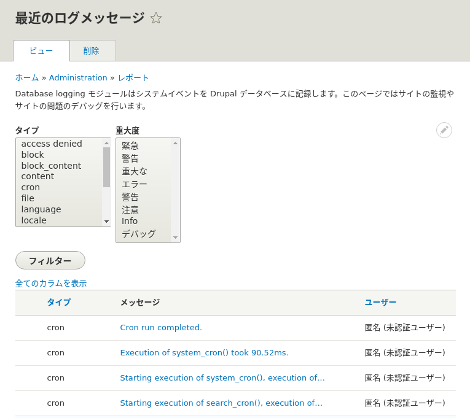

<!-- _class: lead -->
# 2.18 ロギング

---

このセクションではDrupalでログを出力する方法について解説します。

---

<!-- _class: lead -->
# 2.18.1 Database Logging (a.k.a Watchdog)

---

Drupalをstandard profileでインストールすると、デフォルトで `Database Logging` (dblog)モジュールが有効になっています。

このモジュールはデータベース上の `watchdog` というテーブルにログを保存します。

どんなデータ構造になっているか簡単に見てみましょう。

---

```txt
 ❯ vendor/bin/drush sqlc
SQLite version 3.31.1 2020-01-27 19:55:54
Enter ".help" for usage hints.
sqlite> .mode line
sqlite> .schema watchdog
CREATE TABLE watchdog (
wid INTEGER PRIMARY KEY AUTOINCREMENT,
uid INTEGER NOT NULL CHECK (uid>= 0) DEFAULT 0,
type VARCHAR(64) NOT NULL DEFAULT '',
message TEXT NOT NULL,
variables BLOB NOT NULL,
severity INTEGER NOT NULL CHECK (severity>= 0) DEFAULT 0,
link TEXT NULL DEFAULT NULL,
location TEXT NOT NULL,
referer TEXT NULL DEFAULT NULL,
hostname VARCHAR(128) NOT NULL DEFAULT '',
timestamp INTEGER NOT NULL DEFAULT 0
);
CREATE INDEX watchdog_type ON watchdog (type);
CREATE INDEX watchdog_uid ON watchdog (uid);
CREATE INDEX watchdog_severity ON watchdog (severity);
```

---

```txt
sqlite> select * from watchdog limit 1
      wid = 109
      uid = 0
     type = mail
  message = Error sending email (from %from to %to with reply-to %reply).
variables = a:3:{s:5:"%from";s:17:"admin@example.org";s:3:"%to";s:17:"admin@example.org";s:6:"%reply"; ...
 severity = 3
     link =
 location = http://127.0.0.1:8088/
  referer =
 hostname = 127.0.0.1
timestamp = 1579867593
```

dblogモジュールは管理用のUIも提供しています。管理者ロールを持つアカウントで `/admin/reports/dblog` にアクセスするとブラウザからログを確認することができます。

---



---

<!-- _class: lead -->
# 2.18.2 syslog

---

デフォルトでは有効になっていませんが、Drupalコアではsyslogモジュールも提供されています。名前の通り、ログは [syslog](https://en.wikipedia.org/wiki/Syslog) として出力されます。

Drupalでは複数のログ出力を併用できるようになっているため、dblogとsyslogは同時に利用可能です。

---

<!-- _class: lead -->
# 2.18.3 ログの書き込み

---

Drupal 7では `watchdog` というグローバル関数を使うことでログを出力することができました。

例によってこのAPIはDrupal 8では削除されています。しかし、これによりDrupalのロギングインターフェースは [PSR-3](https://www.php-fig.org/psr/psr-3/) に準拠した設計に変更されています。

これはAPIの学習コストや周辺ツールとの連携を考えると非常に大きなメリットです。

---

Drupal 8でログを出力するのは非常に簡単です。以下のコードでログが出力されます。

```php
\Drupal::logger('hello_world')->info('hello!');
```

`\Drupal::logger` の引数で渡しているのは「チャンネル名」です。これはログのカテゴリのようなもので、Drupal 7の `watchdog` 関数の `$type` 引数に相当します。

チャンネルを適切に分割することで、ログの分析が簡単になるというメリットがあります。チャンネル名には任意の文字列が利用可能ですが、名前が衝突しないようにモジュール名が利用されるケースが多いようです。

---

2.10章でも紹介したように、`\Drupal` クラスのstaticメソッドの多くは、頻繁に利用するサービスコンテナを取得するためのヘルパーメソッドです。

そのため、先ほどのサンプルコードは、

```php
\Drupal::service('logger.factory')->get('hello_world')->info('hello!');
```

のように書いても等価になります。

---

※実際のプロダクトのコードでは、`logger.factory` をDIの機能で渡すようにしましょう。このサービスのインターフェースは以下のように確認することができます。

```txt
$ vendor/bin/drupal debug:container logger.factory
 Service      Service
 Class        Class
 Interface(s) Drupal\Core\Logger\LoggerChannelFactoryInterface: Drupal\Core\Logger\LoggerChannelFactoryInterface
              Symfony\Component\DependencyInjection\ContainerAwareInterface: Symfony\Component\DependencyInjection\ContainerAwareInterface

 Methods      addLogger(Psr\Log\LoggerInterface $logger, $priority = 0)
              get($channel)
              setContainer(Symfony\Component\DependencyInjection\ContainerInterface $container = NULL)
```

---

`\Drupal::logger` および `LoggerChannelFactory::get` は `\Drupal\Core\Logger\LoggerChannelInterface` のインスタンスを返します。

このインターフェースは `\Psr\Log\LoggerInterface` を継承しているため、[PSR-3](https://www.php-fig.org/psr/psr-3/) に準拠した次のAPIが利用できます。

```php
public function emergency($message, array $context = array());
public function alert($message, array $context = array());
public function critical($message, array $context = array());
public function error($message, array $context = array());
public function warning($message, array $context = array());
public function notice($message, array $context = array());
public function info($message, array $context = array());
public function debug($message, array $context = array());
public function log($level, $message, array $context = array());
```

---

[PSR-3](https://www.php-fig.org/psr/psr-3/) を読んだことがない方は、この機会に目を通しておきましょう。

`dblog` や `syslog` 以外にも、独自のロガーを定義してログを出力することもできますが、ここでの解説は割愛します。

ログの加工や転送に関しては、アプリケーションで実装する以外にもfluentd等のツールを組み合わせて実現する方法もあります。

Drupal上での実装にこだわらず、プロダクトの性質に合わせて適切な手段で実現してください。

---

## まとめ

このセクションではDrupalでログを出力する方法について解説しました。

独自のロガーの実装に興味がある方は、[log_stdout](https://www.drupal.org/project/log_stdout) モジュールのコードを見てみることを推奨します。

このモジュールは、主にDocker環境向けにログをstdout/stderrに出力するもので、とてもシンプルな実装になっています。
