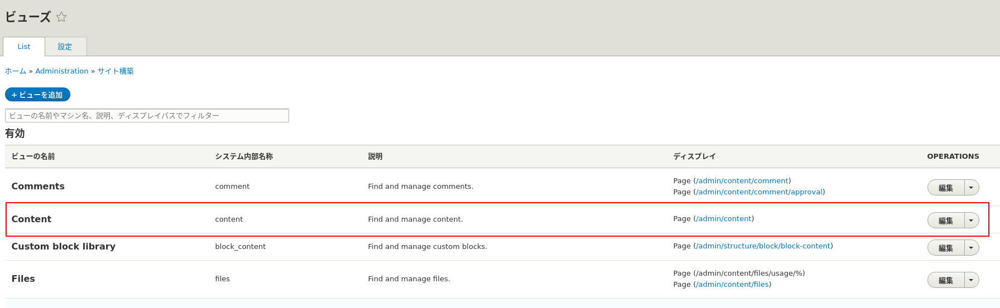
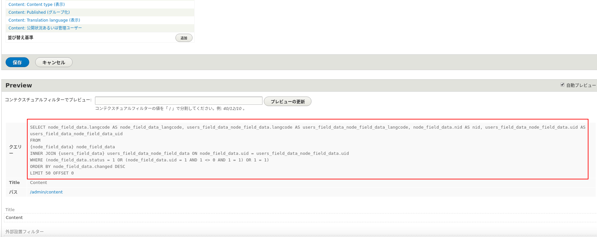
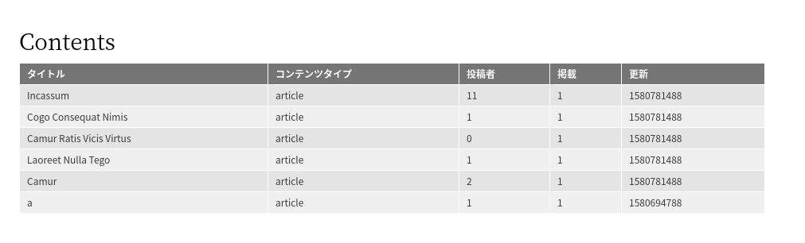
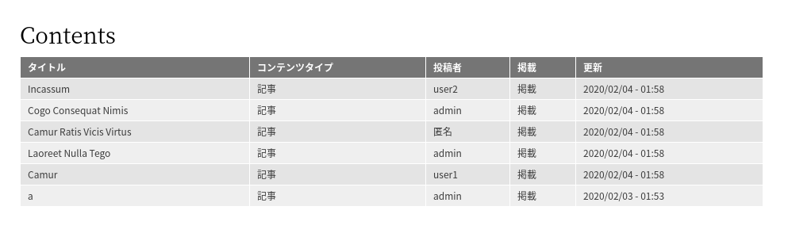

<!-- _class: lead -->
# 2.20 データベースAPI (1)

---

このセクションでは、DrupalのデータベースAPIについて解説します。

[Viewsによるコンテンツ一覧ページの作成](https://thinkit.co.jp/article/10077) でも紹介されているように、DrupalにはViewsというUI生成機能も備えるSQLビルダーのような機能があります。

また、モデルを[Entity](https://www.drupal.org/docs/8/api/entity-api/introduction-to-entity-api-in-drupal-8)として実装すれば、CRUDの処理や画面のレイアウトなどのほとんどはフレームワーク側に任せることができます。

そのため、「**UIを作成する**」目的でSQLを書かないといけないようなシチュエーションはそれほど多くありません (頻繁にあるようならプロダクトの設計を疑いましょう)。

---

しかし、
- 何らかのビジネスロジックのために特定の条件でデータを取得・更新したい
- パフォーマンスの観点から最適化されたクエリを発行したい

などのケースでは、Drupal内部のデータ構造とアクセスするためのAPIの理解が必要になります。

---

セクション全体を通して、Viewsで実現されているコンテンツ一覧 (`/admin/contents`) の簡易版をコードで実装していきます。

この過程で、Drupal内部のデータ構造とアクセスするためのAPIの理解を深めていきましょう。

このセクションを読み進めるためには、ノードのデータ構造の概要を把握しておく必要があります。先に以下の記事に目を通しておいてください。

- [Drupal 8のノードのデータ構造を見てみる (1)](https://annai.co.jp/article/drupal8-node-structure-1)
- [Drupal 8のノードのデータ構造を見てみる (2)](https://annai.co.jp/article/drupal8-node-structure-2)

---

<!-- _class: lead -->
## 2.20.1 デフォルトのコンテンツ一覧 (Views)

---

まず、Viewsで実現されているデフォルトのコンテンツ一覧 (`/admin/contents`) のユーザーインターフェースと、発行されるSQLクエリを見てみましょう。

デフォルトの設定ではViewsが発行するSQLクエリは見ることができません。

[Viewsが出力するSQLクエリーを確認してみる](https://thinkit.co.jp/article/10077?page=0%2C1#views-sql-) を参考に、SQLクエリーを表示できるように設定を変更してください。

---

設定を変更したら、ツールバーから「管理 > サイト構築 > Views」(/admin/structure/views) に進んでください。

`ディスプレイ` カラムを見ると、 `Content` が `/admin/content` のルーティングに対して応答するViewsの定義であることが分かります。



---

「編集」をクリックしてこのViewsが発行するSQLクエリを確認してみましょう。



---

以下のような、それなりに長いSQLが発行されていることが分かります。

```SQL
SELECT
node_field_data.langcode AS node_field_data_langcode,users_field_data_node_field_data.langcode AS users_field_data_node_field_data_langcode,
node_field_data.nid AS nid, users_field_data_node_field_data.uid AS users_field_data_node_field_data_uid

FROM
{node_field_data} node_field_data

INNER JOIN {users_field_data} users_field_data_node_field_data
ON node_field_data.uid = users_field_data_node_field_data.uid

WHERE
(node_field_data.status = 1 OR (node_field_data.uid = 1 AND 1 <> 0 AND 1 = 1) OR 1 = 1)

ORDER BY node_field_data.changed DESC

LIMIT 50 OFFSET 0
```

---

このViewsで生成される一覧では、タイトルやコンテンツタイプ、掲載状態などをユーザーが入力してフィルターできるようになっています。そのため、実際にはもう少し複雑なSQLクエリが発行されることもあります。

全ての入力項目に値を入れて検索した場合は次のようなSQLが発行されます。

---

```SQL
SELECT node_field_data.langcode AS node_field_data_langcode, users_field_data_node_field_data.langcode AS users_field_data_node_field_data_langcode,
node_field_data.nid AS nid, users_field_data_node_field_data.uid AS users_field_data_node_field_data_uid

FROM
{node_field_data} node_field_data

INNER JOIN {users_field_data} users_field_data_node_field_data ON node_field_data.uid = users_field_data_node_field_data.uid

WHERE (node_field_data.title LIKE '%hello%' ESCAPE '\')
AND (node_field_data.type IN ('page'))
AND (node_field_data.status = '1')
AND (node_field_data.langcode IN ('ja'))
AND ((node_field_data.status = 1
OR (node_field_data.uid = 1 AND 1 <> 0 AND 1 = 1) OR 1 = 1))

ORDER BY node_field_data.changed DESC

LIMIT 50 OFFSET 0
```

---

この時点でSQLを直接書かずにViewsに任せた方が幸せになれる雰囲気が漂っていますね。

先のSQLをざっと見てみると、`node_field_data` と `users_field_data` の2つのテーブルを `uid` というカラムでJOINしていることが分かります。

他の多くのフレームワークやO/Rマッパーと同様に、Drupalでも生のSQLを直接書けるAPIと、抽象化されたAPIの両方が用意されています。

同等の機能をこの2種類のAPIを使って実装していきましょう。

---

<!-- _class: lead -->
## 2.15.2 SQL文を直接組み立ててアクセスする

---

まずは、SQLを直接組み立てる低レベルなAPIを使ってコンテンツの一覧を作成していきましょう。

以下のスペックを目指して機能を実装していきます。
- `/custom_admin_content` にアクセスされたらコンテンツの一覧を表示する
- 表示するカラムは `/admin/content` と同様にする(ただし「操作」カラムは除く)
- ユーザー入力によるフィルターはまずは実装しない

---

Drupal 8でデータベースにアクセスするには `database` サービスを利用します。

例によってこのサービスのクラスを確認しましょう。

```txt
 $ vendor/bin/drupal debug:container
Service ID                                                        Class Name
 ...

 database                                                          Drupal\Core\Database\Connection
```

`Drupal\Core\Database\Connection` で定義されていることが分かります。

---

それでは、ルートとコントローラーを実装しましょう。

hello_world.routing.yml に以下を追加してください。

```yml
hello_world.admin_content_replica:
  path: '/custom_admin_content'
  defaults:
    _controller: '\Drupal\hello_world\Controller\HelloWorldController::showContent'
    _title: 'Contents'
  requirements:
    _access: 'TRUE'
```

---

次はコントローラーの実装です。`showContent` メソッドを新しく追加する以外に、このメソッドが `database` サービスを参照できるようにする必要があります。

HelloWorldController.php を次のように変更してください。

---

```php
// ...
use Drupal\Core\Database\Connection;
// ...

class HelloWorldController extends ControllerBase {
  // ...

  /**
   * The database connection.
   *
   * @var \Drupal\Core\Database\Connection
   */
  protected $database;

  // (続く)
```

---

```php
  /**
   * A construtor of HelloWorldController.
   *
   * @param \Drupal\hello_world\EchoMessageServiceInterface $messenger
   *   The messengdatabaseer service.
   * @param \Drupal\Core\Config\ConfigFactoryInterface $config_factory
   *   The configuration service.
   * @param \Drupal\hello_world\Plugin\CalculatorPluginManager $plugin_manager
   *   The plugin manager service.
   * @param \Drupal\Core\Database\Connection $database
   *   The database connection.
   */
  public function __construct(
    EchoMessageServiceInterface $messenger,
    ConfigFactoryInterface $config_factory,
    CalculatorPluginManager $plugin_manager,
    Connection $database
  ) {
    $this->messenger = $messenger;
    $this->configFactory = $config_factory;
    $this->pluginManager = $plugin_manager;
    $this->database = $database;
  }

  /**
   * {@inheritDoc}
   */
  public static function create(ContainerInterface $container) {
    return new static(
      $container->get('hello_world.messenger'),
      $container->get('config.factory'),
      $container->get('plugin.manager.calculator'),
      $container->get('database')
    );
  }
```

---

createメソッドでコンストラクタに `database` サービスを渡すようにしただけですね。？？？になった方は「2.10.5 Dependency Injectionによるサービスの注入」を見直しましょう。

それでは、いよいよ本題です。`showContent` を次のように実装してください。

---

```php
  /**
   * Show contents with Database API.
   *
   * @see https://www.drupal.org/docs/8/api/database-api/static-queries
   */
  public function showContent() {
    $query = <<<EOS
SELECT
node_field_data.nid AS node_field_data_nid,
node_field_data.title AS node_field_data_title,
node_field_data.type AS node_field_data_type,
node_field_data.status AS node_field_data_status,
node_field_data.changed AS node_field_data_changed,
users_field_data_node_field_data.uid AS users_field_data_node_field_data_uid
FROM {node_field_data} node_field_data
INNER JOIN {users_field_data} users_field_data_node_field_data
ON node_field_data.uid = users_field_data_node_field_data.uid
ORDER BY node_field_data.changed DESC
LIMIT 50 OFFSET 0
EOS;

    $records = $this->database->query($query)->fetchAll();

    $header = [
      $this->t('title'),
      $this->t('content type'),
      $this->t('author'),
      $this->t('published'),
      $this->t('updated'),
    ];

    $rows = [];
    foreach ($records as $record) {
      $rows[] = [
        $record->node_field_data_title,
        $record->node_field_data_type,
        $record->users_field_data_node_field_data_uid,
        $record->node_field_data_status,
        $record->node_field_data_changed,
      ];
    }

    return [
      '#theme' => 'table',
      '#header' => $header,
      '#rows' => $rows,
    ];
  }
```

---

いかにもすぐに破綻しそうな実装ですが、コードを見てみましょう。

`$query` には生のSQLが文字列として設定されています。このSQLは、先程確認したViewsが発行するものとはかなり違う点に注意してください。

Viewsには、「データを取得する機能」と「データを表示する機能」の両方が含まれています。Viewsの管理画面で表示されるSQLは前者を行うためのSQLです。つまり、Viewsの管理画面のSQLをそのまま実行してもViewsと同じ画面を作れるわけではありません。

Viewsが発行するSQLを見てみると、ノートのタイトルや投稿者名を取得していないことが分かると思います。

---

`database` サービスの `query` メソッドに生のSQL文を渡すと任意のクエリを発行する事ができます。

このAPIは、ドキュメントでは [Static Queries](https://www.drupal.org/docs/8/api/database-api/static-queries) という名前で紹介されています。

[fetchAll](https://api.drupal.org/api/drupal/core%21lib%21Drupal%21Core%21Database%21Statement.php/function/Statement%3A%3AfetchAll) で、クエリの結果を [stdClass](https://www.php.net/manual/en/reserved.classes.php) のオブジェクトの配列として取得しています。

配列に格納されているオブジェクトに対して、SELECT構文で指定したプロパティ名でデータにアクセスすることができます。

---

メソッドの最後では、いつものようにRender Arraysを返していますが、 `#theme` キーに `table` を指定してテーブル形式で出力するようにしています。

このように実装することで、Drupalコアが提供する [Table](https://api.drupal.org/api/drupal/core%21lib%21Drupal%21Core%21Render%21Element%21Table.php/class/Table/) 表示向けのレンダラーに処理を任せることができます。

このあたりを深堀りしだすとスライドが軽く100枚は必要になるので、詳細な解説は3章で別途行います。

この時点では、「`$header` と `$rows` のデータをテーブル形式で表示している」という点だけ理解して進めてください。

---

それでは、`/custom_admin_content` にアクセスして動作を確認しましょう。次のように表示されれば成功です。



---

さて、デフォルトのコンテンツの一覧と完全に同じ表示に合わせるには、ここから次の変更が必要になります。

- 「コンテンツタイプ」の値を翻訳する
- 「投稿者名」をユーザーIDからユーザ名に変更する
- 「状態」の値を翻訳する
- 「更新」の時刻フォーマットを変更する

これらに対応するために$rowsを生成するコードを次のように変更してみましょう。

---

```php
    $rows = [];
    foreach ($records as $record) {
      /** @var \Drupal\node\Entity\NodeType $node_type */
      $node_type = \Drupal::entityManager()->getStorage('node_type')->load($record->node_field_data_type);
      /** @var \Drupal\user\Entity\User $account */
      $account = \Drupal\user\Entity\User::load($record->users_field_data_node_field_data_uid);
      /** @var \Drupal\Core\Datetime\DateFormatterInterface $date_formatter */
      $date_formatter = \Drupal::service('date.formatter');

      $rows[] = [
        $record->node_field_data_title,
        $node_type->get('name'),
        $account->getDisplayName(),
        $record->node_field_data_status == 1 ? $this->t('published') : $this->t('unpublished'),
        $date_formatter->format($record->node_field_data_changed, 'short'),
      ];
    }
```

---

再度 `/custom_admin_content` にアクセスして動作を確認しましょう。次のように表示されるはずです。



各カラムの出力内容はデフォルトのコンテンツ一覧と同じになりましたね。

---

Drupalの開発や運用経験がある方は気がついたと思いますが、このコードにも以下のような問題がまだ残っています。

- 「状態」の翻訳文字列をノードのstatusフィールドの定義ではなく "published", "unpublished" という固定の文字列リテラルを元に生成している
- 「更新」の時刻フォーマットを "short" 固定にしており、ノードのchangedフィールドの定義を参照していない (※Drupalでは日付フィールド毎にフォーマットを管理UIから変更できる)

---

Drupalではデータを出力する際の見た目(フォーマット)のほとんどが管理UIから変更可能です。

そして大抵の場合、エンドユーザーは標準の機能であろうがカスタムで実装した機能であろうが、設定変更が振る舞いに連動することを期待します。Drupalで画面を開発する場合は常にこれを考慮してください。

何が言いたいかというと、「DrupalのAPIやベストプラクティスがわからないので、SQLでデータを取得して画面を作ろう」というアプローチは非常にリスクが高いということです。

---

ここまで開発したサンプルコードは非常に良くない実装例です。

実際の開発ではViewsやEntity API、Field Formatterなどの機能を利用することになります。

※この辺りはDatabase APIというこのセクションの趣旨からは外れますが、Database APIと組み合わせるとちょうどいい(悪い)ユースケースになるのでここで説明しています。

---

<!-- _class: lead -->
## 2.15.3 Dynamic Queriesを使ってデータを取得する

---

さて、さすがに生のSQLをゴリゴリ書いていくのは現代的な開発としてはNGなので、もう１段抽象化されたAPIを使って書き直しましょう。

Drupalでは、SQLを抽象化して組み立てるために [Dynamic Queries](https://www.drupal.org/docs/8/api/database-api/dynamic-queries) と呼ばれる機能が提供されています。

この機能を使い、先程のコードを次のように修正してください。

---

```php
  /**
   * Show contents with Database API.
   *
   * @see https://www.drupal.org/docs/8/api/database-api/static-queries
   */
  public function showContent() {
    $query = $this->database->select('node_field_data', 'n');
    $query
      ->fields('n', ['nid', 'title', 'type', 'status', 'changed'])
      ->innerJoin('users_field_data', 'u', 'n.uid = u.uid');
    $query
      ->fields('u', ['uid'])
      ->orderBy('changed', 'DESC')
      ->range(0, 50);

    $records = $query->execute();

    // ...

    $rows = [];
    foreach ($records as $record) {
      /** @var \Drupal\node\Entity\NodeType $node_type */
      $node_type = \Drupal::entityManager()->getStorage('node_type')->load($record->type);
      /** @var \Drupal\user\Entity\User $account */
      $account = \Drupal\user\Entity\User::load($record->uid);
      /** @var \Drupal\Core\Datetime\DateFormatterInterface $date_formatter */
      $date_formatter = \Drupal::service('date.formatter');

      $rows[] = [
        $record->title,
        $node_type->get('name'),
        $account->getDisplayName(),
        $record->status == 1 ? $this->t('published') : $this->t('unpublished'),
        $date_formatter->format($record->changed, 'short'),
      ];
    }

    // ...
```

---

Dynamic Queriesも、同じく `database` サービスから利用できます。

`select` メソッドで取得対象のテーブルを指定します。第二引数はテーブル名のエイリアス(SQLでのAS相当)で、引数の指定は省略することもできます。

`fields` メソッドで取得対象のカラムを指定します。

`innerJoin` メソッドはその名の通り、`INNER JOIN` 句を発行するためのメソッドです。同様のメソッドとして `leftJoin`、 `outerJoin` もあります。

---

`orderBy` メソッドも名前の通り `ORDER BY` 句を発行するためのメソッドです。第二引数として有効な値は `DESC`, `ASC` のいずれかで、省略すると `ASC` になります。

`range` は `LIMIT` と `OFFSET` 句を発行するためのメソッドです。

JOIN関連のメソッドを除いて、これらのメソッドは `$this` を返す [Fluent Interface](https://en.wikipedia.org/wiki/Fluent_interface) ようになっています。そのため、サンプルコードのようにメソッドチェーンで書く事ができます。

`execute` メソッドをコールするとSQLクエリが実行されます。`query` メソッドと同じく `\Drupal\Core\Database\StatementInterface` が戻るため、$rowsを設定する部分のコードはオブジェクトのプロパティが変わっているだけです。

---

何らかのデータベース抽象化ライブラリやO/R Mapperを使った経験があれば、全体的にはおなじみのインターフェースですね。

再度 `/custom_admin_content` にアクセスして動作を確認しましょう。これまでと同じ結果になれば成功です。

---

サンプルコードでは利用していませんが、データの件数を取得するための `countQuery`、`distinct`、`groupBy` などのメソッドも提供されています。

---


## まとめ

このセクションでは、Static Queries, Dynamic Queriesの２種類のデータベースAPIを使い、コンテンツの一覧を開発しました。これに付随して、SQLの生データから画面を作成する際のサンプルや注意点についても紹介しています。

繰り返しになりますが、画面を作成する目的でこのAPIを使うシーンはあまりありません。しかし、バッチ処理を高速に実行したい場合や、ビジネスロジックで必要最低限のSQLを実行したい場合などでは非常に有益です。

[Dynamic Queries](https://www.drupal.org/docs/8/api/database-api/dynamic-queries) に情報がまとまっているので目を通しておいてください。

---

## ストレッチゴール

1. 取得するコンテンツを掲載済みのノードに制限するように変更してください。

2. 「リビジョン数」というカラムを追加し、そのノードが持つリビジョンの個数を表示するように変更してください。
