<!-- _class: lead -->
# 2.22 メニューとタブ、アクションの実装

---

このセクションでは、[Menu API](https://www.drupal.org/docs/8/api/menu-api) を使ってメニューとタブ、アクション(ボタン)の実装する方法について解説します。

Drupalでは、メニューやタブ、ボタンなどのUIコンポーネントもメタデータを定義するだけで自動的に生成することができます。

自動生成のためスクラッチで実装するよりデザインの自由度は下がりますが、非常に少ないコードの量で実装することが可能です（もちろん、自由度を持たせるためにスクラッチで実装することもできます）。

簡単なサンプルコードを実装して、使い方を見ていきましょう。

---

<!-- _class: lead -->
## 2.22.1 メニューの実装

---

メニューの実装に入る前に、「メニュー」と「メニューリンクコンテンツ」の違いを把握しておきましょう。

`/admin/structure/menu` にアクセスすると次のような一覧が表示されます。ここに表示されているものが「メニュー」です。

---

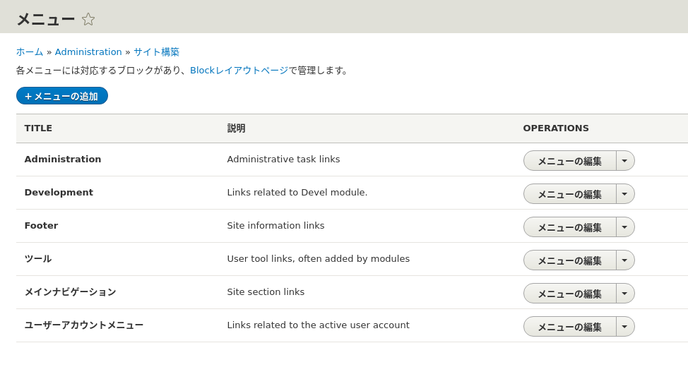

---

メニューはエンティティであり `\Drupal\system\Entity\Menu` で実装されています。

このクラスの宣言部分を見てみましょう。

```php
class Menu extends ConfigEntityBase implements MenuInterface {
```

メニューはコンテツエンティティではなくコンフィグエンティティであることが分かります。「それってどう違うんだっけ？」という方は2.13章を見直してください。

---

続けてAdministationメニューの「メニューの編集」をクリックしてください。

次のような一覧が表示されます。ここに表示されているものが「メニューリンクコンテンツ」です。

---

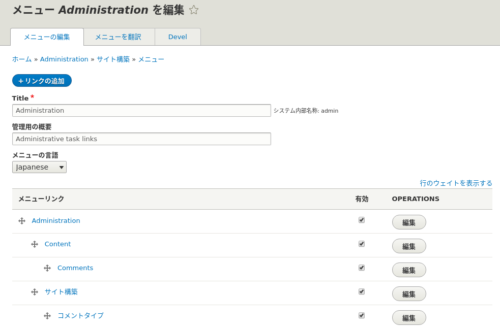

---

メニューリンクコンテンツもエンティティであり `\Drupal\system\Entity\MenuLinkContent` で実装されています。

このクラスの宣言部分も見てみましょう。

```php
class MenuLinkContent extends EditorialContentEntityBase implements MenuLinkContentInterface {
```

今度はコンフィグエンティティではなくコンテンツエンティティであることが分かります。

---

この違いを理解することは、メンテナンス性の高いシステムを開発する上で非常に重要です。

簡単にまとめると、Drupalのメニューは次のような構成になっています。

- メニューの構成要素には、「メニュー」と「メニューリンクコンテンツ」の2つがある
- 「メニュー」 は複数の「メニューリンクコンテンツ」の親になるデータであり、コンフィグエンティティである
- 「メニューリンクコンテンツ」はラベルやリンク先などのデータを持つコンテンツエンティティである

---

ご存じの通り、Drupalは管理UIからメニューを作成することができます。

では、モジュールにコードを書いてメニューを実装する理由は何でしょうか？

それは、メニューリンクコンテンツがコンテンツエンティティだからです。つまり、コードで実装しないと「そのメニューが常に存在する」ことを運用でもコードでも保証できない事になります。

2.14章でも「なぜ管理UIから生成できるブロックをわざわざコードで書くのか？」という点について解説しましたが、メニューに関しても同様の考え方が必要になります。

---

前置きはこれくらいにして、後者の「メニューリンクコンテンツ」を実装するコードを書いていきましょう。

これは `{module_name}.links.menu.yml` というファイルに定義します。

`hello_world.links.menu.yml` を新規に作成して次のように実装してください。

```yml
hello_world.hello:
  title: 'Hello World!'
  description: 'Show hello message according to configuration.'
  route_name: hello_world.hello
  menu_name: main
  weight: 1
```

---

トップレベルのキーはメニューのIDです。サンプルコードでは `hello_world.hello` としています。

`title` がそのままメニューのラベルになります。

`description` に設定した内容は、管理UIでメニューにカーソルを合わせるとポップアップで表示される説明文です。

`route_name` がメニューのリンク先です。

`menu_name` でこのメニューリンクコンテンツが属するメニューを指定します。

`weight` はおなじみの表示順です。

---

つまり、このサンプルコードでは、`main` メニューに` hello_world.hello` ルート(`/hello`)へのリンクを `Hello World!` というラベルで定義しています。

このymlファイルで設定可能なパラメータは他にもいくつかあります。詳細は [Providing module-defined menu links](https://www.drupal.org/docs/8/api/menu-api/providing-module-defined-menu-links)

それでは、キャッシュをクリアしてトップページにアクセスしてみましょう。

次のようにメインナビゲーションにリンクが追加されたら成功です。

---

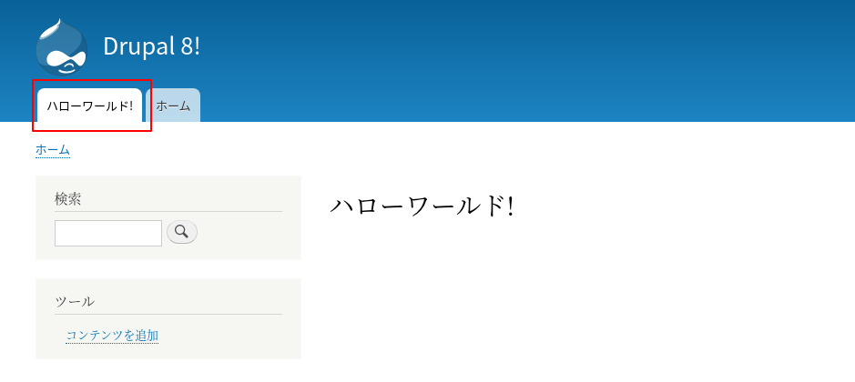

---

管理UIの方も見てみましょう。`/admin/structure/menu` にアクセスして、「メインナビゲーション」の「メニューの編集」をクリックしてください。管理UIから作成したメニューと同様に扱えることが分かります。

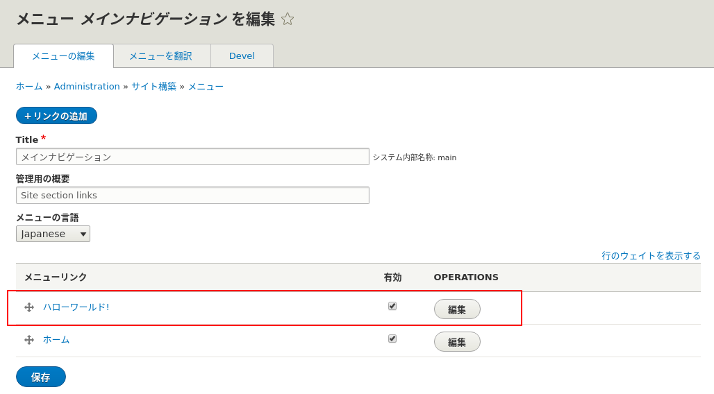

---

続けて「編集」ボタンを押して見ましょう。一部の項目がロックされ、管理者であっても編集できないことが分かります。

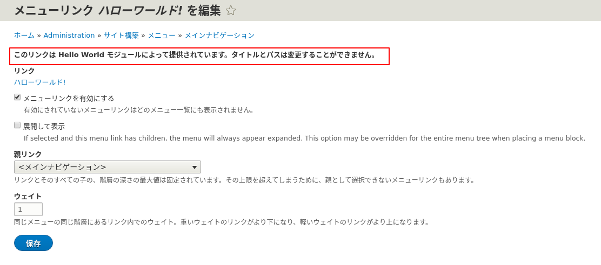

---

ちょっと分かりにくいので、コードではなく管理UIから同様に `/hello` へのリンクをメインナビゲーションに追加してください。

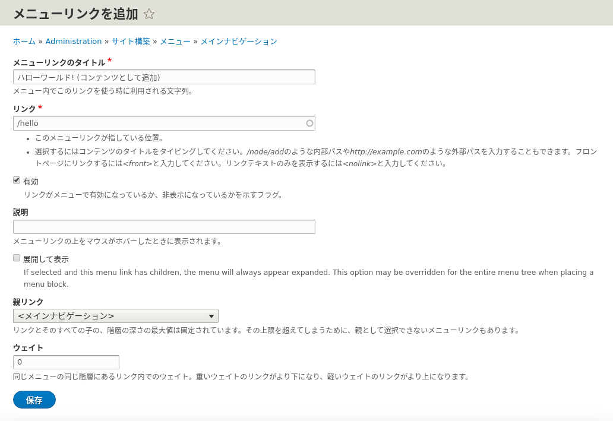

---

こちらの方法だと、タイトルやリンク先も変更できることが分かります。

また、所定の権限を持っていれば管理UIからリンク自体の削除も可能ですが、コードで実装したリンクは削除できません。

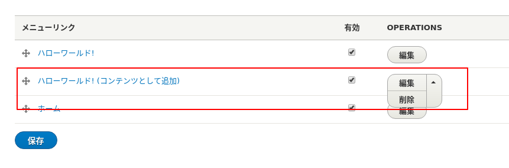

---

生成されるメニューの見た目は同じですが、モジュールのコードで実装したほうがより厳粛な運用ができそうですね。

どちらの方法で実現するかは開発するシステムの運用によりますが、Config Managementを活用した運用を行うのであればコードで実装した方がいいでしょう。

(理由については2.14章のストレッチゴールで経験済みのはずです)

---

<!-- _class: lead -->
## 2.22.2 タブ(Local Task)の実装

---

次はタブを実装してみましょう。

以下の画面のように、ノードにアクセスした時に「ビュー」「編集」「削除」などが表示されるのを見たことがあると思います。

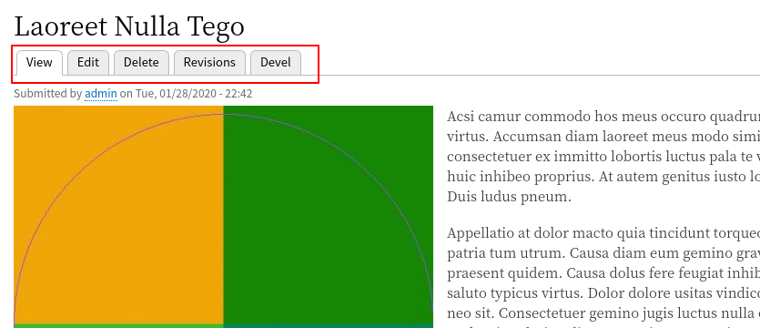

---

これらは、内部的には `Local Task` という名称で扱われています。

「タブ(tab)」というキーワードだとなかなか情報が探せないので注意しましょう。

タブ(Local Task)は、`{module_name}.links.task.yml` というファイルに定義します。

`hello_world.links.task.yml` を以下のように実装してください。

```yml
hello_world.page:
  route_name: hello_world.hello
  title: 'Hello World!'
  base_route: hello_world.hello
```

---

トップレベルのキーはタブのIDです。サンプルコードでは `hello_world.page` としています。

`route_name` はタブのリンク先です。

`title` がそのままタブのラベルになります。

`base_route` でタブを表示するルートを指定します。

ちょっと分かりにくいですが、このサンプルコードでは `hello_world.hello` (/hello) ルートに `hello_world.hello` 自身にリンクするタブを定義しています。

ノードでの「ビュー」というタブ相当ですね。

---

他にも指定可能なパラメータはいくつかあります。詳細は [Providing module-defined local tasks](https://www.drupal.org/docs/8/api/menu-api/providing-module-defined-local-tasks) を参照してください。

それでは、キャッシュをクリアして `/hello` にアクセスしてみましょう。

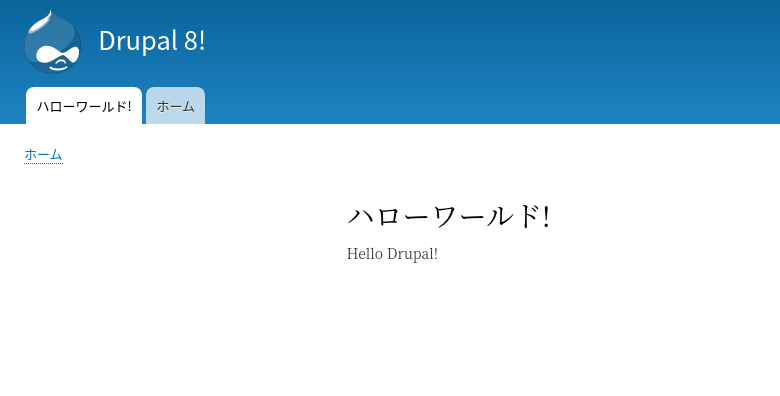

---

おやっ、タブが表示されませんね。

実は「表示するタブが1つであり、かつ現在のURLとタブのリンク先が同一である」場合、フレームワーク側でタブが自動的に非表示にされます。これはバグではなくフレームワークの仕様です。

デザイン的に問題になることもあるので、この振る舞いは把握しておきましょう。

---

それでは、設定フォームへのリンクもタブに追加しましょう。次のコードを追加してください。

```yml
hello_world.config:
  route_name: hello_world.setting_form
  title: 'Configuration'
  base_route: hello_world.hello
  weight: 0
```

---

再度キャッシュをクリアして `/hello` にアクセスしてください。

タブに2件のリンクが表示されれば成功です。

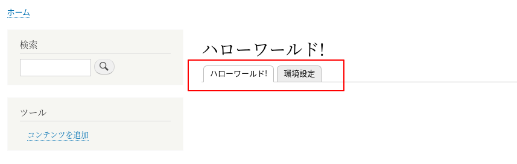

---

タブ (Local Task) には「プライマリータブ「と「セカンダリータブ」という概念があり、2段までネストすることができます。ここまで実装したリンクは「プライマリータブ」です。

「セカンダリータブ」も実装してみましょう。ymlに次のコードを追加してください。

---

```yml
hello_world.config_secondary:
  route_name: hello_world.setting_form
  title: 'Configuration'
  parent_id: hello_world.page
  weight: 0
hello_world.contents:
  route_name: hello_world.admin_content_replica
  title: 'Contents'
  parent_id: hello_world.page
  weight: 1
```

「セカンダリータブ」として実装する場合は、`parent_id` に上位のタブのIDを指定します。

---

再度キャッシュをクリアして `/hello` にアクセスしてください。

次のように表示されれば成功です。

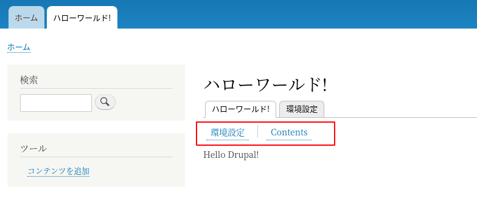

---

<!-- _class: lead -->
## 2.22.3 アクション(ボタン)の実装

---

最後にアクション(ボタン)を実装しましょう。

データ一覧の周辺に新規追加ボタンを表示するようなデザインは、Webサービスやプロプライエタリなシステムでよく目にすると思います。

Drupalでは `Local Action` という仕組みで同様の機能が実装できます。

これも、タブ(Local Task)と同じく「ボタン」というキーワードではなかなか情報に辿り着かないため、`Local Action` というキーワードを覚えておきましょう。

---

例えば、ユーザーアカウントの管理画面 (`/admin/people`) に「ユーザーの追加」というボタンがありますが、これはLocal Actionとして実装されています。

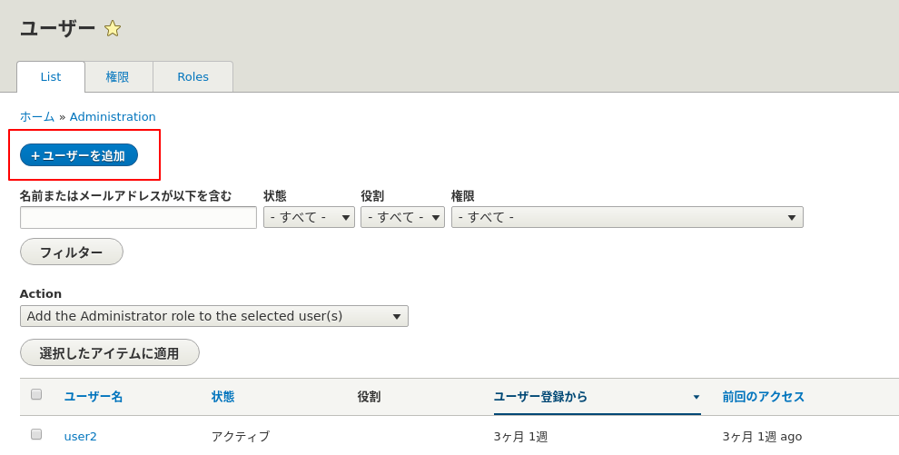

---

ボタン(Local Action)は、 `{module_name}.links.action.yml` というファイルに定義します。

`hello_world.links.action.yml` を以下のように実装してください。

```yml
hello_world.config:
  route_name: hello_world.setting_form
  title: 'Configuration'
  appears_on:
    - hello_world.hello
```

ボタン(Local Action)はタブと異なり、`appears_on` キーに指定した複数のルートに表示することができます。指定可能なパラメータについては [Providing module-defined local actions](https://www.drupal.org/docs/8/api/menu-api/providing-module-defined-local-actions) を参照してください。

---

再度キャッシュをクリアして `/hello` にアクセスしてください。

次のようにモジュールの設定画面へリンクするボタンが表示されれば成功です。

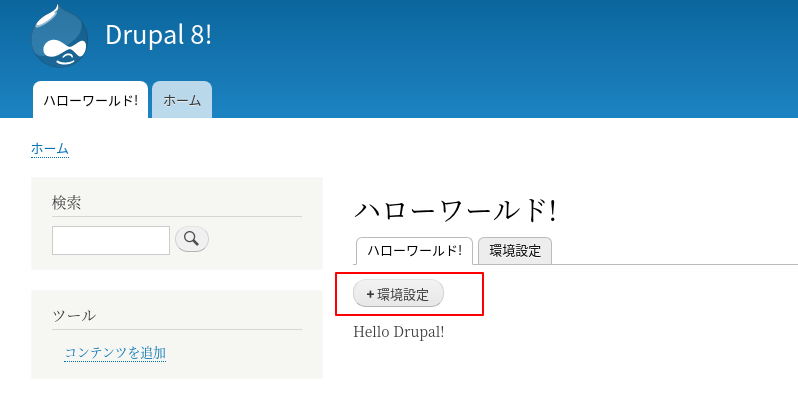

---

<!-- _class: lead -->
## 2.22.4 Menu APIを使うメリット

---

Menu APIを使うと、ymlでメタデータを定義するだけでほとんどコードを書かずにメニューやタブ、ボタンが実装できることがわかったと思います。

このように、UIの自動生成はこの機能に限らずDrupalの非常に大きなメリットの1つです。

また、この方法で実装するもう一つの大きなメリットは、ユーザーのアクセス権とUIコンポーネントの表示が自動的に連動することです。

---

`/hello` にアクセスするとタブやボタンが表示されてるようになっていますが、これらのリンク先に権限がないアカウントでアクセスした場合は自動的に非表示になります。これはメニューリンクも同様です。

PHPのコードを書いたり、テンプレート内で分岐処理を作る必要はありません。

デザインの自由度を優先してスクラッチでUIを開発する場合は、この点も理解して判断する必要があります。

---

## まとめ

このセクションでは、メニューとタブ、アクションの実装について解説しました。

メニューについては管理UIから作成することもできますが、この方法ではコンフィグがコンテンツ(DB)に依存することになります。ケースバイケースでコードで実装すべきかどうかを判断するようにしてください。

---

ローカルタスク(タブ)とアクション(ボタン)は管理UIから作成することはできませんが、これらの機能を使うとUIの生成やアクセス権限に応じた表示の制御などをフレームワークに任せることができます。

しかし、デザイン的な制約も同時に強くなるため、こちらの機能も必要に応じて利用するかどうか判断するようにしましょう。

---

## ストレッチゴール

1. 2.22.1で実装したメニューがHomeの右に表示されるようにコードを修正してください。

2. `hello_world.hello` にアクセスした時に、ローカルタスク(タブ)として`hello_world.inspect_user` が表示されるようにしてください。`{user}` パラメータの値は1固定とします。

---

3. ユーザーの表示画面 (`/user/{user_id}`) にローカルタスク(タブ)として`hello_world.inspect_user` が表示されるようにしてください。`{user}` パラメータの値は現在表示しているユーザーと連動するようにしてください。

4. `/admin/config` の「システム」グループの配下にhello_worldモジュールの管理フォームへのリンクを追加してください。
