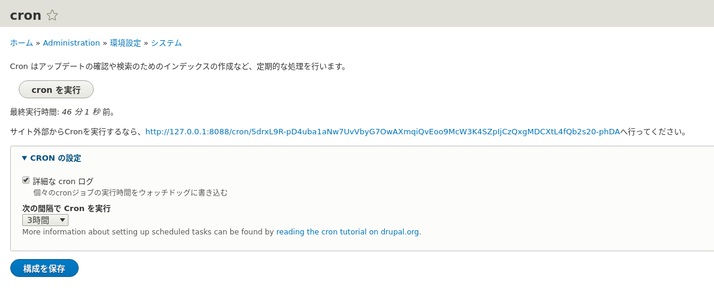
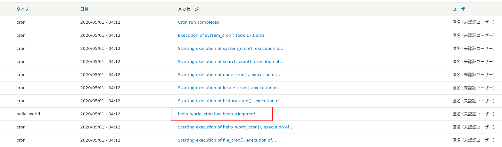

<!-- _class: lead -->
# 2.23 定期的に実行する処理の実装

---

このセクションでは、Drupal上で定期的に実行する処理の実装方法について解説します。

---

<!-- _class: lead -->
## 2.23.1 Drupalで定期的に処理を実行する方法

---

Drupalで定期的に何らかの処理を実行するにはいくつかの方法がありますが、現実的に選択肢として検討可能な手段は以下になると思います。

- 1. hook_cronを実装する
- 2. Drushのスクリプトを作成してcronで実行する
- 3. Drushのサブコマンドを作成してcronで実行する
- 4. AWS Lambda等の外部サービスからDrupalのREST APIをコールする

簡単にそれぞれのメリットとデメリットを紹介します。

---

**1. hook_cronを実装する**

名前の通り、[hook_cron](https://api.drupal.org/api/drupal/core!core.api.php/function/hook_cron/) というフックを実装する方法で、これが最も一般的に利用される手段になります。

メリットとしては以下があります。

- [Automated Cron](https://www.drupal.org/docs/8/administering-a-drupal-8-site/cron-automated-tasks/automated-cron) モジュールを利用する場合、任意のHTTPリクエストを起動のトリガーにできるためサーバー側でcrontab等の設定は不要
- 管理UI上 (/admin/config/system/cron) から任意のタイミングで（も）実行できる

---

[Automated Cron](https://www.drupal.org/docs/8/administering-a-drupal-8-site/cron-automated-tasks/automated-cron) モジュールを利用する場合、起動のトリガーは「一定期間を過ぎた後にDrupalがなんらかのHTTPリクエストを受けた時」になります。そのため、例えば「毎日0時0分に実行」のような精度が必要な場合は適していません。

このような場合はAutomated Cronは使わずに、crontabなどで実行時刻を指定して[Drushのcronサブコマンド](https://drushcommands.com/drush-9x/core/core:cron/) を実行するか、wgetやcurlなどでToken付きのURLに対してGETリクエストを送ることで対応できます。

どの方法でも `hook_cron` が実行されることには変わりありません。

---

デメリットとしては、全てのモジュールのhook_cronが一度に実行されてしまうため、負荷が高いことです。

もちろん、同時に実行されないようにフレームワーク側で制御はされますが、例えばhook_cronを実装したモジュールが10個ある場合、その全てが一度のトリガーで順次実行されます。

この問題を回避するためには、[ultimate_cron](https://www.drupal.org/project/ultimate_cron) などのモジュールを導入してモジュール毎に実行タイミングをずらしたり、hook_cronの実装側で一度に実行するデータ量に制限をかけるなどの検討が必要になります。

---

**2. Drushのスクリプトを作成してcronで実行する**

2.21章で作成したようなDrushのスクリプトを作成してcronから実行する方法です。

メリットとしては、hook_cronと違い一度のトリガーで実行される処理がスクリプトで書いた内容だけになるため、負荷が低いことです。

デメリットとしては、hook_cronで利用可能な管理UIからの実行や外部から起動できるエンドポイントが提供されないことです。

---

**3. Drushのサブコマンドを作成してcronで実行する**

Drushのサブコマンドとして処理を実装する以外は、2.の方法と違いはありません。

メリットとしては、Drushが提供する起動引数の制御やログ書き込み、エラーハンドリングなどのAPIが利用できることです。

デメリットとしてはスクリプトより多少実装コストが高くなります。

---

**4. AWS Lambda等の外部サービスからDrupalのREST APIをコールする**

DrupalのREST APIが外部から実行できる場合は、この方法を検討することもできます。

メリットとしては実装がPHPに依存しない点です。

デメリットとしては、DrupalのREST APIに関するドキュメントが不足していることでしょうか..

---

それぞれにメリット・デメリットはありますが、このセクションでは1.のhook_cronを実装する方法に絞って紹介します。

---

<!-- _class: lead -->
## 2.23.2 hook_cron

---

それでは、実行されたらログを出力するシンプルな機能を実装してみましょう。

「ログってどうやって書くんだっけ？」という方は2.18章を見直してください。

`hello_world.module` に次のコードを追加してください。

```php
/**
 * Implements hook_cron().
 */
function hello_world_cron() {
  \Drupal::service('logger.factory')->get('hello_world')->info('hello_world_cron has been triggered!');
}
```

---

実装が完了したら一度キャッシュをクリアし、管理者権限を持つアカウントで `/admin/config/system/cron` にアクセスしてください。「Cronを実行」ボタンを押すと hook_cron が実行されます。



---

`/admin/reports/dblog` にアクセスしてログが出力されていることを確認しましょう。



hello_worldモジュール以外にも、他のモジュールのhook_cronが実行されていることも分かりますね。

---

Drushからの起動も確認しておきましょう。Drushからhook_cronを実行する場合は `cron` サブコマンドを利用します。

```txt
$ vendor/bin/drush cron

 [notice] Starting execution of comment_cron().
 [notice] Starting execution of dblog_cron(), execution of comment_cron() took 2.72ms.
 [notice] Starting execution of field_cron(), execution of dblog_cron() took 16.92ms.
 [notice] Starting execution of file_cron(), execution of field_cron() took 1.2ms.
 [notice] Starting execution of hello_world_cron(), execution of file_cron() took 19.31ms.
 [notice] Starting execution of history_cron(), execution of hello_world_cron() took 0.63ms.
 [notice] Starting execution of locale_cron(), execution of history_cron() took 0.15ms.
 [notice] Starting execution of node_cron(), execution of locale_cron() took 0.46ms.
 [notice] Starting execution of search_cron(), execution of node_cron() took 6.4ms.
 [notice] Starting execution of system_cron(), execution of search_cron() took 9.29ms.
 [notice] Execution of system_cron() took 7.61ms.
 [notice] Cron run completed.
 ```

---

## まとめ

このセクションでは、Drupalで定期的に実行する処理を実装する方法の紹介を行い、その一例としてhook_cronを実装しました。

求められる時刻の精度や性能の要件を考慮して、適切な方法で実装するようにしましょう。

