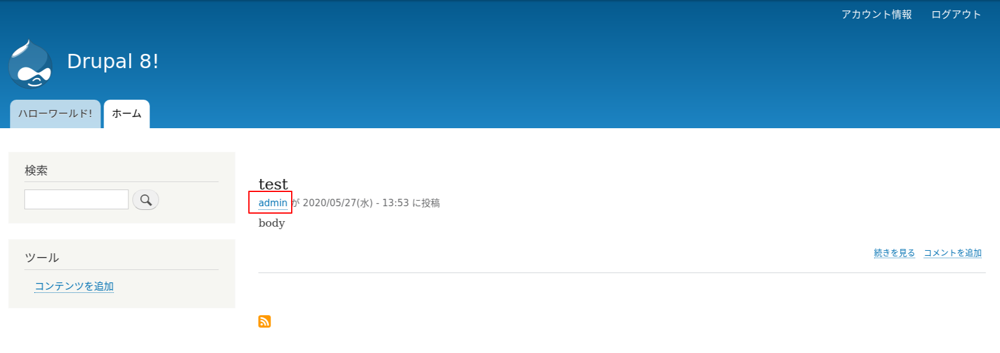

<!-- _class: lead -->
# 3.1 Drupalのテーマレイヤーの概要

---

このセクションでは、Drupalのテーマが全体の処理の流れでどの部分を担当するか、どのような機能を持つかなどの概要を解説します。

---

<!-- _class: lead -->
## 3.1.1 ビジネスロジックとプレゼンテーション

---

ビジネスロジックで生成したデータをどのように[プレゼンテーションレイヤー](https://en.wikipedia.org/wiki/Multitier_architecture)で出力するかは、Drupalに限らず多くのCMSやフレームワークで重要な要素の１つです。

一般的には、ビジネスロジックとプレゼンテーションレイヤーを分離し、お互いの責任範囲を明確にするとともに粗結合にするアーキテクチャが採用されます。

つまり、ビジネスロジックはデータの取扱だけに注力し、それがどのように出力されるかはケアしません。逆にプレゼンテーションレイヤーは、渡されたデータをどのように出力するかのみに注力します。

---

Drupalでは、他のCMSやWebアプリケーションにもあるような「テーマ」と呼ばれるプレゼンテーションレイヤーの機能を差し替えることで、デザインを自由に変更することができます。

このセクションを通して、Drupalがデータをレンダリング（表示）する流れや、テーマを構成する要素を紹介します。

---

<!-- _class: lead -->
## 3.1.2 全体シーケンス (TBD)

---

TBD (個別の要素の解説の後の方がいいか？)

@see https://www.drupal.org/docs/8/api/render-api/the-drupal-8-render-pipeline

---

<!-- _class: lead -->
## 3.1.3 Twig

---

Drupal 7では、テンプレートエンジンとしてPHPそのもの(PHP Template)が使われていました。

例えば、テンプレートは以下のように実装されます。

```php
<?php

print '<div class="wrapper">' . $data . '</div>';

?>
```

---

このサンプルコードの場合、`$data` という変数にはビジネスロジックでアクセス制御を行い、なんらかの処理を実行した結果が格納されています。

しかし、テンプレート自身がPHPで実装されているため、下記のようにこの変数を無視してテンプレート側でDBにアクセスし、任意のデータを表示するような実装もできてしまいます。

```php
<?php

$secret_data = get_some_secret_data();
print '<div class="wrapper">' . $secret_data . '</div>';

?>
```

---

もちろん、後述するtheme_hookのような「ビジネスロジックがテーマに安全に変数を渡す仕組み」はDrupal 7の時点で提供されていました。しかし、これを使わずにテンプレートを魔改造する実装が一定の割合で存在するのが悲しい現実です。

これは、特にDrupal初学者やシステムの長期的なメンテナンス経験が少ない開発者が陥りがちな問題です。

このような各レイヤーの責任区分が曖昧で蜜結合な実装は、メンテナンスを困難にし、場合によってはセキュリティーの問題を発生させます。

---

Drupal 8では、テンプレートエンジンに[twig](https://twig.symfony.com/)が採用され、このような問題は発生しなくなりました。

先のテンプレートはtwigだと次のようになります。

```twig
<div class="wrapper">{{ data }}</div>
```

twigではPHPは書けないため、テンプレートレイヤーではビジネスロジックから渡された変数のみで出力を生成することが強制されます。また、特に何もしなくても文字列がデフォルトでエスケープされます。

これはThemeingに関するDrupal 7からの大きな違いであり、制約であり、同時に大きなメリットでもあります。

---

twigのシンタックスについては本コンテンツの趣旨ではないので、解説は行いません。

必要に応じて [twigのドキュメント](https://twig.symfony.com/doc/3.x/) を参照してください。

---

<!-- _class: lead -->
## 3.1.4 Theme hookとPreprocess

---

Drupalの機能を拡張する方法の１つとしてフックが利用できることを2章で学びました。テーマも同様にフックで拡張することができます。

主な拡張ポイントは次の2つです。

- [hook_theme](https://api.drupal.org/api/drupal/core%21lib%21Drupal%21Core%21Render%21theme.api.php/function/hook_theme/): 新しいテーマフックとそのメタデータ(テンプレート名やテンプレートで利用する変数名など)を定義する
- [preprocess](https://api.drupal.org/api/drupal/core%21lib%21Drupal%21Core%21Render%21theme.api.php/group/themeable#sec_preprocess_templates): テンプレートに実際に渡す変数の値を設定する

---

ここで、例としてコアのuserモジュールのコードを見てみましょう。

`web/modules/user/user.module` には `hook_theme` の実装である `user_theme` が次のように書かれています。

---

```php
/**
 * Implements hook_theme().
 */
function user_theme() {
  return [
    'user' => [
      'render element' => 'elements',
    ],
    'username' => [
      'variables' => ['account' => NULL, 'attributes' => [], 'link_options' => []],
    ],
  ];
}
```

---

`hook_theme` が返す配列のキーは、テーマフックの名称です。

各配列の要素が `template` というキーを持たない場合、テーマフックの名前がそのままテンプレート名として利用されます。

つまり、このサンプルコードでは `user`, `username` という2つのテーマフックが定義され、それぞれ `user.html.twig`、 `username.html.twig` というテンプレートを通してレンダリングされることになります。

※hook_themeの詳細は、この章の別のセクションで解説します。

先に `user` の方から見ていきましょう。


---

TBD

`render element` というキーは... (TBD)

---

次に `username` の方を見ていきましょう。

`variables` というキーでは、テンプレートに渡す変数名とその初期値が定義されます。

サンプルコードの例では、`account`, `attributes`, `link_options` という変数とその初期値が定義されている事がわかります。

この定義があるおかけで、 `username.html.twig` というテンプレートの中でこれらの変数にアクセスできるようになります。

---

それでは、次に `username.html.twig` に渡す変数の値がどのように設定されているのか見ていきましょう。

先に少し紹介したように、テンプレートに渡す変数の値を設定するのは `preprocess` の役割です。

preprocessは、モジュールのフックと同様に「特定の命名規則で実装されたグローバル関数」として実装されます。

---

具体的には、[Preprocessing for Template Files](https://api.drupal.org/api/drupal/core!lib!Drupal!Core!Render!theme.api.php/group/themeable#sec_preprocess_templates) にリストされている次の関数が有効なpreprocessの関数名です。`HOOK` の部分には `hook_theme` で定義したフック名が入ります。

- template_preprocess(&$variables, $hook)
- template_preprocess_HOOK(&$variables)
- MODULE_preprocess(&$variables, $hook)
- MODULE_preprocess_HOOK(&$variables)
- ENGINE_engine_preprocess(&$variables, $hook)
- ENGINE_engine_preprocess_HOOK(&$variables)
- THEME_preprocess(&$variables, $hook)
- THEME_preprocess_HOOK(&$variables)

---

複数の有効なproprocess関数がある場合は優先度の低いものから順次実行されます。優先度はリストの下にいくほど高くなります。

つまり、

- **コンテキスト(HOOK)を特定できる関数の方が優先度が高い**
- **バックエンドよりフロントエンドに近いレイヤーで定義された関数の方が優先度高い**

というルールになっています。

---

このルールに照らし合わせると、Drupalのデフォルトのコードツリーを使った場合は、`template_preprocess_username` と `rdf_preprocess_username` という関数が使われることが分かります。

```txt
$  ❯ grep -rnI preprocess_username .
./core/modules/rdf/rdf.module:395:    // rdf_preprocess_username().
./core/modules/rdf/rdf.module:415:function rdf_preprocess_username(&$variables) {
./core/modules/rdf/rdf.module:455:  // Long usernames are truncated by template_preprocess_username(). Store the
./core/modules/rdf/tests/src/Functional/UserAttributesTest.php:47:    // by template_preprocess_username (20 characters)
./core/modules/user/user.module:478:function template_preprocess_username(&$variables) {
./core/modules/user/templates/username.html.twig:22: * @see template_preprocess_username()
./core/themes/classy/templates/user/username.html.twig:22: * @see template_preprocess_username()
./core/themes/stable/templates/user/username.html.twig:22: * @see template_preprocess_username()
```

`template_preprocess_username` のコードを少し覗いてみましょう。

---

```php
/**
 * Prepares variables for username templates.
 *
 * Default template: username.html.twig.
 *
 * Modules that make any changes to variables like 'name' or 'extra' must ensure
 * that the final string is safe.
 *
 * @param array $variables
 *   An associative array containing:
 *   - account: The user account (\Drupal\Core\Session\AccountInterface).
 */
function template_preprocess_username(&$variables) {
  // ...

  // Populate link path and attributes if appropriate.
  if ($variables['uid'] && $variables['profile_access']) {
    // We are linking to a local user.
    $variables['attributes']['title'] = t('View user profile.');
    $variables['link_path'] = 'user/' . $variables['uid'];
  }
  elseif (!empty($account->homepage)) {
  // ...
```

---

preprocess関数では、参照渡しされている `$variables` という配列の変数にテンプレートに渡したい値を設定します。

例えば、

```php
$variables['foo'] = "Foo!!!";
```

というコードを書くと、twigテンプレートで `foo` という変数が利用できるようになります。

この観点で先程のコードを見てみると、`user_theme` で定義されている `attributes` という変数を設定していることが分かりますね。

---

ちなみに、`usrename.html.twig` がレンダリングしている箇所がどこかというと、下の画像の赤い部分です。



このように非常に小さな単位でテンプレートが分割されています。

---

先のpreprocessのルールに戻りましょう。

このルールは、「コアやモジュールが定義したデフォルトのpreprocessやテンプレートは、他のモジュールやテーマで変更できる」ということになります。

この考え方、特に「モジュールがデフォルトのpreprocessとテンプレートを定義できる」ということを理解するのはとても重要です。

先程見たuserやusernameのproprocessやテンプレートの実装は、テーマではなくモジュールが持っていましたね。

---

つまり、**「Themeingとはthemesディレクトリ以下のソースコードだけを触る仕事ではない」** ということです。

ここを理解しないと、特定のテーマでしか動かなかったり、拡張性に乏しい実装が生まれる原因になります。しっかりと押さえておいてください。

---

コアやモジュールが提供するデフォルトの実装から単にテンプレートや既存の変数の値を変えるだけではなく、テンプレート内で使う変数自体を新しく追加したい場合もあります。

このようなケースでは、[hook_theme_resgitory_alter](https://api.drupal.org/api/drupal/core%21lib%21Drupal%21Core%21Render%21theme.api.php/function/hook_theme_registry_alter/) を使って、他で宣言されている `hook_theme` の内容を変更することもできます。

---

<!-- _class: lead -->
## 3.1.5 Theme hook suggestion

---

<!-- _class: lead -->
## 3.1.6 Render Arrays

---

<!-- _class: lead -->
## 3.1.5 レンダーパイプライン

---

## まとめ

TBD