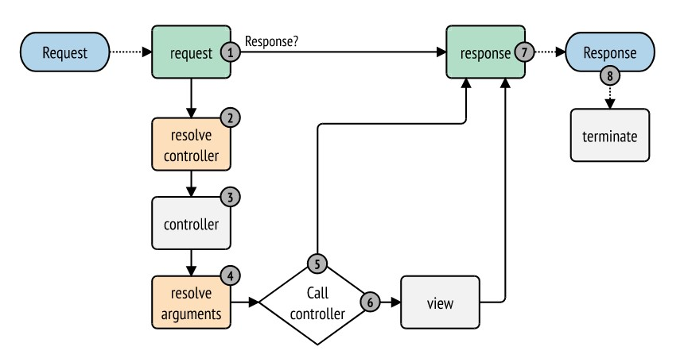
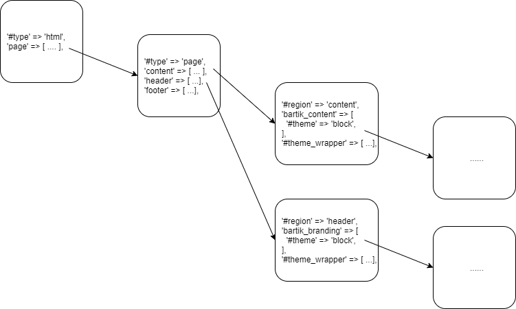

<!-- _class: lead -->
# 3.1 Drupalのテーマレイヤーの概要

---

このセクションでは、Drupalのテーマが全体の処理の流れでどの部分を担当するか、どのような機能を持つかなどの概要を解説します。

---

<!-- _class: lead -->
## 3.1.1 ビジネスロジックとプレゼンテーション

---

Drupalでは、他のCMSやWebアプリケーションにもあるような「テーマ」と呼ばれるプレゼンテーションレイヤーの機能を差し替えることで、デザインを自由に変更することができます。

ビジネスロジックで生成したデータをどのように[プレゼンテーションレイヤー](https://en.wikipedia.org/wiki/Multitier_architecture)で出力するかは、Drupalに限らず多くのCMSやフレームワークで重要な要素の１つです。

一般的には、ビジネスロジックとプレゼンテーションレイヤーを分離し、お互いの責任範囲を明確にするとともに粗結合にするアーキテクチャが採用されます。

---

つまり、ビジネスロジックはデータの取扱いだけに注力し、それがどのように出力されるかの詳細まではケアしません。逆にプレゼンテーションレイヤーは、渡されたデータをどのように出力するかのみに注力します。

このように設計することでコンポーネント毎の責任が明確になり、メンテナンスや拡張性に優れたシステムが実装できます。

このセクションを通して、Drupalがデータをレンダリング（表示）する流れや、テーマを構成する要素を紹介していきます。

---

<!-- _class: lead -->
## 3.1.2 HTMLを生成するまでの全体シーケンス (aka. Render Pipeline)

---

先述したとおり、テーマの仕事はビジネスロジックが必要なデータを生成した後に行われます。

つまり、システムがリクエストを受けてからレスポンスを返す一連の流れの中では、後半部分でテーマが利用されます。

レイヤーの分離の観点からは、テーマ開発者は全体の流れやビジネスロジックの部分はブラックボックスとして扱う、という考え方もあります。

---

しかし、テーマ開発者は「PHPの読み書きができなくてもいい」、「DrupalのAPIは理解しなくていい」という意味ではありません。

この考え方で分業をすると「画面を作る」というタスクの半分程度か、場合によってはそれ以上がモジュール開発者(正確にはDrupalのAPIを使いPHPでの開発ができる人)の仕事になりかねません。

特に小さなチームで効率の良い開発を行う場合、テーマ開発者やモジュール開発者というロールに関わらず、全体の流れや自分の担当となる部分の前後のつながりを理解しておくことはとても重要です。

というわけで、まずは全体の流れについて解説していきます。

---

全体の流れはDrupal.orgの [The Drupal 8 render pipeline](https://www.drupal.org/docs/8/api/render-api/the-drupal-8-render-pipeline) に非常にわかりやすくまとまっていますので、これを噛み砕いて説明していきます。

とは言っても、全く新しい事をこれから覚えるわけではありません。ここまでのトレーニングで得たことを思い出してみましょう。

「1.1.5 リクエストからレスポンスまでの流れ」でDrupalがリエクストを受けてからレスポンスを返すまでの流れの概要を解説しました。

そして2.5.3章では、実際にあるルーティングを担当するコントローラーを作成し、Render Arraysとしてレスポンスを返すと、それが最終的にHTMLとして表示されることを学びました。

----

テーマレイヤーは、主にこの「Render ArraysをHTMLに変換する」部分を担当します。

これまでに学んだことを思い出してきたでしょうか？必要に応じて、先程示した資料のセクションを軽く見直してから次に進みましょう。

---

「1.1.5 リクエストからレスポンスまでの流れ」で説明した全体の流れは、実はDrupalに特有なものではありません。この全体の流れは [SynfomyのRender Pipeline](https://symfony.com/doc/3.4/components/http_kernel.html) そのものです。

---



https://symfony.com/doc/4.4/components/http_kernel.html

---

Drupalは、この流れの中で発生する [Kernel.view](https://symfony.com/doc/3.4/components/http_kernel.html#component-http-kernel-kernel-view) イベントに対してイベントハンドラーを登録することで、「Render ArrayをHTMLに変換して出力するテーマーレイヤー」を実現しています。

具体的には [MainContentViewSubscriber](https://github.com/drupal/drupal/blob/8.8.x/core/lib/Drupal/Core/EventSubscriber/MainContentViewSubscriber.php) というクラスの `onViewRenderArray` メソッドが「Render ArraysをHTMLに変換する」起点となります。

正確には、必ずしもHTMLを返すわけではなく、HTTPリクエストが要求するフォーマット (html, json, etc)に対応したレンダラーがレスポンスを返します。

これらのレンダラーは、[MainContentRendererInterface](https://api.drupal.org/api/drupal/core%21lib%21Drupal%21Core%21Render%21MainContent%21MainContentRendererInterface.php/interface/MainContentRendererInterface/) を実装したクラスとして提供されています。

---

コアのコードツリーを見ると、いくつかのレンダラーが実装されていることがわかります。

```txt
$ grep -rnle "class .* implements .*MainContentRendererInterface" web
web/core/modules/system/tests/modules/common_test/src/Render/MainContent/JsonRenderer.php
web/core/lib/Drupal/Core/Render/MainContent/DialogRenderer.php
web/core/lib/Drupal/Core/Render/MainContent/HtmlRenderer.php
web/core/lib/Drupal/Core/Render/MainContent/AjaxRenderer.php
```

最終的には、`MainContentRendererInterface::renderResponse` がSymfonyのRender Pipelineへの応答の責任、つまり、[Response](https://symfony.com/doc/current/components/http_foundation.html#response) オブジェクトを生成を担当します。

---

HTMLをレンダリングする場合の例を見てみましょう。この場合、処理の起点は [HtmlRenderer::rederResponse](https://github.com/drupal/drupal/blob/8.8.x/core/lib/Drupal/Core/Render/MainContent/HtmlRenderer.php#L116) です。

このメソッドは次のようなステップでRender ArraysをHTMLに変換します。

1. `HtmlRenderer::prepare()` を呼び出し、Render Arraysに `#type` が `page` のデータがあるかを確認します。これは、最終的には `<body>` タグ内のコンテンツに変換されます。

---

2. もし `#type` が `page` のデータが存在しない場合は、`RenderEvents::SELECT_PAGE_DISPLAY_VARIANT ` イベントを起動してデータの生成を行います。デフォルトでは、`SimplePageVariant` が使われます。blockモジュールが有効な場合は、`BlockPageVariant` が使われ、各リージョンに配置したブロックコンテンツのデータが登録されます。PanelsやPage Managerといったメインコンテンツエリアのレイアウトを変更するモジュールにも、このイベントに反応するハンドラーが実装されています。ここでは `page.html.twig` というテンプレートが利用されます。

---

3. [hook_page_attachments()](https://api.drupal.org/api/drupal/core%21lib%21Drupal%21Core%21Render%21theme.api.php/function/hook_page_attachments/) と [hook_page_attachments_alter()](https://api.drupal.org/api/drupal/core%21lib%21Drupal%21Core%21Render%21theme.api.php/function/hook_page_attachments_alter/) を起動し、ライブラリ(cssやjsなどのアセット)を追加します。

4.`#type` が `page` のRender Arraysを `#type` が `html` のRender Arrayでラップし、[hook_page_top()](https://api.drupal.org/api/drupal/core%21lib%21Drupal%21Core%21Render%21theme.api.php/function/hook_page_top/) と [hook_page_bottom()](https://api.drupal.org/api/drupal/core%21lib%21Drupal%21Core%21Render%21theme.api.php/function/hook_page_bottom/) を起動します。

5. `#type` が `html` のRender Arraysを [RendererInterface::render](https://api.drupal.org/api/drupal/core%21lib%21Drupal%21Core%21Render%21RendererInterface.php/function/RendererInterface%3A%3Arender/) に渡し、`html.html.twig` テンプレートを使ってデータをレンダリングします。

---

6. レンダリング処理は再帰的に行われ、HTML全体→メインコンテンツ全体(`<body>`タグ)→ブロック→ノード→フィールド→ラベルと値のように、大きな単位から小さな単位に進みながらそれぞれの単位ごとのテンプレートを元にデータを作成し、最終的にHTML全体のデータが文字列として生成されます。ここで `block.html.twig`、 `node.html.twig`、 `field.html.twig` などのテンプレートが利用されます。

7. HTMlの文字列を元に [Response](https://symfony.com/doc/current/components/http_foundation.html#response) のサブクラスである [HtmlResponse](https://api.drupal.org/api/drupal/core%21lib%21Drupal%21Core%21Render%21HtmlResponse.php/class/HtmlResponse/) を生成します。

※メンテナンス中や例外が発生した場合など、Drupalが完全なレスポンスを返せない場合には、代わりに [BareHtmlPageRenderer](https://api.drupal.org/api/drupal/core%21lib%21Drupal%21Core%21Render%21BareHtmlPageRenderer.php/class/BareHtmlPageRenderer/) がレンダリングを担当します。

---

以上がDrupalがRender ArraysをHTMLに変換する仕組みになります。抽象化層が多いですが、やっていることは単なるデータ変換です。

[The Drupal 8 render pipeline](https://www.drupal.org/docs/8/api/render-api/the-drupal-8-render-pipeline) にここで解説した原文とシーケンス図が公開されていますので、しっかりと目を通しておいてください。

---

<!-- _class: lead -->
## 3.1.3 Twig

---

Drupal 7では、テンプレートエンジンとしてPHPそのもの(PHP Template)が使われていました。

例えば、テンプレートは以下のように実装されます。

```php
<?php

print '<div class="wrapper">' . $data . '</div>';

?>
```

---

このサンプルコードの場合、`$data` という変数にはビジネスロジックでアクセス制御を行い、なんらかの処理を実行した結果が格納されています。

しかし、テンプレート自身がPHPで実装されているため、下記のようにこの変数を無視してテンプレート側で機密性の高いデータにアクセスし、任意のデータを表示するような実装もできてしまいます。

```php
<?php

$secret_data = get_some_secret_data();
print '<div class="wrapper">' . $secret_data . '</div>';

?>
```

---

もちろん、後述する `theme hook` のような「ビジネスロジックがテーマに安全に変数を渡す仕組み」はDrupal 7の時点で提供されていました。しかし、これを使わずにテンプレートを魔改造する実装が一定の割合で存在するのが悲しい現実です。

これは、特にDrupal初学者やシステムの長期的なメンテナンス経験が少ない開発者が陥りがちな問題です。

このような各レイヤーの責任区分が曖昧で密結合な実装は、メンテナンスを困難にし、場合によってはセキュリティーの問題を発生させます。

---

Drupal 8では、テンプレートエンジンに[twig](https://twig.symfony.com/)が採用され、このような問題は発生しなくなりました。

先のテンプレートはtwigだと次のようになります。

```twig
<div class="wrapper">{{ data }}</div>
```

twigではPHPは書けないため、テンプレートレイヤーではビジネスロジックから渡された変数のみで出力を生成することが強制されます。

また、特に何もしなくても文字列がデフォルトでエスケープされます。

---

これらのtwigの特徴はテーマ開発に関するDrupal 7からの大きな違いであり、制約であり、同時に大きなメリットでもあります。

twigのシンタックスについては本コンテンツの趣旨ではないので、解説は行いません。

必要に応じて [twigのドキュメント](https://twig.symfony.com/doc/3.x/) を参照してください。

---

<!-- _class: lead -->
## 3.1.4 テーマの主要な拡張ポイント

---

Drupalの機能を拡張する方法の１つとしてフックが利用できることを2章で学びました。

テーマも同様にフックで拡張することができます。主な拡張ポイントは次の3つです。

- [hook_theme](https://api.drupal.org/api/drupal/core%21lib%21Drupal%21Core%21Render%21theme.api.php/function/hook_theme/): 新しいテーマフックとそのメタデータ(テンプレート名やテンプレートで利用する変数名など)を定義する
- [Theme hook suggestions](https://www.drupal.org/docs/theming-drupal/twig-in-drupal/working-with-twig-templates#suggestions): 利用するテンプレート名を変更する
- [Preprocess](https://api.drupal.org/api/drupal/core%21lib%21Drupal%21Core%21Render%21theme.api.php/group/themeable#sec_preprocess_templates): テンプレートに実際に渡す変数の値を設定する

Drupalのテーマは、この3つを組み合わせることで柔軟に拡張可能なプレゼンテーションレイヤーを提供しています。

---

ここで、例としてコアのuserモジュールのコードを見てみましょう。

`web/modules/user/user.module` には `hook_theme` の実装である `user_theme` が次のように実装されています。

---

```php
/**
 * Implements hook_theme().
 */
function user_theme() {
  return [
    'user' => [
      'render element' => 'elements',
    ],
    'username' => [
      'variables' => ['account' => NULL, 'attributes' => [], 'link_options' => []],
    ],
  ];
}
```

---

`hook_theme` が返す配列のキーは、テーマフックの名称です。

各配列の要素が `template` というキーを持たない場合、`{テーマフックの名称}.html.twig` という名前のテンプレートが利用されます。

このコードの例では `user`, `username` という2つのテーマフックが定義され、それぞれ `user.html.twig`、 `username.html.twig` というテンプレートを通してレンダリングされることになります。

---

`username` の配列に注目すると、`variables` というキーが定義されています。このキーでは、テンプレートに渡す変数名とその初期値が定義することができます。

サンプルコードの例では、`account`, `attributes`, `link_options` という変数とその初期値が定義されています。

この定義があるおかけで、 `username.html.twig` というテンプレートの中でこれらの変数にアクセスできるようになります。

---

`username.html.twig` 以外のテンプレートを利用するように変更したい場合は、次の2の方法を利用することができます。

- [Theme hook suggestions](https://www.drupal.org/docs/theming-drupal/twig-in-drupal/working-with-twig-templates#suggestions) のいずれかを実装して利用するテンプレート名を変更する
- [hook_theme_registry_alter](https://api.drupal.org/api/drupal/core%21lib%21Drupal%21Core%21Render%21theme.api.php/function/hook_theme_registry_alter/) を実装して他のモジュールやテーマの `hook_theme` の内容を変更する

---

それでは、次に `username.html.twig` に渡す変数の値がどのように設定されているのか見ていきましょう。

先に少し紹介したように、テンプレートに渡す変数の値を設定するのは `Preprocess` の役割です。

Preprocessは、モジュールのフックと同様に「特定の命名規則で実装されたグローバル関数」として実装されます。

---

具体的には、[Preprocessing for Template Files](https://api.drupal.org/api/drupal/core!lib!Drupal!Core!Render!theme.api.php/group/themeable#sec_preprocess_templates) にリストされている次の関数が有効なPreprocessの関数名です。`HOOK` の部分には `hook_theme` で定義したフック名が入ります。

- **template_preprocess(&$variables, $hook)**
- **template_preprocess_HOOK(&$variables)**
- **MODULE_preprocess(&$variables, $hook)**
- **MODULE_preprocess_HOOK(&$variables)**
- **ENGINE_engine_preprocess(&$variables, $hook)**
- **ENGINE_engine_preprocess_HOOK(&$variables)**
- **THEME_preprocess(&$variables, $hook)**
- **THEME_preprocess_HOOK(&$variables)**

---

複数の有効なPreprocess関数がある場合は優先度の低いものから順次実行されます。優先度はリストの下にいくほど高くなります。

つまり、

- **コンテキスト(HOOK)を特定できる関数の方が優先度が高い**
- **バックエンドよりフロントエンドに近いレイヤーで定義された関数の方が優先度高い**

というルールになっています。

---

このルールに照らし合わせると、Drupalのデフォルトのコードツリーを使った場合は、`template_preprocess_username` と `rdf_preprocess_username` という関数が使われることが分かります。

```txt
$ grep -rnI preprocess_username .
./core/modules/rdf/rdf.module:395:    // rdf_preprocess_username().
./core/modules/rdf/rdf.module:415:function rdf_preprocess_username(&$variables) {
./core/modules/rdf/rdf.module:455:  // Long usernames are truncated by template_preprocess_username(). Store the
./core/modules/rdf/tests/src/Functional/UserAttributesTest.php:47:    // by template_preprocess_username (20 characters)
./core/modules/user/user.module:478:function template_preprocess_username(&$variables) {
./core/modules/user/templates/username.html.twig:22: * @see template_preprocess_username()
./core/themes/classy/templates/user/username.html.twig:22: * @see template_preprocess_username()
./core/themes/stable/templates/user/username.html.twig:22: * @see template_preprocess_username()
```

`template_preprocess_username` のコードを少し覗いてみましょう。

---

```php
/**
 * Prepares variables for username templates.
 *
 * Default template: username.html.twig.
 *
 * Modules that make any changes to variables like 'name' or 'extra' must ensure
 * that the final string is safe.
 *
 * @param array $variables
 *   An associative array containing:
 *   - account: The user account (\Drupal\Core\Session\AccountInterface).
 */
function template_preprocess_username(&$variables) {
  // ...

  // Populate link path and attributes if appropriate.
  if ($variables['uid'] && $variables['profile_access']) {
    // We are linking to a local user.
    $variables['attributes']['title'] = t('View user profile.');
    $variables['link_path'] = 'user/' . $variables['uid'];
  }
  elseif (!empty($account->homepage)) {
  // ...
```

---

Preprocess関数では、参照渡しされている `$variables` という配列の変数にテンプレートに渡したい値を設定します。

例えば、

```php
$variables['foo'] = "Foo!!!";
```

というコードを書くと、twigテンプレートで `foo` という変数が利用できるようになります。`$variables` の配列のキーの名前でtwigからはアクセスできるということですね。

この観点で先程のコードを見てみると、`user_theme` で定義されている `attributes` という変数を設定していることが分かります。

---

ちなみに、`username.html.twig` がレンダリングしている箇所がどこかというと、下の画像の赤い部分です。


このように非常に小さな単位でテンプレートが分割されています。

---

最後に、先のPreprocessのルールに戻りましょう。

このルールは、「コアやモジュールが定義したデフォルトのPreprocessやテンプレートは、他のモジュールやテーマで変更できる」ということを意味します。

言い換えると、「（テーマではなく)モジュールがデフォルトのPreprocessとテンプレートを定義できる」ということになります。これを意識するのはとても重要です。

先程見たuserやusernameのpreprocessやテンプレートの実装は、テーマではなくモジュールが持っていましたね。

---

つまり、**「Themeingとはthemesディレクトリ以下のソースコードだけを触る仕事ではない」** ということです。

ここを理解しないと、特定のテーマでしか動かなかったり拡張性に乏しい実装が生まれる原因になります。しっかりと押さえておいてください。

---

<!-- _class: lead -->
## 3.1.5 Render Arrays

---

3.1.2章で解説した通り、Render Arraysは `renderer` サービスによってレンダリングされます。

Render Arraysは配列の各階層に1つ以上のエレメントを持っています。エレメントには `properties` (以下、プロパティ) と `children` の2種類があります。

----

大雑把ですが、HTML全体を表現するためのRender Arraysは次の図のような構造になります。



---

プロパティ は `#` から始まる配列のキーを持ち、childrenはそれ以外の文字から始まるキーを持ちます。

children自身もプロパティとchildrenを持つことができますが、rendererにどの階層をレンダリングするか伝えるために、各階層で少なくとも1つのプロパティを持つ必要があります。

プロパティの名前は、[Render API](https://www.drupal.org/docs/drupal-apis/render-api) で定義されています。

Render APIでは多数のプロパティが定義されていますが、そのうちレンダリングのために必須なプロパティ、つまり「Render Arraysの各階層にいずれか1つが必要となる」プロパティのみをここで紹介します。

---

### 3.1.5.1 #type

`#type` プロパティは、`Render element` としてレンダリングするデータを意味します。

Render elementはPlugin (2.15章を参照)であり、カプセル化され、ネストされたレンダリング可能なコンポーネントです。

Render elementには2つのタイプがあります。 `generic`と `form input` です。後者はより複雑であり、バリデーションやデータの処理のための機能を持ちます。

---

この2種類のRender elementは、それぞれ `ElementInterface` と `FormElementInterface` を実装したPluginとしてソースコードで確認することができます。

---

### 3.1.5.2 #theme

データを特定のTheme hookを使って出力する場合は `#theme` プロパティを指定します。

通常、このプロパティを使う際は、 `hook_theme` で定義した変数に実際の値をマッピングするために他のプロパティを併用します。

このプロパティに指定可能な値は、カスタムコードの `hook_theme` で定義したものだけではありません。DrupalコアやContirbuteモジュールで定義された多数のTheme hookの値も利用可能です。

[drupal_common_theme()](https://github.com/drupal/drupal/blob/8.8.0/core/includes/theme.inc#L1743) 関数を見ると、コアで定義されているTheme hookの定義を確認することができます。

---

### 3.1.5.3 #markup

`#markup` プロパティは、2章ですでに利用しましたね。以下のように直感的に記述することができます。

```php
    return [
      "#markup" => '<span>' . $message . '</span>'
    ];
```

`#theme` を使った実装が過剰であり、もっとシンプルに実装したい場合はこのプロパティを使うことができます。例えば、ある文字列に対して単に固定的に `<span>` タグでラップしたい場合などです。

---

このプロパティを使う場合、文字列は `\Drupal\Cmponent\Utility\Xss::filterAdmin` によって暗黙的にサニタイズされる点には注意してください。例えば `<script>` や `<style>` といったタグは利用することができません。

---

### 3.1.5.4 #plain_text

単にプレーンテキストを表現したい場合は、 `#markup` の代わりに `#plain_text` プロパティが利用できます。

高速にレスポンスを生成したい場合などに利用してください。

---

### 3.1.5.5 その他のプロパティ

前述したとおり、[Render API](https://www.drupal.org/docs/drupal-apis/render-api)では他にも多数のプロパティが定義されています。

Drupal.orgの　[Render Arrays](https://www.drupal.org/docs/drupal-apis/render-api/render-arrays) にプロパティの一覧のドキュメントがあるので、目を通しておいてください。

---

## まとめ

このセクションでは、Drupalのテーマが全体の処理の流れでどの部分を担当するか、どのような機能を持つかなどの概要を解説しました。

繰り返しになりますが、問題を解決するための個別の手順を覚えるのではなく、道具の設計思想や原理原則を理解することがとても重要です。

次のセクションからは個別の要素の実装になりますが、このセクションで解説した全体の流れを意識しながら進めてください。
