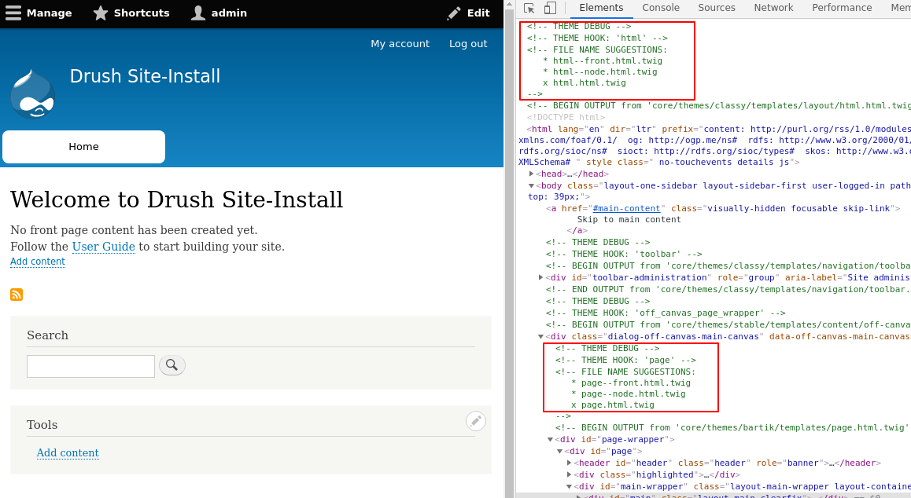

<!-- _class: lead -->
# 3.2 テーマの開発環境のセットアップ

---

このセクションでは、テーマの開発環境のセットアップ方法を解説します。

---

<!-- _class: lead -->
## 3.2.1 Drupalのローカル環境の構築

---

事前準備として、1.4章、1.5章の通りDrupalがローカルで起動する環境を構築してください。

また、2.6章の通りデバッグ支援のための設定も実施してください。

2章をすでに実施している方は現在の環境をそのまま利用できます。

---

<!-- _class: lead -->
## 3.2.2 テーマのデバッグ支援機能の有効化

---

ここまででDrupalのローカル環境の構築、および基本的なデバッグ支援のための設定ができているはずです。

テーマを開発していくに当たり、さらにテーマのデバッグ支援機能を有効にしましょう。

`web/sites/default/default.services.yml` には、Drupalのサービスに与えるパラメータが記載されています。

2章を実施している方はご存じの通り、Drupal 8ではサービスに対してymlファイルからパラメータを設定することで、サービスの実装クラスや振る舞いを変更することができます。

このファイルを開いてみましょう。

---

```yml
parameters:
  # ...
  twig.config:
    # Twig debugging:
    #
    # When debugging is enabled:
    # - The markup of each Twig template is surrounded by HTML comments that
    #   contain theming information, such as template file name suggestions.
    # - Note that this debugging markup will cause automated tests that directly
    #   check rendered HTML to fail. When running automated tests, 'debug'
    #   should be set to FALSE.
    # - The dump() function can be used in Twig templates to output information
    #   about template variables.
    # - Twig templates are automatically recompiled whenever the source code
    #   changes (see auto_reload below).
    #
    # For more information about debugging Twig templates, see
    # https://www.drupal.org/node/1906392.
    #
    # Not recommended in production environments
    # @default false
    debug: false

    # (続く)
```

---

```yml
    # Twig auto-reload:
    #
    # Automatically recompile Twig templates whenever the source code changes.
    # If you don't provide a value for auto_reload, it will be determined
    # based on the value of debug.
    #
    # Not recommended in production environments
    # @default null
    auto_reload: null
    # Twig cache:
    #
    # By default, Twig templates will be compiled and stored in the filesystem
    # to increase performance. Disabling the Twig cache will recompile the
    # templates from source each time they are used. In most cases the
    # auto_reload setting above should be enabled rather than disabling the
    # Twig cache.
    #
    # Not recommended in production environments
    # @default true
    cache: true 
    
    # ...
```

---

`twig.config` に関して3つのパラメータがあることが分かります。

各パラメータは、それぞれ以下の意味を持ちます。


**twig.config.debug**:

trueにすると、出力されるHTMLにtwigのテンプレート名の候補(suggention)および、実際に適用されたテンプレート名が表示されます。また、twigに `dump()` 関数を追加し、テンプレート内で利用可能な変数をダンプできるようになります。デフォルト値はfalseです。　

---

**twig.config.auto_reload**:

trueにすると、twigテンプレートを更新した時に自動的に再コンパイルし常に最新のファイルがロードされるようになります。デフォルト値はnullです。なお、 `twig.config.debug` がtrueの場合は、このパラメータの値によらず常に常に最新のファイルがロードされます。


**twig.config.cache**:

trueにした場合、twigテンプレートをコンパイルした結果をファイルシステムには保存せず、リクエストの度にコンパイルするようになります。デフォルト値はfalseです。

---

これら3つのパラメータを全てtrueに変更すると、効率よくテーマの開発を進めることができます。

`web/sites/default/default.services.yml` はコアのアップデートにより変更されることもあるので、直接書き換えるのは避けましょう。

2.6章で紹介した設定がされている場合は、 `/sites/development.services.yml` がロードされますので、このファイルの `parameters` キーの下に次のようにパラメータを追加してください。

---

```yml
parameters:
  # ....
  twig.config:
    debug: true
    auto_reload: true
    cache: false
```

それでは、キャッシュをクリアしてからトップページをリロードしてみてください。

次のように `THEME DEBUG` というHTMLのコメントブロックが生成されていれば成功です。

---



---

`THEME HOOK` その部分のHTMLを出力する際に動作するフックの名称、`FILE NAME SUGGESTIONS` にはテンプレートファイルの候補が表示されます。

候補のうち、実際に利用されたファイルには先頭に `x` 印がついており、ファイルシステム上のパスが `BEGIN OUTPUT From` で表示されます。

テーマを開発する上で頻繁にチェックする情報になるので、しっかり押さえておいてください。

---

## まとめ

このセクションでは、テーマの開発環境のセットアップ方法を解説しました。

2.6章でもお伝えしましたが、良い仕事をするにはまず良い道具を整備する事が重要です。

どんな道具を使っても構いませんが、効率の良い環境作りに継続的にコストをかけるようにしてください。
