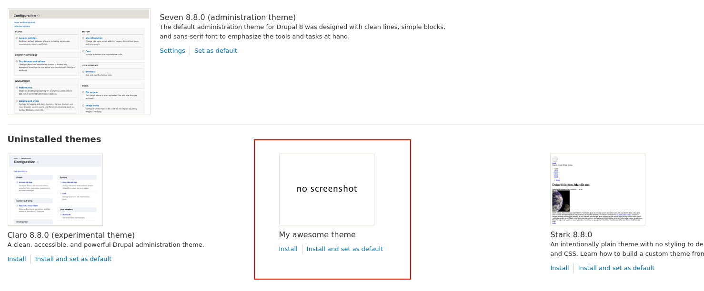
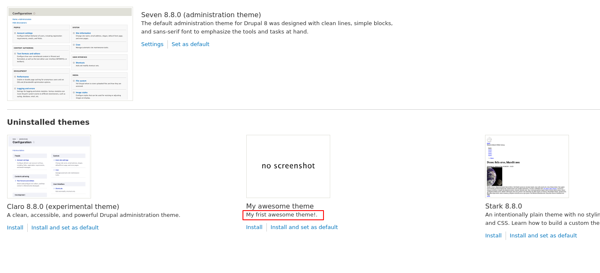

<!-- _class: lead -->
# 3.3 テーマのファイル構成

---

このセクションでは、シンプルなテーマを開発することでテーマのファイル構造について学んでいきます。

コアのテーマやdrupal.orgで公開されている[Conribute theme](https://www.drupal.org/project/project_theme)、DrupalConsoleで自動生成(scaffolding)したテーマは学習用のサンプルとしてはとても有益ですが、情報量が多すぎて初学者には難易度が高くなります。

そのため、まずはなんの機能も持たないシンプルなカスタムテーマを作成し、テーマにはどのようなファイルが必要なのか、というところから解説していきます。

---

<!-- _class: lead -->
## 3.3.1 テーマのソースコードの配置先

---

2.1章で説明したとおり、contribute themeやカスタムテーマ　は `web/themes` ディレクトリに格納されます。

モジュールやテーマなど、Drupal特有のファイルをどのディレクトリに配置するかは、composerの [installer-paths](https://getcomposer.org/doc/faqs/how-do-i-install-a-package-to-a-custom-path-for-my-framework.md#how-do-i-install-a-package-to-a-custom-path-for-my-framework-) で設定されています。

ルートディレクトリにある `composer.json` を見てみましょう。

---

```json
...
    "extra": {
        ...
        "installer-paths": {
            "web/core": ["type:drupal-core"],
            "web/libraries/{$name}": ["type:drupal-library"],
            "web/modules/contrib/{$name}": ["type:drupal-module"],
            "web/profiles/contrib/{$name}": ["type:drupal-profile"],
            "web/themes/contrib/{$name}": ["type:drupal-theme"],
            "drush/Commands/contrib/{$name}": ["type:drupal-drush"]
        }
        ...
```

---

`"web/themes/contrib/{$name}": ["type:drupal-theme"]` の行を見ると、「drupal-themeというtypeのライブラリは、web/themes/contrib/{$name} にインストールされる」ということがなんとなく読み取れるかと思います。

`type` と `name` の定義については以下を参照してください。
- [type](https://getcomposer.org/doc/04-schema.md#type)
- [name](https://getcomposer.org/doc/04-schema.md#name)

---

このようにcomposer.jsonの断片からだけでも、様々な情報を読み取ることができます。

「Drupalのルールはこれだ」と丸暗記や手順で覚えるのではなく、「Drupalではcomposer.jsonのinstaller-pathsでライブラリのtype毎にファイルの配置先を振り分けている」というような考え方で理解するようにしてください。

抽象化して理解する習慣をつけることで、composerで構成管理されているLaravelやSymfonyで書かれた他のコードを見る時にも、知識を応用することができようになります。

(もちろん、これはgemやnpmなど、言語やツール自体が変わっても考え方は同じです)

---

前置きが長くなりましたが、実は「カスタムテーマ」を示す `type` は決まりがないため、どこにインストールするかについても明確な制限はありません。

慣習的には `web/themes/custom/` 以下に配置されますが、Drupalは`web/themes` 以下を再帰的に読み込んでテーマの存在をチェックするため、 `web/themes` 以下であればどこに配置してもモジュールは認識されます。

本コンテンツでは、`web/themes/custom/` 以下に配置していきます。

---

<!-- _class: lead -->
## 3.3.2 my_awesome_themeの開発

---

それでは、いよいよテーマのコードを書いていきましょう。
(ここまで長かったですね！)

冒頭で説明したとおり、このセクションでは何の機能を持たない `my_awesome_theme` テーマを開発します。

---

Drupalにモジュールを認識させるために最低限必要なことは、`{theme_name}.info.yml` を作成することです。

それでは、 `web/themes/custom/my_awesome_theme` というディレクトリと、その下に `my_awesome_theme.info.yml` を作成しましょう。ymlファイルの中身はまだ空のままで構いません。

つまり、ルートディレクトリから確認すると以下のようなファイル構成になるようにします。

```bash
$ find web/themes/custom
web/modules/themes
web/modules/themes/my_awesome_theme
web/modules/themes/my_awesome_theme/my_awesome_theme.info.yml
```

---

次に `my_awesome_theme.info.yml` を次のように書き換えます。

```yml
name: My awesome theme
type: theme
core: 8.x
```

この `name`、`type`、`core` が `{theme_name}.info.yml` に必須なキーとなります。その他のキーも含めて、 `{theme_name}.info.yml` では次のようなキーが指定できます。

---

|キー|必須|値|
|---|---|---|
|name|yes|モジュール(テーマ)の名前|
|type|yes|モジュールの場合は `module`、テーマの場合は `theme`|
|core|yes|サポートするコアのバージョン。Drupal 8.8時点では有効な値は `8.x` のみ。|

---

|キー|必須|値|
|---|---|---|
|description|no|テーマの説明。管理UI上に表示されます(後述)。|
|package|no|テーマが属するパッケージ。動作には影響しない。管理UI上に表示されます。|
|dependencies|no|テーマが依存する他のモジュールやテーマ|
|version|no|テーマのバージョン|

TBD: テーマ特有のキーについても紹介する

---

それでは、my_awesome_themeテーマが無事Drupalに認識されたか確認してみましょう。

上部メニューの `Appearance` をクリックして `/admin/appearance` にアクセスしてください。次のように表示されれば成功です。

---



---

無事に動いたところで、この状態をgitで保存しておきましょう。

```sh
$ git add web/themes/custom
$ git commit -m "congratulations! This is my first theme!"
```

以降は明記しませんが、このように適宜gitでソースコードの変更を管理していってください。

あとで見直したり、不具合が発生した場合の切り分けやロールバックなどを考えると、gitのコミットはなるべく細かい単位で行うことを推奨します。

---

<!-- _class: lead -->
## 3.3.2 テーマに説明を追加する

---

さて、descriptionを省略したため管理UI上でテーマの説明が表示されていません。

以下のように `my_awesome_theme.info.yml` に `description` を追加してみましょう。

```yml
name: My awesome theme
type: theme
core: 8.x
description: My first awesome theme!!!.
```

---

ブラウザをリロードして、以下の様に説明が表示されることを確認してください。



---

`description` は必須ではないため最初は実装しませんでしたが、コードや管理UIからの可読性を考えると必ず実装したほうが良いでしょう。

---

<!-- _class: lead -->
## 2.2.5 テーマの識別子(Machine name)

---

テーマには `Machine name` と呼ばれるユニークなIDが付与されます。

テーマのMachine nameは、`{theme name}.info.yml` の `{theme name}` の部分から自動的に決定されます。つまり、Machine nameはテーマが格納されているディレクトリ名や、`.info.yml` 内の `Name` とは必ずしも一致しない点に注意してください。

---

<!-- _class: lead -->
## 2.2.6 my_awesome_themeの有効化

---

それでは、テーマを有効化してみましょう。

ここでは管理UIからではなく、Drushを使ってCLIから有効化します。

テーマの有効化は `drush` の `theme:enable` サブコマンドを使って以下のように実行します。

```txt
$ vendor/bin/drush theme:enable my_awesome_theme
 [success] Successfully enabled theme: my_awesome_theme
```

---

`/admin/appearance` にアクセスしてください。以下のようにテーマが有効になっているはずです。


TBD.
まだ何の機能も実装していないため、今のところhello_worldモジュールの存在が確認できるのは、このモジュール一覧が表示されるパスだけです。

---

モジュールの状態は `drush pml` でも確認することができます。

```
$ vendor/bin/drush pml |grep hello_world
  Other                 Hello World (hello_world)                                   Enabled
```

---

## まとめ

モジュール開発の最初の一歩として、機能を何も持たないhello_worldモジュールを開発し、Drupalがどのようにモジュールを認識するかの概要が理解できたと思います。

次のセクションでは、伝統的なDrupalの機能拡張方法であるhookを実装していきます。

---

## ストレッチゴール

1. `package` キーを追加して、モジュールが `Custom` パッケージに所属するように変更してください。
2. `version` キーを追加して、モジュールのバージョンを `8.x-1.0` に設定してください。
