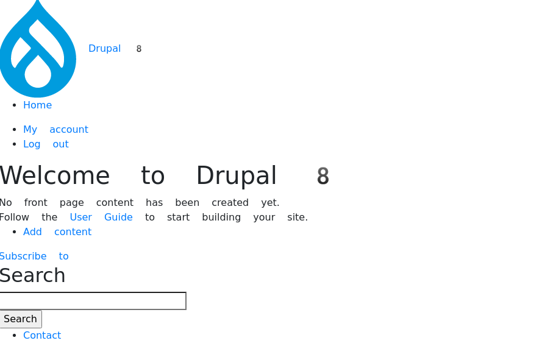
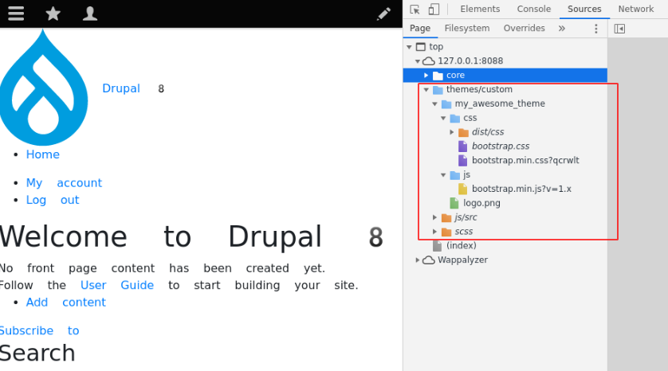

<!-- _class: lead -->
# 3.4 ライブラリを登録して静的にロードする

---

このセクションでは、テーマにCSSとJavascriptを「ライブラリ」として定義し、静的にロードする方法を解説します。

Bootstrap 4のCSSとJavascriptをテーマのライブラリとして定義し、サイトで利用できるようにしましょう。

---

<!-- _class: lead -->
## 3.4.1 ライブラリの定義

---

Drupal 8では、CSSやJavascriptなどのアセットは「ライブラリ」という単位で管理されます。

ライブラリは複数のCSSとJavascriptを持つことができます。

また、ライブラリには別のライブラリとの依存関係を定義することができます。

---

ライブラリの定義は `{theme_name}.libraries.yml` で行います。

`web/themes/custom/my_awesome_theme/my_awesome_theme.libraries.yml` を新規に作成して次のように実装してください。

```yml
base-styling:
  version: 1.x
  css:
    theme:
      css/bootstrap.min.css: { minified: true }
  js:
    js/bootstrap.min.js: { minified: true }
  dependencies:
    - core/jquery
```

---

それではコードを見ていきましょう。

`base-styling` の部分はライブラリの名称です。名前空間としてはここで定義する名称の前にモジュール名やテーマ名が付くため、名前の重複を気にする必要はありません。テーマの単位で管理しやすい名前を付けてください。

`version` はライブラリのバージョンです。特にフォーマットの規定はありません。

---

`css` にはライブラリが参照するCSSファイルを指定します。

`css` の直下の階層には優先度を指定します。これはDrupal特有のものではなく[SMACSS](http://smacss.com/)の定義です。サンプルコードでは一番優先度が低い `theme` を指定しています。

その下の階層にテーマのディレクトリを起点としたcssファイルのパスを指定します。

また、minifiedされたCSSを利用するため、`minified` を `true` に設定しています。これにより、Drupalが再度ファイルをminifyすることを抑制できます。

---

`minified` 以外にも多数の属性が指定可能です。例えば、外部リソースを参照する場合に利用する `external` という属性があります。

詳細は「Adding stylesheets (CSS) and JavaScript (JS) to a Drupal module」の[Defining Libraries: Options & Detailsセクション](https://www.drupal.org/docs/theming-drupal/adding-stylesheets-css-and-javascript-js-to-a-drupal-theme#libraries-options-details) を参照してください。

---

`js` にはライブラリが参照するJavascriptファイルを指定します。

その下の階層にテーマのディレクトリを起点としたJavascriptファイルのパスをリストで指定します。今回は全てのコードをローカル上に持つために内部のパスを指定していますが、CDN等の外部のURLを指定することもできます。

CSSと同様にこちらもminifiedされたファイルを利用するため、`minified` を `true` に設定しています。

ライブラリが他のライブラリに依存する場合、 `dependencies` に宣言します。Bootstrap4はjQueryに依存するため、コアで定義されている `core/jquery` への依存を宣言しました。

---

Drupalコアが定義しているライブラリにどのようなものがあるかは、 `web/core/core.libraries.yml` や `web/core/modules/system/system.libraries.yml`  を参照してください。

非常に恐ろしいことに、「Drupalコアに含まれているjQueryの参照方法が分からない」、「参考にしたスニペットや導入したいプラグインがDrupalとは違うバージョンのjQueryで動いている」という理由だけで、CDN等から違うバージョンのjQueryをロードするカスタム実装はよく見かけます。

このような実装をしてしまうとコアの機能が正しく動く保証がなくなりますので、絶対に止めましょう。

---

`{theme_name}.libraries.yml` には他にも指定可能なキーが多数あります。詳細は [Adding stylesheets (CSS) and JavaScript (JS) to a Drupal theme](https://www.drupal.org/docs/theming-drupal/adding-stylesheets-css-and-javascript-js-to-a-drupal-theme) を参照してください。

---

次に、`{theme_name}.info.yml` でテーマがこのライブラリを利用するように変更します。`web/themes/custom/my_awesome_themes/my_awesome_theme.info.yml` に次の内容を追加してください。

```yml
libraries:
  - my_awesome_theme/base-styling
```

`libraries` にはロードするライブラリ名を指定します。

ライブラリ名の名前空間の先頭にはテーマ名(またはモジュール名)が含まれます。そのため、今回の例では `my_awesome_theme/base-styling` がライブラリ名になります。

---

最後に参照するファイルを配置しましょう。

```
$ mkdir -p web/themes/custom/my_awesome_theme/css
$ mkdir -p web/themes/custom/my_awesome_theme/js
$ curl https://stackpath.bootstrapcdn.com/bootstrap/4.1.3/css/bootstrap.min.css --output web/themes/custom/my_awesome_theme/css/bootstrap.min.css
$ curl https://stackpath.bootstrapcdn.com/bootstrap/4.1.3/css/bootstrap.min.css.map --output web/themes/custom/my_awesome_theme/css/bootstrap.min.css.map
$ curl https://stackpath.bootstrapcdn.com/bootstrap/4.1.3/js/bootstrap.min.js --output web/themes/custom/my_awesome_theme/js/bootstrap.min.js
$ curl https://stackpath.bootstrapcdn.com/bootstrap/4.1.3/js/bootstrap.min.js.map --output web/themes/custom/my_awesome_theme/js/bootstrap.min.js.map
```

開発効率を上げるためにソースマップ (`.map`) ファイルの追加も忘れずに行いましょう。

ソースマップって何？という方は、[Map Preprocessed Code to Source Code](https://developers.google.com/web/tools/chrome-devtools/javascript/source-maps) を参照してください。

---

正しくファイルが配置されている場合、以下の4つのファイルが見つかります。

```
$ find web/themes/custom/my_awesome_theme -type f|grep bootstrap
web/themes/custom/my_awesome_themes/js/bootstrap.min.js
web/themes/custom/my_awesome_themes/js/bootstrap.min.js.map
web/themes/custom/my_awesome_themes/css/bootstrap.min.css.map
web/themes/custom/my_awesome_themes/css/bootstrap.min.css
```

---

今回の修正を行うと、Drupal内部では「テーマレジストリ」と呼ばれるテーマの構造が変更されます。

テーマレジストリはDrupalのキャッシュの設定に依らず必ずキャッシュされるため、変更を適用するためにキャッシュをクリアしましょう。

```txt
$ vendor/bin/drush cr
```

---

それでは、トップページにアクセスしてください。

次のようにBootstrap4の見出しのデザインが適用されていれば成功です。

---



---

出力されたHTMLも確認してみましょう。

次のように先ほどライブラリとして登録したBootstrap4のCSSとJavascriptのファイルがロードされていることが分かります。



---

## まとめ

このセクションでは、テーマにCSSとJavascriptを「ライブラリ」として定義して静的にロードする方法を学びました。

以降のセクションでは、ナビゲーションやサイドバーなど個々のコンポーネントのテンプレートやPreprocessを開発し、サイト全体にBootstrap4のデザインを適用していきます。

---

## ストレッチゴール

1. コンソールに "hello my_awesome_theme!!!, It works with Bootstrap {version}." を出力するJavascriptを `custom.js` というファイル名で作成し、`custom-script` というライブラリ名で登録してテーマに組み込んでください。`{version}` の部分は参照しているBootstrapのバージョンを動的に取得するようにしてください。
