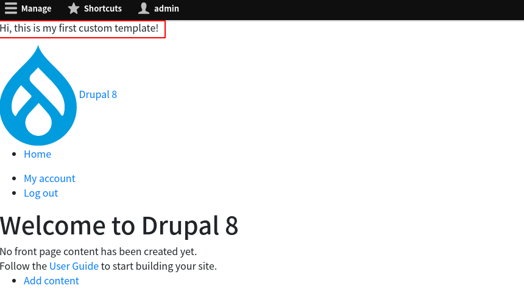

<!-- _class: lead -->
# 3.5 HTMLテンプレート

---

このセクションでは、一番大きな単位のテンプレートであるHTMLテンプレートを作成します。

---

<!-- _class: lead -->
## 3.5.1 現在利用されているテンプレートを確認する

---

まずは、現在利用されているテンプレートファイルを確認しましょう。

トップページにアクセスしてHTMLの出力を見ると次のことが分かります。

- `html.html.twig`, `html--node.html.twig`,  `html--front.html.twig` という３つのテンプレートファイルの候補がある
- `web/core/modules/system/templates/html.html.twig` というファイルが最終的に使われている

---


---

<!-- _class: lead -->
## 3.5.2 独自のテンプレートファイルを作成する

---

それでは、このテンプレートファイルをベースに独自のテンプレートファイルを作成しましょう。

`web/core/modules/system/templates/html.html.twig` をテーマの `templates` ディレクトリにコピーします。

```txt
$ mkdir -p web/themes/custom/my_awesome_theme/templates
$ cp web/core/modules/system/templates/html.html.twig web/themes/custom/my_awesome_theme/templates/
```

ファイルをコピーしたら、キャッシュをクリアしてください。

```txt
$ vendor/bin/drush cr
```

---

再度トップページにアクセスしてみましょう。先程コピーしたテンプレートファイルが適用されていることが分かります。


---

無事にコピーしたファイルが利用されるようになったので、ファイルの内容を見ていきましょう。

---

```txt
{#
/**
 * @file
 * Default theme implementation for the basic structure of a single Drupal page.
 *
 * Variables:
 * - logged_in: A flag indicating if user is logged in.
 * - root_path: The root path of the current page (e.g., node, admin, user).
 * - node_type: The content type for the current node, if the page is a node.
 * - head_title: List of text elements that make up the head_title variable.
 *   May contain one or more of the following:
 *   - title: The title of the page.
 *   - name: The name of the site.
 *   - slogan: The slogan of the site.
 * - page_top: Initial rendered markup. This should be printed before 'page'.
 * - page: The rendered page markup.
 * - page_bottom: Closing rendered markup. This variable should be printed after
 *   'page'.
 * - db_offline: A flag indicating if the database is offline.
 * - placeholder_token: The token for generating head, css, js and js-bottom
 *   placeholders.
 *
 * @see template_preprocess_html()
 *
 * @ingroup themeable
 */
#}
```

---

```
<!DOCTYPE html>、
<html{{ html_attributes }}>
  <head>
    <head-placeholder token="{{ placeholder_token }}">
    <title>{{ head_title|safe_join(' | ') }}</title>
    <css-placeholder token="{{ placeholder_token }}">
    <js-placeholder token="{{ placeholder_token }}">
  </head>
  <body{{ attributes }}>
    {#
      Keyboard navigation/accessibility link to main content section in
      page.html.twig.
    #}
    <a href="#main-content" class="visually-hidden focusable">
      {{ 'Skip to main content'|t }}
    </a>
    {{ page_top }}
    {{ page }}
    {{ page_bottom }}
    <js-bottom-placeholder token="{{ placeholder_token }}">
  </body>
</html>
```

---

冒頭のコメント (`{#...#}` のセクション) の `Variables` には、このテンプレートファイルで利用可能な変数とその説明が書かれています。

コアで提供されているテンプレートについては、ファイルの冒頭に必ずこの情報が記載されていますが、Contributeモジュールやテーマでは記載がない場合もあります。品質や使い勝手をチェックする上での一つの判断要素になるでしょう。

コメント以降には、テンプレートとしてhtml, head, bodyタグなど、上位の階層のタグが含まれていることが分かります。

---

bodyタグの直後に以下のHTMLを埋め込んでみましょう。

```
<p>Hi, this is my first custom template!</p>
```

次のように表示されれば成功です。

---



---

<!-- _class: lead -->
## 3.5.3 利用可能な変数とその値を確認する

---

テンプレートの冒頭のコメントに利用可能な変数の一覧がありますが、実際に格納されている値まではコメントからは確認できません。

また、3.1章で紹介したようにテーマやモジュールがPreprocessを通してテンプレートで利用する変数を追加することもできます。

そのため、実際にはtwigのデバッグ機能を使って変数をダンプするのが一番正確な情報を得る手段になります。

`dump()` 関数を使って変数の一覧と内容を表示してみましょう。

`html` タグの前の行に `{{ dump() }}` を追加してください。

---

トップページをリロードしてみましょう。期待に反してエラー画面が表示されたと思います。

[dump()](https://twig.symfony.com/doc/3.x/functions/dump.html) 関数はそのテンプレートで利用可能な全ての変数とその値を表示しますが、データが大きすぎると期待通り動かない場合があります。

この問題を回避するために [twig_vardumper](https://www.drupal.org/project/twig_vardumper) モジュールを導入しましょう。次のコマンドを実行してモジュールを有効化してください。


```txt
$ composer require drupal/twig_vardumper:~2.2
$ vendor/bin/drush -y en twig_vardumper
```

---

twig_vardumperは、`dump()` 関数をそのまま置き換えるので、コードを変更する必要はありません。

トップページをリロードして次のように表示されれば成功です。


---

<!-- _class: lead -->
## 3.5.4 ファイルのクリーンアップ

---

ここまでで、動作確認のためにhtml.html.twigに対して次の変更を行いました。

- Pタグの追加
- dump関数の追加

この変更は以降は不要になるので、元に戻しておいてください。

---

## まとめ

このセクションでは、一番大きな単位のテンプレートであるHTMLテンプレートを作成しました。

基本的なテンプレート開発は、このセクションで行った通り親テーマまたはコアのテンプレートをコピーする事がスタート地点になります。

テンプレートで利用可能な変数が十分であればテンプレートやJavascript、CSSの修正を行い、変数が足りない場合はPreprocessのコードを開発することになります。

Preprocessの開発についてはこの章の中で別途解説します。
