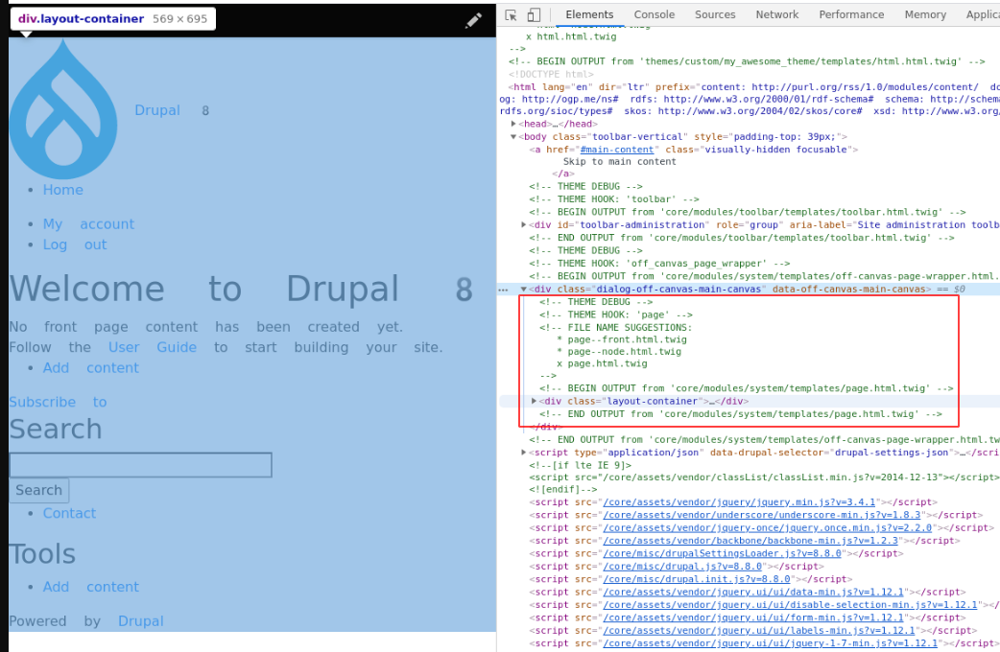
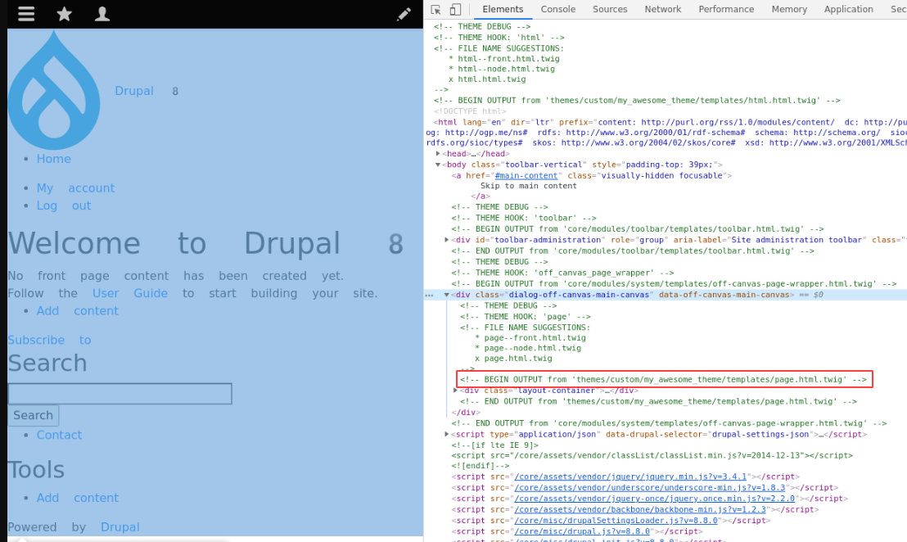
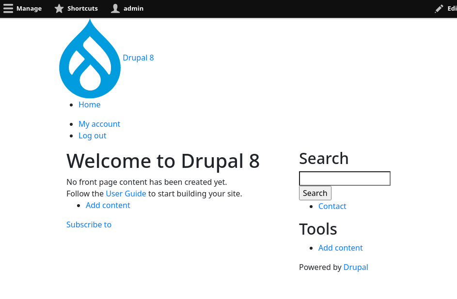

<!-- _class: lead -->
# 3.6 Pageテンプレート

---

このセクションでは、メインのコンテンツ表示部分を制御するPageテンプレートを作成します。

とは言っても、やることは前回のHTMLテンプレートの作成と変わりありません。

現在利用されているテンプレートを確認し、そのテンプレートファイルをコピーし、必要に応じてカスタマイズしていきます。

これは、html, page region, nodeのように対象のテンプレートに依存しない共通の考え方です。

---

<!-- _class: lead -->
## 3.6.1 現在利用されているテンプレートを確認する

---

それでは、現在利用されているテンプレートファイルを確認しましょう。

トップページにアクセスしてHTMLの出力を見ると次のことが分かります。

- `page.html.twig`, `page--node.html.twig`,  `page--front.html.twig` という３つのテンプレートファイルの候補がある
- `web/core/modules/system/templates/page.html.twig` というファイルが最終的に使われている

---



---

<!-- _class: lead -->
## 3.6.2 独自のテンプレートファイルを作成する

---

それでは、このテンプレートファイルをベースに独自のテンプレートファイルを作成しましょう。

`web/core/modules/system/templates/page.html.twig` をテーマの `templates` ディレクトリにコピーします。

```txt
$ mkdir -p web/themes/custom/my_awesome_theme/templates
$ cp web/core/modules/system/templates/page.html.twig web/themes/custom/my_awesome_theme/templates/
```

ファイルをコピーしたら、キャッシュをクリアしてください。

```txt
$ vendor/bin/drush cr
```

---

再度トップページにアクセスしてみましょう。先程コピーしたテンプレートファイルが適用されていることが分かります。



---

無事にコピーしたファイルが利用されるようになったので、ファイルの内容を見ていきましょう。

---

```txt
{#
/**
 * @file
 * Default theme implementation to display a single page.
 *
 * The doctype, html, head and body tags are not in this template. Instead they
 * can be found in the html.html.twig template in this directory.
 *
 * Available variables:
 *
 * General utility variables:
 * - base_path: The base URL path of the Drupal installation. Will usually be
 *   "/" unless you have installed Drupal in a sub-directory.
 * - is_front: A flag indicating if the current page is the front page.
 * - logged_in: A flag indicating if the user is registered and signed in.
 * - is_admin: A flag indicating if the user has permission to access
 *   administration pages.
 *
 * Site identity:
 * - front_page: The URL of the front page. Use this instead of base_path when
 *   linking to the front page. This includes the language domain or prefix.
 *
 * Page content (in order of occurrence in the default page.html.twig):
 * - messages: Status and error messages. Should be displayed prominently.
 * - node: Fully loaded node, if there is an automatically-loaded node
 *   associated with the page and the node ID is the second argument in the
 *   page's path (e.g. node/12345 and node/12345/revisions, but not
 *   comment/reply/12345).
 *
 * Regions:
 * - page.header: Items for the header region.
 * - page.primary_menu: Items for the primary menu region.
 * - page.secondary_menu: Items for the secondary menu region.
 * - page.highlighted: Items for the highlighted content region.
 * - page.help: Dynamic help text, mostly for admin pages.
 * - page.content: The main content of the current page.
 * - page.sidebar_first: Items for the first sidebar.
 * - page.sidebar_second: Items for the second sidebar.
 * - page.footer: Items for the footer region.
 * - page.breadcrumb: Items for the breadcrumb region.
 *
 * @see template_preprocess_page()
 * @see html.html.twig
 *
 * @ingroup themeable
 */
#}
```

---

```txt
<div class="layout-container">

  <header role="banner">
    {{ page.header }}
  </header>

  {{ page.primary_menu }}
  {{ page.secondary_menu }}

  {{ page.breadcrumb }}

  {{ page.highlighted }}

  {{ page.help }}

  <main role="main">
    <a id="main-content" tabindex="-1"></a>{# link is in html.html.twig #}

    <div class="layout-content">
      {{ page.content }}
    </div>{# /.layout-content #}

    
      <aside class="layout-sidebar-first" role="complementary">
        {{ page.sidebar_first }}
      </aside>
    

    
      <aside class="layout-sidebar-second" role="complementary">
        {{ page.sidebar_second }}
      </aside>
    

  </main>

  
    <footer role="contentinfo">
      {{ page.footer }}
    </footer>
  

</div>{# /.layout-container #}
```

---

冒頭のコメントに利用可能な変数の情報があり、その後にテンプレートの本文が実装されています。HTMLテンプレートと同様ですね。

---

<!-- _class: lead -->
## 3.6.3 ページにBootstrapのGrid systemを適用する

---

3.6.1章で確認したPageテンプレートで出力されている範囲と3.6.2章のテンプレートのコードを見ると、Drupalの各リージョンに配置されたコンテンツやブロックなどをどのように配置するかを、このテンプレートが決めていることが分かります。

現在はBootstrap4が利用可能になっていますが、現在は見出しなどの一部にしか適用されていない状態です。

BootstrapのGrid systemを適用して全体のレイアウトを調整しましょう。

`web/core/modules/system/templates/page.html.twig` を次のように変更してください(冒頭のコメント部分の記載は省略していますが、そのまま残しておきましょう)。

---

```txt
<div class="layout-container container">

  <div class="row flex-row">
    <header role="banner">
      {{ page.header }}
    </header>
  </div>

  <div class="row flex-row">
    {{ page.primary_menu }}
  </div>

  <div class="row flex-row">
    {{ page.secondary_menu }}
  </div>

  <div class="row flex-row">
    {{ page.breadcrumb }}
  </div>

  <div class="row flex-row">
    {{ page.highlighted }}
  </div>

  <div class="row flex-row">
    {{ page.help }}
  </div>

  {# (続く..) #}
```

---

```txt
  <main role="main">
    <a id="main-content" tabindex="-1"></a>{# link is in html.html.twig #}

    <div class="row flex-row">
      <div class="col">
        <div class="layout-content">
          {{ page.content }}
        </div>{# /.layout-content #}
      </div>

      <div class="col-md-4">
        
        <aside class="layout-sidebar-first" role="complementary">
          {{ page.sidebar_first }}
        </aside>
        

        
        <aside class="layout-sidebar-second" role="complementary">
          {{ page.sidebar_second }}
        </aside>
        
      </div>

    </div>
  </main>

  <div class="row flex-row">
    
      <footer role="contentinfo">
        {{ page.footer }}
      </footer>
    
  </div>

</div>{# /.layout-container #}
```

---

テンプレートが出力する各コンポーネント (`page.***`)をBoostrapのGrid systemでレイアウトしました。

メインコンテンツの部分のみ、コンテンツ部分とサイドバーが2カラムになるようにレイアウトしています。

Bootstrap4の詳細な使い方を覚えるのが趣旨ではないため詳細な解説は割愛しますが、[Grid systemのドキュメント](https://getbootstrap.com/docs/4.1/layout/grid/) に目を通して、このテンプレートが何を行っているのかは理解しておいてください。

それではトップページにアクセスしてみましょう。次のように表示されれば成功です。

---



---

## まとめ

このセクションでは、メインのコンテンツ表示部分を制御するPageテンプレートを作成しました。

テンプレートをカスタマイズする際の考え方や流れ、情報の探し方は前回のhtmlテンプレートと同様だったと思います。

このように、「同じパターンだ」「抽象化すると前と同じだ」のように俯瞰して学習する習慣を付けるのは非常に大切です。

---

「これから新しいフレームワークを覚える」と考えるととても多くのことを学ばなければならない気になりますが、他のフレームワークで使われている設計思想やデザインパターンはDrupalでも採用されているケースが多くあるはずです。

自分が今までやってきた知識と照らし合わせながら効率的に学習を進めてください。

---

## ストレッチゴール

1. 3.6.2章で開発したテンプレートでは、メインのコンテンツとサイドバーを2カラムのレイアウトで出力しています。しかし、Drupalのブロックレイアウトやメニューの設定によってはサイドバーの出力は空になることもあり、この状態はテンプレート側でも考慮すべきです。サイトバーに出力するデータが何もない場合は、`page.content` がカラムの幅を100%利用できるように修正してください。
