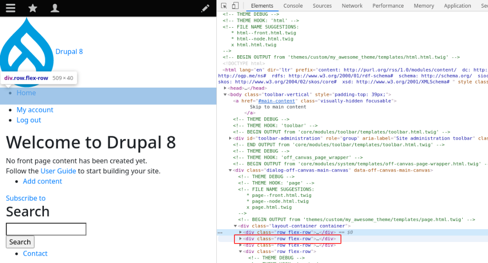
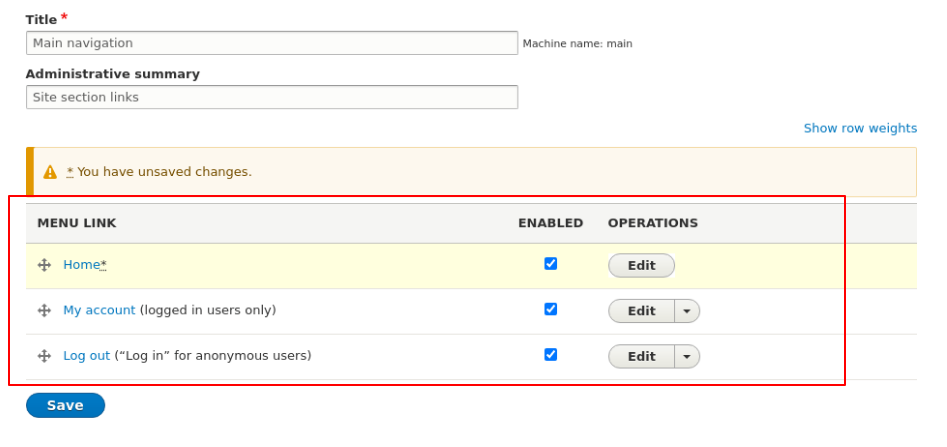

<!-- _class: lead -->
# 3.7 Region, Block, Menuテンプレート

---

このセクションでは、テーマにBootstrap4の[Navbar](https://getbootstrap.com/docs/4.1/components/navbar/) のデザインを実装します。

これを通してRegion, Block, Menuの3種類のテンプレートを開発します。

前回と同様の繰り返しになります（重要なので2回目です）が、デザインを当てるコンポーネントが変わってもやることは変わりありません。

現在利用されているテンプレートを確認し、そのテンプレートファイルをコピーし、必要に応じてカスタマイズしていきます。

---

<!-- _class: lead -->
## 3.7.1 最終的に必要なHTML出力と現状のHTML出力を確認する

---

まず、最終的にどのようなHTMLを出力すべきかを整理しましょう。

Bootstrap4のオフィシャルドキュメントの例は少し複雑なので、w3schools.comの[Basic Navbar](https://www.w3schools.com/bootstrap4/bootstrap_navbar.asp) のサンプルを参考にします。

---

```html
<!-- A grey horizontal navbar that becomes vertical on small screens -->
<nav class="navbar navbar-expand-sm bg-light">

  <!-- Links -->
  <ul class="navbar-nav">
    <li class="nav-item">
      <a class="nav-link" href="#">Link 1</a>
    </li>
    <li class="nav-item">
      <a class="nav-link" href="#">Link 2</a>
    </li>
    <li class="nav-item">
      <a class="nav-link" href="#">Link 3</a>
    </li>
  </ul>

</nav>
```

---

Drupalが出力するDOM構造とCSSのクラスをこれに合わせて変更していきましょう。

トップページにアクセスしてください。現状は「ロゴ」、「Homeへのリンク」、「My accountとLog outのリンク」の3つが別々の行(`.row` クラス)で出力されていることが分かります。

---


---




---


---

今回は、シンプルにするためにロゴは出力しないように変更してしまいましょう。

その他の「Home」、「My account」、「Log out」の3つを1つのNavbarとして出力することをこのセクションのゴールとします。

---

<!-- _class: lead -->
## 3.7.2 Navbarに表示するリンクを1つのメニューにまとめる

---

ご存知の通り、Drupalではメニューを管理UIから定義してそれをブロックとしてリージョンに配置することでメニューを出力しています。

まずはロゴの出力を無効化しましょう。

画面上部のツールバーから「Manage > Structure > Block layout」に進み、ブロックレイアウトの管理UI (`/admin/structure/block`) から「Site Branding」を「Disable」に変更してください。

---


---

同様に「User account menu」も「Disable」に変更してください。


---

これで、「Main navigation」メニューに登録されている「Home」のみが出力される状態になりました。

次は、先ほど無効化した「User account menu」に登録されている2つのリンクを「Main navigation」に移動しましょう。

画面上部のツールバーから「Manage > Structure > Menus」に進み、メニューの管理UI (`/admin/structure/menu`) から「User account menu」の編集画面に移動します。

---


---

そこから、更に「My account」メニューの編集画面に移動します。


---

「Parent link」を「Main Navigation」に変更してください。


---

「Log out」メニューも、同様に「Parent link」を「Main Navigation」に変更してください。

次に、「Main Navigation」の編集画面に移動して、「Home]、「My account」、「Log out」の順にメニューの並びを調整してください。

---



---

これで設定は完了です。トップページにアクセスしてください。
3つのリンクが1つの行(`.row` クラス)で出力されるようになりました。

---

<!-- _class: lead -->
## 3.7.3 Menuテンプレートのカスタマイズ

---

TBD

---

<!-- _class: lead -->
## 3.7.4 Blockテンプレートのカスタマイズ

---

TBD

---

<!-- _class: lead -->
## 3.7.5 Regionテンプレートのカスタマイズ

---

TBD

---

## まとめ

TBD

---

## ストレッチゴール

TBD
