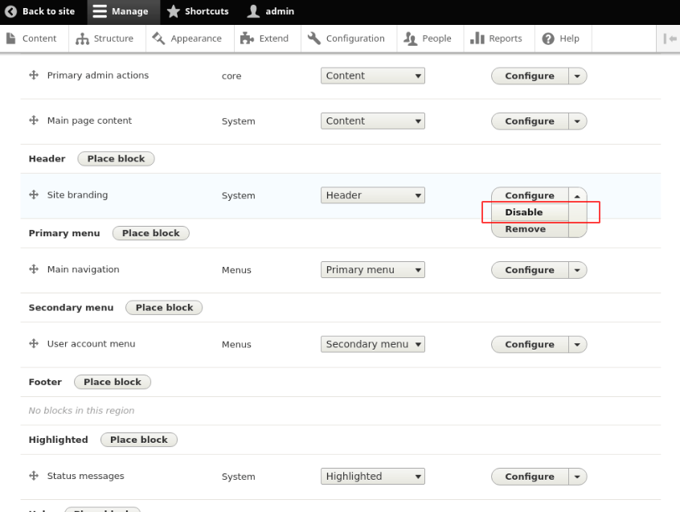

<!-- _class: lead -->
# 3.7 Region, Block, Menuテンプレート

---

このセクションでは、テーマにBootstrap4の[Navbar](https://getbootstrap.com/docs/4.1/components/navbar/) のデザインを実装します。

これを通してRegion, Block, Menuの3種類のテンプレートを開発します。

前回と同様の繰り返しになります（重要なので2回目です）が、デザインを当てるコンポーネントが変わってもやることは変わりありません。

現在利用されているテンプレートを確認し、そのテンプレートファイルをコピーし、必要に応じてカスタマイズしていきます。

---

<!-- _class: lead -->
## 3.7.1 最終的に必要なHTML出力と現状のHTML出力を確認する

---

まず、最終的にどのようなHTMLを出力すべきかを整理しましょう。

Bootstrap4のオフィシャルドキュメントの例は少し複雑なので、w3schools.comの[Basic Navbar](https://www.w3schools.com/bootstrap4/bootstrap_navbar.asp) のサンプルを参考にします。

---

```html
<!-- A grey horizontal navbar that becomes vertical on small screens -->
<nav class="navbar navbar-expand-sm bg-light">

  <!-- Links -->
  <ul class="navbar-nav">
    <li class="nav-item">
      <a class="nav-link" href="#">Link 1</a>
    </li>
    <li class="nav-item">
      <a class="nav-link" href="#">Link 2</a>
    </li>
    <li class="nav-item">
      <a class="nav-link" href="#">Link 3</a>
    </li>
  </ul>

</nav>
```

---

Drupalが出力するDOM構造とCSSのクラスをこれに合わせて変更していきましょう。

トップページにアクセスしてください。現状は「ロゴ」、「Homeへのリンク」、「My accountとLog outのリンク」の3つが別々の行(`.row` クラス)で出力されていることが分かります。

---


---


---


---

今回は、シンプルにするためにロゴは出力しないように変更してしまいましょう。

その他の「Home」、「My account」、「Log out」の3つを1つのNavbarとして出力することをこのセクションのゴールとします。

---

<!-- _class: lead -->
## 3.7.2 Navbarに表示するリンクを1つのメニューにまとめる

---

ご存知の通り、Drupalではメニューを管理UIから定義してそれをブロックとしてリージョンに配置することでメニューを出力しています。

まずはロゴの出力を無効化しましょう。

画面上部のツールバーから「Manage > Structure > Block layout」に進み、ブロックレイアウトの管理UI (`/admin/structure/block`) から「Site Branding」を「Disable」に変更してください。

---



---

同様に「User account menu」も「Disable」に変更してください。


---

これで、「Main navigation」メニューに登録されている「Home」のみが出力される状態になりました。

次は、先ほど無効化した「User account menu」に登録されている2つのリンクを「Main navigation」に移動しましょう。

画面上部のツールバーから「Manage > Structure > Menus」に進み、メニューの管理UI (`/admin/structure/menu`) から「User account menu」の編集画面に移動します。

---


---

そこから、更に「My account」メニューの編集画面に移動します。


---

「Parent link」を「Main Navigation」に変更してください。


---

「Log out」メニューも、同様に「Parent link」を「Main Navigation」に変更してください。

次に、「Main Navigation」の編集画面に移動して、「Home]、「My account」、「Log out」の順にメニューの並びを調整してください。


---

これで設定は完了です。トップページにアクセスしてください。

3つのリンクが1つの行(`.row` クラス)で出力されるようになりました。

---

<!-- _class: lead -->
## 3.7.3 Blockテンプレートのカスタマイズ

---

それでは、今度はテンプレートをカスタマイズしてきましょう。

例によって変更したいDOMを出力しているテンプレートをまずは特定します。

3.7.1章の通り、Bootstrap4のNavbarの一番外側のタグは `nav` になります。

トップページにアクセスした時に出力されるHTMLを見ると、この部分は `web/core/modules/system/templates/block--system-menu-block.html.twig` が出力していることが分かります。

---

このテンプレートファイルをテーマのディレクトリにコピーしましょう。

```sh
$ cp web/core/modules/system/templates/block--system-menu-block.html.twig web/themes/custom/my_awesome_theme/templates
```

コピーが終わったら、テンプレートファイルを見てみましょう。

---

```ttx
+{#
+/**
+ * @file
+ * Default theme implementation for a menu block.
+ *
+ * Available variables:
+ * - plugin_id: The ID of the block implementation.
+ * - label: The configured label of the block if visible.
+ * - configuration: A list of the block's configuration values.
+ *   - label: The configured label for the block.
+ *   - label_display: The display settings for the label.
+ *   - provider: The module or other provider that provided this block plugin.
+ *   - Block plugin specific settings will also be stored here.
+ * - content: The content of this block.
+ * - attributes: HTML attributes for the containing element.
+ *   - id: A valid HTML ID and guaranteed unique.
+ * - title_attributes: HTML attributes for the title element.
+ * - content_attributes: HTML attributes for the content element.
+ * - title_prefix: Additional output populated by modules, intended to be
+ *   displayed in front of the main title tag that appears in the template.
+ * - title_suffix: Additional output populated by modules, intended to be
+ *   displayed after the main title tag that appears in the template.
+ *
+ * Headings should be used on navigation menus that consistently appear on
+ * multiple pages. When this menu block's label is configured to not be
+ * displayed, it is automatically made invisible using the 'visually-hidden' CSS
+ * class, which still keeps it visible for screen-readers and assistive
+ * technology. Headings allow screen-reader and keyboard only users to navigate
+ * to or skip the links.
+ * See http://juicystudio.com/article/screen-readers-display-none.php and
+ * http://www.w3.org/TR/WCAG-TECHS/H42.html for more information.
+ *
+ * @ingroup themeable
+ */
+#}
```

---

```
+
+<nav role="navigation" aria-labelledby="{{ heading_id }}"{{ attributes|without('role', 'aria-labelledby') }}>
+  {# Label. If not displayed, we still provide it for screen readers. #}
+  
+    
+  
+  {{ title_prefix }}
+  <h2{{ title_attributes.setAttribute('id', heading_id) }}>{{ configuration.label }}</h2>
+  {{ title_suffix }}
+
+  {# Menu. #}
+  
+    {{ content }}
+  
+</nav>
```

---

`nav` タグの出力部分を見ると、roleとaria-labelledby以外の属性は `{{ attributes|without('role', 'aria-labelledby') }}` で生成されるので、`attributes` 変数にクラスを設定すればデザインを変えることができそうです。

ログインした状態でもう一度トップページのHTMLを見てみましょう。「contextual-region」というクラスがすでに付与されていることが分かります。

既存の機能を壊さないように、これは維持したままBootstrap4で必要なクラスの値を追加する必要があります。

---


---

3.2.2章で少し紹介した通り、twigのデバッグ機能を有効にしている場合は、`dump()` 関数でそのテンプレートで利用可能な変数名とその値を確認することができます。

`nav` タグの前の行に `{{ dump() }}` を追加してトップページにもう一度アクセスしてください。

テンプレートでアクセスできる変数とその値が表示され....るかと思いきや、おそらくInternal Server Error(500)になると思います。

テンプレートで利用可能な変数が大量にある場合(これはほとんどないですが)や、変数の内部で再帰的な参照がある場合に[この問題](https://www.drupal.org/project/drupal/issues/2647298)が発生します。

---

`{{ dump(attributes) }}` のように確認する変数名を絞れば表示できますが、この方法だと「テンプレートにどんな変数があるかわからないので全て表示して確認したい」ができなくなります。

この問題を解決するために [Twig VarDumper](https://www.drupal.org/project/twig_vardumper) を導入しましょう。次のコマンドを実行してください。

```
$ composer require --dev drupal/twig_vardumper:~2.2
$ vendor/bin/drush -y en twig_vardumper
```

※ twig_vardumper 2.3以降はDrupal 8には非対応なので `~2.2` を指定しています。

---

Twig VarDumperは標準の `dump()` 関数の実装を上書きするので、twigテンプレートの方は変更する必要はありません。

再度トップページにアクセスしてください。次のように変数の一覧と詳細が表示されます。


---

これを見ると、`class` という配列に値を追加すれば良さそうですね。

ここで、確認のためにtwigテンプレートに挿入した `dump()` 関数のコードは消しておいてください。

---

それではテンプレートをカスタマイズしましょう。

今回の場合、次の2つの方法で対応できます。

- 1. Twigテンプレート内でattributes変数を変更する
- 2. Proprocessを実装してattributes変数を変更する

今回はtwigの知識だけで実現できるように1.の方法を採用します。

`web/themes/custom/my_awesome_theme/templates/block--system-menu-block.html.twig` を次のように変更してください (※冒頭のコメントは省略していますがそのまま残しておきましょう)。

---

```txt


<nav role="navigation" aria-labelledby="{{ heading_id }}"{{ attributes.addClass(additional_classes)|without('role', 'aria-labelledby') }}>
  {# Label. If not displayed, we still provide it for screen readers. #}
  
    
  
  {{ title_prefix }}
  <h2{{ title_attributes.setAttribute('id', heading_id) }}>{{ configuration.label }}</h2>
  {{ title_suffix }}

  {# Menu. #}
  
    {{ content }}
  
</nav>
```

変更したのは2-3行目のみです。このサンプルコードでは `additional_classes` という変数に追加するBootstrap用のクラスを格納し、 `attributes` オブジェクトの `addClass` メソッドでクラスを追加しています。

---

 `attributes` オブジェクトで利用可能なメソッドの詳細は [Using attributes in templates](https://www.drupal.org/docs/8/theming-drupal-8/using-attributes-in-templates) を参照してください。

ここでトップページの状態を確認しましょう。まだBootstrapのスタイルは当たっていないはずです。

ここから更にliやaタグにもクラスを当てる必要があります。これらについては次のセクションで解説します。

---

<!-- _class: lead -->
## 3.7.4 Menuテンプレートのカスタマイズ

---

先ほど使ったテンプレートを見ると、`nav` タグの下の階層の `li` や `a` タグは別のテンプレートが出力していることが分かります。

```
  {# Menu. #}
  
    {{ content }}
  
```

先程と同じようにHTMLの出力から利用されているテンプレートを確認すると、`web/core/modules/system/templates/menu.html.twig` が出力していることが分かります。

---

このテンプレートファイルをテーマのディレクトリにコピーしましょう。

```sh
$ cp web/core/modules/system/templates/menu.html.twig web/themes/custom/my_awesome_theme/templates
```

テンプレートのコードも見てみましょう。

---

```twig
+{#
+/**
+ * @file
+ * Default theme implementation to display a menu.
+ *
+ * Available variables:
+ * - menu_name: The machine name of the menu.
+ * - items: A nested list of menu items. Each menu item contains:
+ *   - attributes: HTML attributes for the menu item.
+ *   - below: The menu item child items.
+ *   - title: The menu link title.
+ *   - url: The menu link url, instance of \Drupal\Core\Url
+ *   - localized_options: Menu link localized options.
+ *   - is_expanded: TRUE if the link has visible children within the current
+ *     menu tree.
+ *   - is_collapsed: TRUE if the link has children within the current menu tree
+ *     that are not currently visible.
+ *   - in_active_trail: TRUE if the link is in the active trail.
+ *
+ * @ingroup themeable
+ */
+#}
```

---

```
+
+
+{#
+  We call a macro which calls itself to render the full tree.
+  @see https://twig.symfony.com/doc/1.x/tags/macro.html
+#}
+{{ menus.menu_links(items, attributes, 0) }}
+
+
+  
+  
+    
+      <ul{{ attributes }}>
+    
+      <ul>
+    
+    
+      <li{{ item.attributes }}>
+        {{ link(item.title, item.url) }}
+        
+          {{ menus.menu_links(item.below, attributes, menu_level + 1) }}
+        
+      </li>
+    
+    </ul>
+  
+{% endmacro %
```

---

これも先程と同じように `attributes` と `items.attributes` にクラスを追加すれば良さそうですね。

次のようにコードを変更してください。

---

```txt


{#
  We call a macro which calls itself to render the full tree.
  @see https://twig.symfony.com/doc/1.x/tags/macro.html
#}
{{ menus.menu_links(items, attributes, 0) }}


  
  
    
      <ul{{ attributes.addClass('navbar-nav') }}>
    
      <ul>
    
    
      <li{{ item.attributes.addClass('nav-item') }}>
        {{ link(item.title, item.url, { 'class':['nav-link']} ) }}
        
          {{ menus.menu_links(item.below, attributes, menu_level + 1) }}
        
      </li>
    
    </ul>
  

```

---

ulタグに `navbar-nav` クラスを、liタグに `nav-item` クラス、aタグに `nav-link` クラスをそれぞれ付与しています。

これで期待通り動きそうですね。トップページにアクセスしてみましょう。


---

上部のナビゲーションは期待通りのデザインになりましたが、サイドメニューにまでデザインが適用されてしまいました。

サイドメニューのHTMLを見ると、同じテンプレートファイルが利用されていることが分かります。


---

twigのテンプレートファイルは、いくつかの候補の中から最も優先度の高いものが利用されます。

`FILE NAME SUGGESTIONS` の上に表示されているファイルほど優先度が高くなります。

候補のテンプレートファイル名を見てみると、3.1章で紹介したpreprocessと同様に、コンテキストが詳細に特定できるものほど優先度高いことが分かります。

---

今回のケースでは、上部のナビゲーションのみにカスタムテンプレートを適用できれば良いことになります。

この部分の出力を見ると `block--system-menu-block--main.html.twig` にリネームすれば良さそうですね。


---

次のコマンドを実行してテンプレートをリネームしてください。

```
$ mv web/themes/custom/my_awesome_theme/templates/block--system-menu-block.html.twig web/themes/custom/my_awesome_theme/templates//block--system-menu-block--main.html.twig
```

再度トップページにアクセスしてください。先ほどリネームしたテンプレートファイルが適用され、上部のナビゲーションのみにBootstrap4のスタイルが適用されているはずです。

---


---

<!-- _class: lead -->
## 3.7.5 Regionテンプレートのカスタマイズ

---

無事にナビゲーションにデザインが適用されましたが、よく見ると横幅が100%になっていません。

出力されたHTMLを見ると、navタグの上に不要なdivタグがあるのが原因であることが分かります。

※ピンとこなかった方は試しにdivタグを消してみましょう。

---


---

この部分はブロックの上位のリージョンテンプレートが出力しているので、他と同様にカスタムテーマのテンプレートとしてコピーしてカスタマイズすれば良さそうです。

また、メニューの時のような副作用が発生しないように `region.html.twig` ではなく `region--primary-menu.html.twig` にファイル名を変更して利用しましょう。

次のコマンドを実行してテンプレートファイルをコピーしてください。

```
$ cp web/core/modules/system/templates/region.html.twig web/themes/custom/my_awesome_theme/templates/region--primary-menu.html.twig
```

---

テンプレートファイルを見てみましょう。

シンプルにコンテンツがあればラッパー用にdivタグを出力し、その中にコンテンツを入れています。

---

```
{#
/**
 * @file
 * Default theme implementation to display a region.
 *
 * Available variables:
 * - content: The content for this region, typically blocks.
 * - attributes: HTML attributes for the region <div>.
 * - region: The name of the region variable as defined in the theme's
 *   .info.yml file.
 *
 * @see template_preprocess_region()
 *
 * @ingroup themeable
 */
#}

  <div{{ attributes }}>
    {{ content }}
  </div>

```

---

外側のdivタグが余計なので、これを削除して以下のように変更してください。

```

  {{ content }}

```

---

これで全ての変更は終了です。トップページにアクセスして、コピーしてテンプレートファイルが適用されていることと、ナビゲージョンの幅が100%になっていることの2点を確認しましょう。


---

## まとめ

このセクションでは、テーマにBootstrap4の[Navbar](https://getbootstrap.com/docs/4.1/components/navbar/) のデザインを実装しました。

HTML的には大きなものではありませんが、テンプレートがコンポーネント単位で細かく分割されているためなかなかの作業量だったと思います。

今回のサンプルコードでは、必要な知識が少なくて済むようにクラスをtwigテンプレートで直接指定しましたが、動的な要素があったり他の機能から上書きを許可したいような場合はpreprocessを実装することになります。

preprocessの実装については、この章の後半で別途解説します。

---

## ストレッチゴール

TBD
