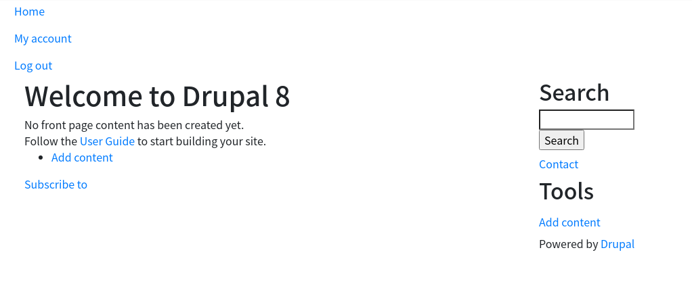
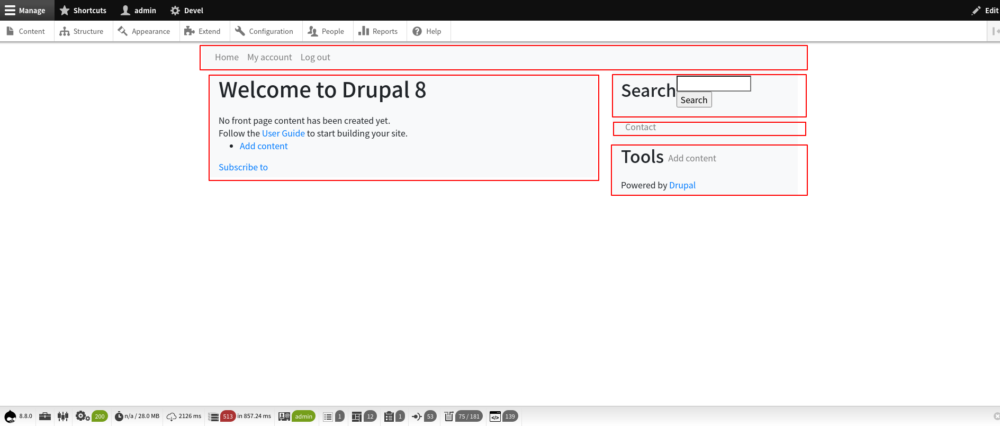
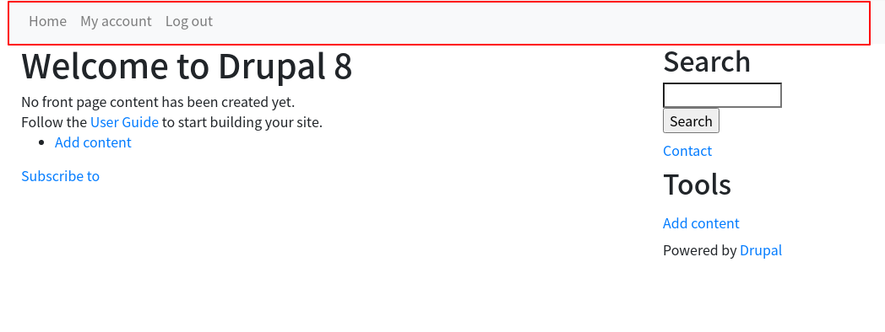

<!-- _class: lead -->
# 3.8 Preprocess

---

前回のセクションではBootstrap4のデザインに必要なCSSクラスを、直接twigテンプレートに実装しました。

このセクションでは、[Preprocessing and modifying attributes in a .theme file](https://www.drupal.org/docs/8/theming-drupal-8/modifying-attributes-in-a-theme-file) の内容を紹介しながら、これをテンプレートではなくPreprocessから変数で渡す形に実装し直します。

---

<!-- _class: lead -->
## 3.8.1 カスタマイズしたテンプレートを削除する

---

それではProprocessを実装しましょう、と行きたいところですが、その前にまずは前回のセクションでカスタマイズしたブロックのテンプレートを削除しましょう。

次のコマンドを実行してテンプレートを削除してください。

```
$ rm web/themes/custom/my_awesome_theme/templates/block--system-menu-block--main.html.twig
```

---

レポジトリのgitのコミット粒度が適切であれば、手動で削除するのではなく `git revert` でコードを戻せるかもしれません。

この場合は、先のrmコマンドの代わりに次のコマンドを実施してください。

```
$ git revert {ブロックのテンプレートの追加、変更のコミットのハッシュ値}
```

---

キャッシュをクリアしてからトップページにアクセスして、Navbarのスタイルが元に戻っていること、つまり、Bootstrap4のスタイルが適用されていないことを確認してください。



---

<!-- _class: lead -->
## 3.8.2 Preprocess: hook_preprocess_HOOKの実装 (1)

---

それではPreprocessを実装していきましょう。

Preprocessは [hook_preprocess_HOOK](https://api.drupal.org/api/drupal/core%21lib%21Drupal%21Core%21Render%21theme.api.php/function/hook_preprocess_HOOK/8.8.x) という命名規則を持つグローバル関数として実装します。

2章でモジュールのフックを実装しましたが、それと同じ仕組みですね。まさにその通りで、Proprocessの実体はフックです。

モジュールの場合、フックは `{module_name}.module` というファイルに実装する必要がありました。テーマの場合は、`{theme_name}.theme` というファイルで実装します。

---

`hook_preprocess_HOOK` の具体的な命名規則について説明します。

先頭の `hook` の部分にはテーマのmachine nameが入ります。今回は `my_awesome_theme` です。

末尾の `HOOK` には、対象となるUIコンポーネントの名前が入ります。例えば、 `html`, `page`, `block`, `node` などです。

今回CSSクラスを追加するUIコンポーネントはブロックなので、 `HOOK` の部分は `block` になります。

つまり、今回実装するPreprocessの関数名は `my_awesome_theme_preprocess_block` となります。

---

実装すべきファイル名と関数名はわかりましたが、関数の実装についてはどうでしょうか？

実はここまでに説明した内容や触ってきたファイルの中にすでに答えはあります。

3.1章で説明した通り、twigからはPreprocess関数に参照渡しされる `$variables` の配列のキーの名前で変数にアクセスすることができます。

また、先ほど削除したテンプレートファイルを見ると、クラス属性は `attribute.class` (コード的には `attributes.without('role', 'aria-labelledby')`) から取得されていることがわかります。

---

つまり、Preprocess内で `$variables['attributes']['class']` にBootstrap 4のNavbarに必要なクラスの値を設定すればよい、ということですね。

[Preprocessing and modifying attributes in a .theme file](https://www.drupal.org/docs/8/theming-drupal-8/modifying-attributes-in-a-theme-file) のサンプルコードを見ると、そのような実装になっていることがわかると思います。

また、このページの末尾にある [A search through the API of preprocess implementations in the core.](https://api.drupal.org/api/drupal/8.8.x/search/preprocess) から他のテーマの実装、例えば [bartik_preprocess_menu](https://api.drupal.org/api/drupal/core%21themes%21bartik%21bartik.theme/function/bartik_preprocess_menu/8.8.x) を見ても同様の実装がされています。

---

Drupal 8に関するドキュメントは手厚く整備されているとはいい難い状況ですが、手がかりがゼロということはまずありません。概念的な解説やコードの中に手がかりは多数あります。

特にコア(テーマを含む)やモジュールのコードはとても有益な実装サンプルです。何か情報を探す場合は必ず見る習慣をつけてください。

それでは、`my_awesome_theme_preprocess_block` を次のように実装してください。

---

```php
<?php

/**
 * Implements hook_preprocess_HOOK().
 */
function my_awesome_theme_preprocess_block(&$variables) {
  // If there is not an existing class array, create an empty array.
  if (!isset($variables['attributes']['class'])) {
    $variables['attributes']['class'] = [];
  }

  // additional classes for bootstrap navbar style
  // @see https://getbootstrap.com/docs/4.1/components/navbar/
  $additional_classes = [
    'navbar',
    'navbar-light',
    'navbar-expand-sm',
    'bg-light',
    'nav-fill',
    'w-100',
  ];

  // Merge with any classes that may have been set by other hook_preprocess_menu invocations
  $variables['attributes']['class'] = array_merge($variables['attributes']['class'], $additional_classes);
}
```

---

キャッシュをクリアしてからトップページにアクセスしてください。

Navbarのスタイルは期待通り変更されていますが、次のように他の箇所にもスタイルが適用される副作用が発生しているはずです。



---

前のセクションでも同じ問題に当たっているので原因は分かりますね。

先程実装した `my_awesome_theme_preprocess_block()` は全てのブロック (先の図の赤枠部分)に対して実行されるため、メインナビゲーション以外にもCSSクラスが適用されてしまいます。

テンプレートで実装していた時は、適用範囲を限定するためにより細かくコンテキストが特定できるファイル名に変更しましたね。

---

Preprocessの場合、次の2つの方法でコンテキスト(今回のケースでは対象のブロックID)を限定することができます。

- 1. `$variables` 引数の `plugin_id` キーの値でブロックIDを識別する
- 2. 特定のブロックIDのみでトリガーするPreprocess関数名に変更する

---

<!-- _class: lead -->
## 3.8.3 Preprocess: hook_preprocess_HOOKの実装 (2)

---

まず、1.の方法から実装してみましょう。

`my_awesome_theme_preprocess_block()` の処理の先頭に次のコードを追加してください。

```php
if ($variables['plugin_id'] !== 'system_menu_block:main') {
  return;
}
```

念のため、修正後のコード全体も記載します。

---

```php
<?php

/**
 * Implements hook_preprocess_HOOK().
 */
function my_awesome_theme_preprocess_block(&$variables) {
  if ($variables['plugin_id'] !== 'system_menu_block:main') {
    return;
  }

  // If there is not an existing class array, create an empty array.
  if (!isset($variables['attributes']['class'])) {
    $variables['attributes']['class'] = [];
  }

  // additional classes for bootstrap navbar style
  // @see https://getbootstrap.com/docs/4.1/components/navbar/
  $additional_classes = [
    'navbar',
    'navbar-light',
    'navbar-expand-sm',
    'bg-light',
    'nav-fill',
    'w-100',
  ];

  // Merge with any classes that may have been set by other hook_preprocess_menu invocations
  $variables['attributes']['class'] = array_merge($variables['attributes']['class'], $additional_classes);
}
```

---

これでメインナビゲーションにのみCSSクラスが適用されるようになります。

トップページをリロードして、副作用が解消されて以前のデザインに戻っていることを確認しましょう。

---



---

<!-- _class: lead -->
## 3.8.4 Preprocess: hook_preprocess_HOOKの実装 (3)

---

次に2.の方法で実装してみましょう。

この方法の場合、proprocessの関数名を `{theme}_proprocess_HOOK__{対象のID}` に変更します。

今回のケースでは、対象のブロックIDは `system_menu_block:main` ですが、PHPでは関数名に`:`が利用できないので、`:` を `_` に置き換えて `system_menu_block_menu` になります。

そのため、実装するpreprocess関数の名前は `my_awesome_theme_preprocess_block__my_awesome_theme_main_menu` になります。

---

この方法の場合、特定のIDのブロックをレンダリングする場合だけコアがpreprocess関数をコールするため、先ほどの実装で追加したブロックIDのチェック処理は不要になります。

それでは、 `my_awesome_theme_preprocess_block` を削除し、代わりに `my_awesome_theme_preprocess_block__my_awesome_theme_main_menu` を次のように実装してください (長い...)。

---

```php
<?php

/**
 * Implements hook_preprocess_HOOK().
 */
function my_awesome_theme_preprocess_block__my_awesome_theme_main_menu(&$variables) {
  // If there is not an existing class array, create an empty array.
  if (!isset($variables['attributes']['class'])) {
    $variables['attributes']['class'] = [];
  }

  // additional classes for bootstrap navbar style
  // @see https://getbootstrap.com/docs/4.1/components/navbar/
  $additional_classes = [
    'navbar',
    'navbar-light',
    'navbar-expand-sm',
    'bg-light',
    'nav-fill',
    'w-100',
  ];

  // Merge with any classes that may have been set by other hook_preprocess_menu invocations
  $variables['attributes']['class'] = array_merge($variables['attributes']['class'], $additional_classes);
}
```

---

副作用があった最初の実装と見比べると、関数名以外は全て同じですね。

キャッシュをクリアしてトップページをリロードしください。先程と同じデザインが維持されていれば成功です。

---

## まとめ

このセクションでは、テーマにPreprocessを実装してテンプレートに変数を渡す方法を2つのパターンで解説しました。

どちらが適切かは開発するシステムの仕様や運用などに依存します。

例えば、デザインの見直しが頻繁に発生するサイトの場合、移行期間は旧デザインのメニューブロックと新デザインのメニューブロックが別のIDで2つ存在することが普通に発生するかもしれません。

このような場合では、1つ目の `$variable` 変数からブロックIDを判断する実装にしておき、かつ対象のブロックIDをコンフィグにするなどの設計が考えられます。

---

また、ブロックはコンテンツ、つまり動的に作られる要素ですので、「常にこのIDでブロックが存在するはずだ」という設計は非常に変更に弱いということを把握しておきましょう。

この問題は以下のような方法で解決することができます。

- 対象のブロックIDをコンフィグで設定可能にする
- 2.14章で紹介したように、固定のIDを持つブロックをコードで実装する（この場合は管理者であっても削除ができないので、コンテンツが存在することをコードで保証できる)

---

## ストレッチゴール

1. 3.7章で実装した `menu.html.twig` を削除し、代わりにPreprocessで必要なCSSクラスを追加してください。
