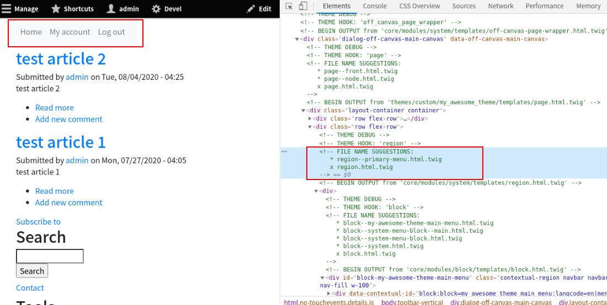
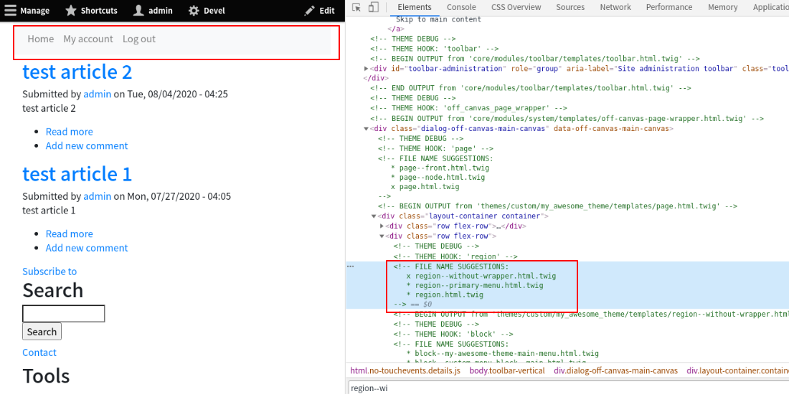
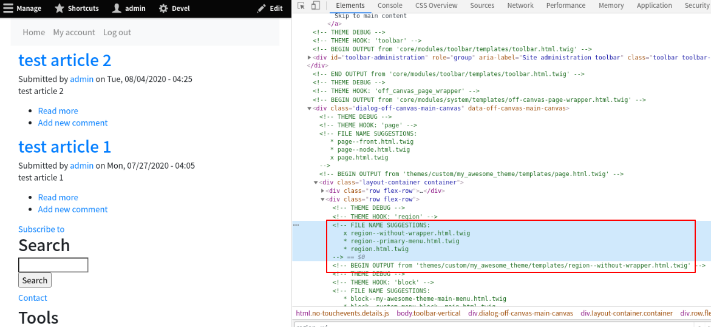

<!-- _class: lead -->
# 3.10 Template suggestion

---

ここまでで学んできたように、あるUIコンポーネントをレンダリングする際は複数のテンプレートファイルの候補から最も優先度が高い(コンテキストが近い)ファイルが利用されます。

場合によってはこの候補に新しいテンプレートファイルを追加したり、優先度を変更したくなる場合もあります。

このセクションでは、フックを実装してテンプレートの候補を変更する方法を解説します。

---

<!-- _class: lead -->
## 3.10.1 hook_theme_suggestions_alter

---

3.7章では、Navbarが表示されるリージョンのテンプレートを `region--primary-menu.html.twig` として実装しました。

動作的には問題はないのですが、このテンプレート名の場合は `primary_menu` というIDを持つリージョンでしか利用できません。

テンプレートの内容自体は「外側のdivタグを入れない」という汎用的なものなので、テンプレートを `region--without-wrapper.html.twig` というファイル名に変更して、Template suggestionのフックでこのファイルを利用できるようにしましょう。

---

3.9章で解説した通り、テンプレートの候補を変更する場合は以下の3つのフックが利用できます。

- 1. [hook_theme_suggestions_HOOK](https://api.drupal.org/api/drupal/core%21lib%21Drupal%21Core%21Render%21theme.api.php/function/hook_theme_suggestions_HOOK/8.8.x)
- 2. [hook_theme_suggestions_alter](https://api.drupal.org/api/drupal/core%21lib%21Drupal%21Core%21Render%21theme.api.php/function/hook_theme_suggestions_alter/8.8.x)
- 3. [hook_theme_suggestions_HOOK_alter](https://api.drupal.org/api/drupal/core%21lib%21Drupal%21Core%21Render%21theme.api.php/function/hook_theme_suggestions_HOOK_alter/8.8.x)

このうち、1.は「あるフックのテンプレート候補のデフォルト値」を定義するためのものです。

対して、「あるフックに対してテンプレートの候補を新たに追加する」場合は、2.もしくは3.のフックを利用します。これは `alter` という関数名からも類推できますね。

---

2.と3.の違いは、「特定のフックだけに適用されるかどうか」です。2.4章のフォームのフックと考え方は同じですね。

今回は3.のフックを利用してコードを実装します。

まずは、`region--primary-menu.html.twig` を `region--without-wrapper.html.twig` にリネームしましょう。

```txt
$ mv web/themes/custom/my_awesome_theme/templates/region--primary_menu.html.twig web/themes/custom/my_awesome_theme/templates/region--without-wrapper.html.twig
```

次に、キャッシュをクリアしてトップページにアクセスしてください。

---

以下のように、適用されるテンプレートが `region.html.twig` に変わっていることが分かります。



---

まだ新しいファイル名に対応するフックを実装していないので、この時点の動作としては当たり前ですね。

また、適用されるテンプレートが変更され外側にdivタグが増えたことにより、Navbarの横幅がウインドウ幅に対して100%ではない、という3.9章で修正する前の状態に戻っています(左上の赤枠部)。

---

それでは、`hook_theme_suggestions_HOOK_alter` を実装して `region--without-wrapper.html.twig` が最優先で利用されるように変更しましょう。

`my_awesome_theme.theme` に次のコードを追加してください。

```php
/**
 * Implements hook_theme_suggestions_HOOK_alter().
 */
function my_awesome_theme_theme_suggestions_region_alter(array &$suggestions, array $variables) {
  $suggestions[] = 'region__' . 'without_wrapper';
  return $suggestions;
}
```

---

このフックには、`$suggestions` という変数でテンプレートファイルの候補が渡されます。

この変数はstringの配列になっており、配列の後ろの方が優先度が高いテンプレートになります。

また、テンプレート名の拡張子 `.html.twig` は配列の値に含める必要はありません。

そのため、配列の末尾に `region__without_wrapper` を追加しました。

---

キャッシュをクリアして、再度トップページにアクセスしてください。

次のように、適用されるテンプレートが `region--without-wrapper.html.twig` に変わり、Navbarの横幅が100%になっていれば成功です。

---



---

これで完了です、としたいところですが、この実装には副作用があります。

フックが追加したテンプレートは全てのリージョンに対して適用されるため、Primary Menuリージョン以外にもこのテンプレートが適用されています。

---



---

先に説明した通り、このフックは対象のUIコンポーネントである `HOOK` (今回の例では `region`)全てに適用されます。

特定のUIコンポーネントだけに適用したい場合は、UIコンポーネントの情報を `$variables['elements']` から取得することができます。

フックの実装を次のように修正して、Primary Menuリージョンにだけテンプレートが適用されるようにしましょう。

---

```php
/**
 * Implements hook_theme_suggestions_HOOK_alter().
 */
function my_awesome_theme_theme_suggestions_region_alter(array &$suggestions, array $variables) {
  $regions = ['primary_menu'];
  if (in_array($variables['elements']['#region'], $regions)) {
    $suggestions[] = 'region__' . 'without_wrapper';
  }
  return $suggestions;
}
```

---

キャッシュをクリアして、再度トップページにアクセスしてください。

Primary Menuリージョンにのみ、`region-without-wrapper.html.twig` が適用されていれば成功です。

---

## まとめ

このセクションでは、フックを実装してテンプレートの候補を変更する方法を解説しました。

今回のセクションの変更内容だと、UIコンポーネントのIDに依存する部分が「テンプレート名に含まれるか」・「フックのコードに含まれるか」の違いなので、Template Suggestionをわざわざ実装する大きなメリットはありません。

---

しかし、複数の(全てではない)UIコンポーネントに対して特定のテンプレートを適用したい場合に、同じ内容のテンプレートファイルを名前を変えてコピーするような稚拙なコード管理は避けるべきです。

また、ここまででも何度か触れているように、コードの実装が管理UIから作成したUIコンポーネントのIDに依存するのはリスクがあります。

Template suggestionで実装しておけば、対象のIDを設定可能にする機能を追加することでコードの変更なしに柔軟に対応することも可能です（実際、コンテンツが流動的なシステムではこのような実装をするケースも多いです)。

必要に応じてどのように実装するか使い分けるようにしましょう。

---

## ストレッチゴール

1. `hook_theme_suggestions_alter` を実装して　`page` エレメントのTemplate suggestionに `page__node_{ロールID}` を追加し、定義済みのロール毎にテンプレートが切り替えられるようにしてください。テンプレートファイル自体の実装は不要とします。また、追加するテンプレートの優先順位は `page__node` の次に高くなるようにしてください。なお、このフックの結果はキャッシュされる点に留意してください。
