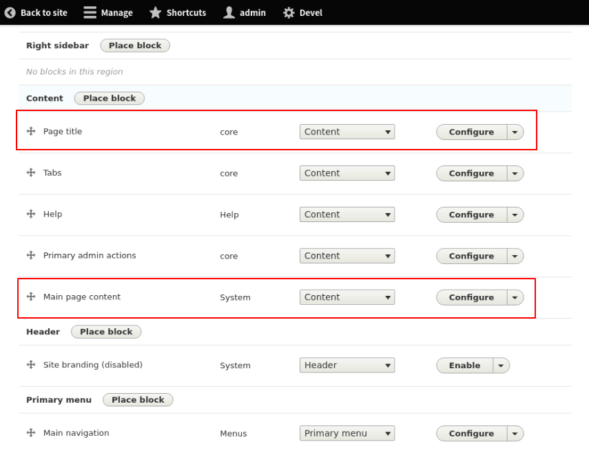

<!-- _class: lead -->
# 3.11 ノードとフィールドテンプレート

---

このセクションでは、ここまでで覚えた知識を使いながらノードとフィールドのテンプレートを作成して、「記事 (article)」ノード全体のデザインを変更していきます。

---

<!-- _class: lead -->
## 3.11.1 デザインの仕様

---

まずは「記事 (article)」ノードのコンテンツを2つ作成して、どちらかのノードを表示してください。

現時点では次のようなデザインになっていると思います。


---

このノードのデザインを次のように変更することをゴールにしましょう。


---

<!-- _class: lead -->
## 3.11.2 ノード全体をJumbotoronで表示する

---

まずは、ノード全体を [Jumbotoron](https://getbootstrap.jp/docs/4.1/getting-started/introduction/) で表示するところから始めましょう。

ノードのタイトルや各フィールド全体を表示する部分に手を加えればいいので、ノードのテンプレートを変えれば良さそうですね。

先の図で赤枠で囲んだ部分をどのテンプレートが表示しているかを確認してみましょう。

---


---


---


---

予想に反して、ノードの全体はリージョンのテンプレート (`region.html.twig`)で表示されています。

また、ノードのタイトルとそれ以外はそれぞれ別々のブロックとして表示されていることもわかります。

タイトルは `block.html.twig` と `field--node--title.html.twig` で、タイトル以外のフィールドは `block.html.twig` と `node.html.twig` のテンプレートが使用されています。

---

ブロックレイアウトの管理UI (`admin/structure/block`) に移動しましょう。

次のように、 `Content` リージョンに「Page title」と「Main page content」が別々のブロックとしてレイアウトされていることが分かります。

---



---

このようにタイトルとそれ以外がブロックコンテンツとして分割して管理されているため、先のようなテンプレートが利用されているということですね。

今回のケースのように、人間が期待するテンプレートの粒度と実際のテンプレートの粒度は必ずしも一致しているとは限りません。

特に作業見積もり、影響範囲等を検討する場合は注意しましょう。

---

それでは、JumbotoronのCSSクラスをリージョンテンプレートに追加しましょう。

デザインを適用したいリージョンは `Content` リージョンだけなので、 `region--content.html.twig`  という名前でテンプレートをコピーします。

```
$ cp web/core/modules/system/templates/region.html.twig web/themes/custom/my_awesome_theme/templates/region--content.html.twig
```

---

次に、JumbotoronのCSSクラス (`.jumbotron`) を `hook_preprocess_HOOK` で追加します。こちらも適用範囲を`Content` リージョンに限定するため、`HOOK` の部分は `region__content` にします。

`my_awesome_theme.theme` に次のコードを追加してください。

---

```php
/**
 * Implements hook_preprocess_HOOK().
 */
function my_awesome_theme_preprocess_region__content(&$variables) {
  if (!isset($variables['attributes']['class'])) {
    $variables['attributes']['class'] = [];
  }
  $variables['attributes']['class'] = array_merge($variables['attributes']['class'], ['jumbotron']);
}
```

キャッシュをクリアしてノードの表示画面をリロードしてください。次のようにリージョン全体にJumbotoronのデザインが適用されていれば成功です。

---


---

<!-- _class: lead -->
## 3.11.3 作成時刻と作成者を非表示にする

---

次に作成時刻と作成者を非表示にしましょう。

先ほど調査したとおり、この部分は `web/core/modules/node/templates/node.html.twig` で表示されています。

まずはこのテンプレートの内容を見てみましょう。

---

```txt
<article{{ attributes }}>

  {{ title_prefix }}
  
    <h2{{ title_attributes }}>
      <a href="{{ url }}" rel="bookmark">{{ label }}</a>
    </h2>
  
  {{ title_suffix }}

  
    <footer>
      {{ author_picture }}
      <div{{ author_attributes }}>
        Submitted by {{ author_name }} on {{ date }}
        {{ metadata }}
      </div>
    </footer>
  

  <div{{ content_attributes }}>
    {{ content }}
  </div>

</article>
```

---

`` のブロックに「Submitted by」という文字列があるので、このブロックを削除してしまえばよさそうですね。

それではテンプレートファイルをコピーしましょう。影響範囲は記事(article)ノードに限定したいので、 `node--article.html.twig` としてコピーします。

```
$ cp web/core/modules/node/templates/node.html.twig web/themes/custom/my_awesome_theme/templates/node--article.html.twig
```

コピーしたファイルの`` のブロックを削除して次のように変更しましょう。

---

```txt
<article{{ attributes }}>

  {{ title_prefix }}
  
    <h2{{ title_attributes }}>
      <a href="{{ url }}" rel="bookmark">{{ label }}</a>
    </h2>
  
  {{ title_suffix }}

  <div{{ content_attributes }}>
    {{ content }}
  </div>

</article>
```

---

キャッシュをクリアしてノードを表示してください。次のように作成時刻と作成者が非表示になっていれば成功です。


---

これで当面の目的は達成されましたが、ちょっと考え直してみましょう。

削除したブロックは `` という分岐になっていました。つまり、`display_submitted` という変数の値次第では、テンプレートを書き換えずに目的を達成できそうです。

テンプレートの冒頭のコメントにあるこの変数の説明を見てみましょう。

```txt
- display_submitted: Whether submission information should be displayed.
```

この変数の値によって、作成時刻や作成者が表示されるかどうかが判断されるようです。テンプレートでの使われ方と一致しますね。

---

この変数を設定している部分のコードを見てみましょう。

```txt
$ grep -rn "display_submitted" web/core/modules/node
web/core/modules/node/migrations/d7_node_type.yml:17:  display_submitted: display_submitted
web/core/modules/node/migrations/d6_node_type.yml:19:  'display_submitted': display_submitted
web/core/modules/node/config/schema/node.schema.yml:33:    display_submitted:
web/core/modules/node/src/Plugin/migrate/source/d6/NodeType.php:131:    $row->setSourceProperty('display_submitted', $submitted);
web/core/modules/node/src/Plugin/migrate/source/d7/NodeType.php:124:    $row->setSourceProperty('display_submitted', $this->variableGet('node_submitted_' . $type, TRUE));
web/core/modules/node/src/NodeTypeForm.php:190:    $form['display']['display_submitted'] = [
web/core/modules/node/src/NodeTypeInterface.php:54:   * @param bool $display_submitted
web/core/modules/node/src/NodeTypeInterface.php:57:  public function setDisplaySubmitted($display_submitted);
web/core/modules/node/src/Entity/NodeType.php:50: *     "display_submitted",
web/core/modules/node/src/Entity/NodeType.php:107:  protected $display_submitted = TRUE;
web/core/modules/node/src/Entity/NodeType.php:143:    return $this->display_submitted;
web/core/modules/node/src/Entity/NodeType.php:149:  public function setDisplaySubmitted($display_submitted) {
web/core/modules/node/src/Entity/NodeType.php:150:    $this->display_submitted = $display_submitted;

...

web/core/modules/node/templates/node.html.twig:29: * - display_submitted: Whether submission information should be displayed.
web/core/modules/node/templates/node.html.twig:85:  
```

`NodeTypeForm.php` というファイルで使われているところを見ると、なんらかのフォームでこの変数が設定できそうな気がしますね。このファイルの190行目前後を見てみましょう。

---

```php
    // ...

    $form['display'] = [
      '#type' => 'details',
      '#title' => t('Display settings'),
      '#group' => 'additional_settings',
    ];
    $form['display']['display_submitted'] = [
      '#type' => 'checkbox',
      '#title' => t('Display author and date information'),
      '#default_value' => $type->displaySubmitted(),
      '#description' => t('Author username and publish date will be displayed.'),
    ];

    return $this->protectBundleIdElement($form);
  }
```

---

2.8章で実装した `#title` や `#description` のような、フォームのUIを生成するコードが書かれていることが分かります。

ファイル名から類推すると、ノードタイプに関するフォームであることが予想できますね。

記事(Artcile)のノードタイプの編集フォーム(`/admin/structure/types/manage/article`) を見てみましょう。

赤枠の部分に先ほどのコードで実装されたUIが表示されていることが分かります。

---


---

`Display author and date information` にチェックが付いているため、エンドユーザーやあなた以外の開発者は「記事ノードには作成者情報が表示される」という振る舞いを期待するはずです。

しかし、先ほどテンプレートでこの設定を参照するブロックごと消してしまったため、設定を変えても振る舞いは変わらず、作成者情報は常に表示されません。

おそらく、テンプレートを実装した本人以外はこれはバグだと考えるでしょう。

---

つまり、今回の対応として適切な修正は「テンプレートを修正せず記事ノードタイプの設定を変更する」になります。

もし、テンプレートの修正をコミットしている場合は、`git revert`　で変更を打ち消しておきましょう。

このように、設定で振る舞いが変更可能なUIや機能をテンプレートで固定的に実装するのは絶対に避けましょう。

ドキュメントを書いたり関係するメンバーでコミュニケーションを取ればよいのでは？と思うかもしれませんが、大抵の場合は半年もすれば本人しか把握できないレシピのない秘伝のタレになります。

---

<!-- _class: lead -->
## 3.11.4 本文に.leadクラスを適用する

---

最後に、本文(bodyフィールド)に.Leadクラスを適用しましょう。

例によってHTMLに出力されたデバッグ情報から確認すると、現状は `field.html.twig` が利用されていることが分かります。


---

今回の変更は記事(article)ノード、かつ本文(body)フィールドに限定したいため、 `field--node--body--article.html.twig` としてテンプレートをコピーします。

```txt
$ cp web/core/modules/system/templates/field.html.twig web/themes/custom/my_awesome_theme/templates/field--node--body--article.html.twig
```

今度はpreprocessではなくテンプレート側で直接CSSクラスを追加しましょう。コピーしたテンプレートファイルを次のように変更してください。

---

```txt


 {# ←追加 #}


  
    <div{{ attributes }}>
      
        <div{{ item.attributes }}>{{ item.content }}</div>
      
    </div>
  
    
      <div{{ attributes }}>{{ item.content }}</div>
    
  

  <div{{ attributes.addClass('lead') }}>
    <div{{ title_attributes.addClass(title_classes) }}>{{ label }}</div>
    
      <div>
    
    
      <div{{ item.attributes }}>{{ item.content }}</div>
    
    
      </div>
    
  </div>

```

---

キャッシュをクリアしてノードを表示してください。次のように本文(body)フィールドのスタイルが変更されていれば成功です。


---

<!-- _class: lead -->
## 3.11.5 その他のtwigテンプレート

---

3章全体を通していくつかのtwigテンプレートに触れてきましたが、Drupalで利用可能なtwigテンプレートは次のように他にもたくさんあります。

- Views関連のコンポーネント
- テキストエリア、セレクト、チェックボックスなどフォーム要素のコンポーネント
- リンク、テーブル、リストなど汎用的なUIコンポーネント

[Theme system overview](https://api.drupal.org/api/drupal/core%21lib%21Drupal%21Core%21Render%21theme.api.php/group/themeable/8.8.x) の末尾に利用可能なテンプレートの一覧がまとまっていますので、一度目を通しておいてください。

---

## まとめ

このセクションでは、ここまでで覚えた知識を使いながらノードとフィールドのテンプレートを作成して、「記事 (article)」ノード全体のデザインを変更しました。

テンプレートの粒度は人間の期待する粒度と異なる場合もあるため、特に作業見積もり、影響範囲等を検討する場合は事前にしっかりと調査しましょう。

また、設定で振る舞いが変更可能なUIや機能をテンプレートで固定的に実装すると、後々大きな問題につながるケースがあります。ここの判断を間違わないためにも、「サイトビルディングで何が設定できるのか」を詳細に把握しておきましょう。

---

## ストレッチゴール

1. 3.11.2章で実装したコードには、「Contentリージョンに表示されるデータであれば、ノード以外でもJumbotronのデザインが適用される」という副作用があります。これは、トップページにアクセスすると、次の画像のように確認できます。preprocessの実装を変更して、単一ノードの表示画面でだけJumbotronのデザインが適用されるように修正してください。

---

