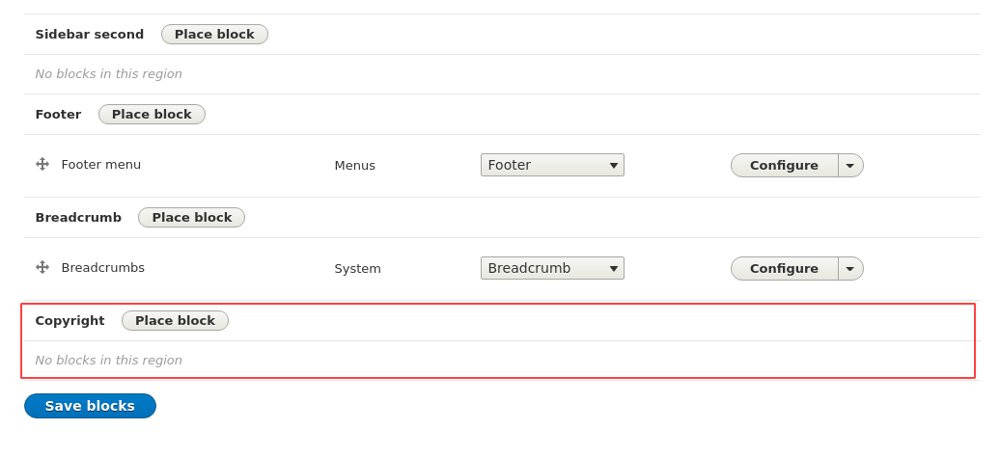

<!-- _class: lead -->
# 3.12 リージョンの定義

---

このセクションでは、新規にリージョンを定義する方法を解説します。

---

<!-- _class: lead -->
## 3.12.1 デフォルトのリージョン

---

3.3章でも紹介した通り、リージョンの定義は `{theme_name}.info.yml` の `regions` キーで行います。

現在のコードを確認してみましょう。

```txt
$ cat web/themes/custom/my_awesome_theme/my_awesome_theme.info.yml
name: My awesome theme
type: theme
core: 8.x
description: My first awesome theme!!!.
base theme: false
logo: logo.png
libraries:
  - my_awesome_theme/base-styling
  - my_awesome_theme/custom-script
```

---

`regions` キーがないですね。しかし、ここまでのブロックレイアウトの管理UIやテンプレート開発を通して複数のリージョンが存在することは確認できています。

`{theme_name}.info.yml` に `regions` キーが存在しない場合、次のドキュメントの通り規定のリージョン群がデフォルトで利用できます。

- [Adding Regions to a Theme: Default Regions](https://www.drupal.org/docs/theming-drupal/adding-regions-to-a-theme#default_regions)

つまり、現在の `my_awesome_theme.info.yml` は次のコードと等価になります。

---

```txt
$ cat web/themes/custom/my_awesome_theme/my_awesome_theme.info.yml
name: My awesome theme
type: theme
core: 8.x
description: My first awesome theme!!!.
base theme: false
logo: logo.png
libraries:
  - my_awesome_theme/base-styling
  - my_awesome_theme/custom-script
regions:
  header: "Header"
  primary_menu: "Primary Menu"
  secondary_menu: "Secondary Menu"
  highlighted: "Highlighted"
  help: "help"
  content: "Content"
  sidebar_first: "Sidebar first"
  sidebar_second: "Sidebar second"
  footer: "Footer"
  breadcrumb: "Breadcrumb"
```

---

<!-- _class: lead -->
## 3.12.2 リージョンの追加

---

デフォルトリージョンの仕組みがわかったところで、ページの最下部に `copyright` という新しいリージョンを追加してみましょう。

新たにリージョンを追加する場合は、先に提示したコードのように `regions` キーにキーとバリューのペアを追加します。キーはリージョンのID、バリューは管理画面で表示されるリージョン名です。

ただし、`regions` キーを定義した時点で、デフォルトのリージョン群も明示的に宣言しないと利用不可になります。

---

つまり、以下のようなコードだと `copyright` 以外のリージョンは利用不可になります。

```
regions:
  copyright: "Copyright"
```

また、この状態でブロックレイアウトの管理画面にアクセスすると他のリージョンに配置していたレイアウト情報が全て無効になります

(興味がある方はデータのバックアップを取得した上で試してみてください)。

それでは、`my_awesome_theme.info.yml`次のように変更してください。

---

```txt
$ cat web/themes/custom/my_awesome_theme/my_awesome_theme.info.yml
name: My awesome theme
type: theme
core: 8.x
description: My first awesome theme!!!.
base theme: false
logo: logo.png
libraries:
  - my_awesome_theme/base-styling
  - my_awesome_theme/custom-script
regions:
  header: "Header"
  primary_menu: "Primary Menu"
  secondary_menu: "Secondary Menu"
  highlighted: "Highlighted"
  help: "help"
  content: "Content"
  sidebar_first: "Sidebar first"
  sidebar_second: "Sidebar second"
  footer: "Footer"
  breadcrumb: "Breadcrumb"
  copyright: "Copyright"
```

---

キャッシュをクリアしてブロックレイアウトの管理画面(`/admin/structure/block`)にアクセスしてください。Copyrightリージョンが追加されていれば成功です。



---

リージョンが認識されたので、ブロックコンテンツを追加してcopyrightの表記を入れましょう。

`/block/add` から次のようにカスタムブロックを作成してください。

---


---

作成したブロックを `copyright` リージョンに配置してください。`Display title` のチェックは外しておきましょう。


---

それでは、トップページにアクセスしてください。Copyrightが表示される...と思いきや何も表示されないことが分かります。


---

これは、現在利用しているテンプレートが先に紹介したデフォルトのリージョンを前提に実装されているためです。

そのため、リージョンより上の階層のテンプレートで下位（つまり追加したリージョン）のコンテンツを出力するように修正する必要があります。

Drupalではリージョンの上の階層はページになるので、修正すべきファイルは3.6章でも触った `page.html.twig` になります。

このテンプレートの冒頭のコメントを見ると、各リージョンのコンテンツは `page.{region_name}` でアクセスできることが分かります。

---

```txt
 * Regions:
 * - page.header: Items for the header region.
 * - page.primary_menu: Items for the primary menu region.
 * - page.secondary_menu: Items for the secondary menu region.
 * - page.highlighted: Items for the highlighted content region.
 * - page.help: Dynamic help text, mostly for admin pages.
 * - page.content: The main content of the current page.
 * - page.sidebar_first: Items for the first sidebar.
 * - page.sidebar_second: Items for the second sidebar.
 * - page.footer: Items for the footer region.
 * - page.breadcrumb: Items for the breadcrumb region.
 *
 * @see template_preprocess_page()
```

---

`@see` で参照されている `template_preprocess_page` のからも情報が取得できそうです。この関数がどこで実装されているか見てみましょう。

```txt
$ grep -rn "function template_preprocess_page" web/core
web/core/includes/pager.inc:185:function template_preprocess_pager(&$variables) {
web/core/includes/theme.inc:1375:function template_preprocess_page(&$variables) {
```

`web/core/includes/theme.inc` で定義されているようです。コードの中身も見てみましょう。

---

```php
/**
 * Prepares variables for the page template.
 *
 * Default template: page.html.twig.
 *
 * See the page.html.twig template for the list of variables.
 */
function template_preprocess_page(&$variables) {
  $language_interface = \Drupal::languageManager()->getCurrentLanguage();

  foreach (\Drupal::theme()->getActiveTheme()->getRegions() as $region) {
    if (!isset($variables['page'][$region])) {
      $variables['page'][$region] = [];
    }
  }

  ...
```

---

テーマのリージョン情報を取得し、値が設定されていない場合は `$variables['page'][$region]` が初期化されていることが分かります。

このコードにより、テンプレート側では `page.{region_name}` という変数でリージョンコンテンツにアクセスすることができます。

※ちなみに、コードを見ても分かる通りこの関数では実際に値を設定しているわけではありません。実際のコンテンツの内容はこの関数より先に実行される[PageBlockVariant::build](https://github.com/drupal/drupal/blob/8.8.0/core/modules/block/src/Plugin/DisplayVariant/BlockPageVariant.php#L125) で設定されています。

---

それでは、`page.html.twig` を修正してfooterリージョンの下に `copyright` リージョンを表示するようにしましょう。

コードを次のように修正してください。

---

```html
<div class="layout-container container">

  <div class="row flex-row">
    <header role="banner">
      {{ page.header }}
    </header>
  </div>

  <div class="row flex-row">
    {{ page.primary_menu }}
  </div>

  <div class="row flex-row">
    {{ page.secondary_menu }}
  </div>

  <div class="row flex-row">
    {{ page.breadcrumb }}
  </div>

  <div class="row flex-row">
    {{ page.highlighted }}
  </div>

  <div class="row flex-row">
    {{ page.help }}
  </div>

  // (続く)

```

---

```html
  <main role="main">
    <a id="main-content" tabindex="-1"></a>{# link is in html.html.twig #}

    <div class="row flex-row">
      <div class="col">
        <div class="layout-content">
          {{ page.content }}
        </div>{# /.layout-content #}
      </div>

      
      <div class="col-md-4">
        
        <aside class="layout-sidebar-first" role="complementary">
          {{ page.sidebar_first }}
        </aside>
        

        
        <aside class="layout-sidebar-second" role="complementary">
          {{ page.sidebar_second }}
        </aside>
        
      </div>
      
    </div>
  </main>

  <div class="row flex-row">
    
      <footer role="contentinfo">
        {{ page.footer }}
      </footer>
    
  </div>

  <div class="row flex-row">
    
      <div>
        {{ page.copyright }}
      </div>
    
  </div>
</div>{# /.layout-container #}
```

---

キャッシュをクリアしてトップページにアクセスしてください。最下部にCopyrightが表示されていれば成功です。


---

## まとめ

このセクションでは、リージョンを追加してコンテンツを配置する方法を解説しました。

あまりないケースですが、`{theme_name}.info.yml` に `regions` キーがない状態でサイトを立ち上げた後にリージョンを追加・変更する場合は、デフォルトで定義されているリージョンの扱いに注意が必要です。
