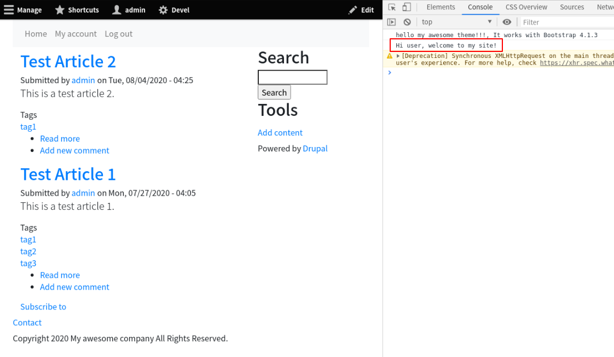

<!-- _class: lead -->
# 3.13 動的なライブラリのロード

---

3.4章では `{theme_name.info.yml}` および `{theme_name}.libraries.yml` にライブラリを定義し、Bootstrap4のJSとCssをロードしました。

この方法の場合、ライブラリはDrupalがレスポンスを生成する際に必ずロードされます。

しかし、実際には次のように特定のパスやコンポーネント、ユーザー等へのレスポンスを生成する場合にのみ、特定のライブラリをロードしたいケースもあります。

- /xxx というパスにだけ特定のCSSを適用したい
- 特定のブロックを表示するときだけJavascriptをロードしたい
- システム管理者ロールでログイン中の場合のみJavascriptをロードしたい

---

このセクションでは、シンプルにコンソールにWelcomeメッセージを表示するライブラリを定義し、トップページでのみロードされるようにします。

これにより、「特定の条件にマッチする場合のみライブラリをロードする方法」を習得しましょう。

---

<!-- _class: lead -->
## 3.13.1 Welcomeメッセージを表示するライブラリの定義

---

まずは `welcome-message` という名前でライブラリを定義します。`my_awesome_theme.libraries.yml` に次のコードを追加してください。

```yml
welcome-message:
  js:
    js/message.js: {}
  dependencies:
    - core/jquery
```

Javascriptのコードで `$` を使いたいため、Drupalコアに含まれているjQueryのライブラリ(`core/jquery`) への依存を定義しています。

---

次に、 `js/message.js` を以下の内容で新規に作成してください。

```js
(function($){
  $(document).ready(function(){
    console.log("Hi user, welcome to my site!");
  });
})(jQuery)
```

実装の内容は簡単ですね。DOMの読み込みが終わったらコンソールにメッセージを表示しているだけです。

---

DrupalコアにはjQueryが含まれていますが、他のJavascriptライブラリとの競合を防ぐために [jQuery.noConflict()](https://api.jquery.com/jquery.noconflict/) が実行されます。

そのため、`$` を使いたい場合は、このサンプルのようにスクリプトのスコープで `jQuery` を `$` として利用するように明示的に宣言する必要があります。

---

<!-- _class: lead -->
## 3.13.2 トップページでのみライブラリをロードする

---

特定の条件でのみライブラリをロードしたい場合、3.4章のように `{theme_name}.info.yml` の `libraries` に追加する代わりに `hook_preprocess_HOOK` を実装します。

具体的に実装すべきHOOK(つまり対象のUIコンポーネント)は、ロードするライブラリをどのUIコンポーネントで利用したいかによって変わります。

例えば、ロードするライブラリをブロックで利用する場合は `hook_preprocess_block`、Viewsで利用する場合は `hook_preprocess_views` を実装することになります。

---

今回は「トップページでのみロードされる」という振る舞いを実現したいため、実装すべきフックは `hook_preprocess_page` になります。

また、このフックは全てのページ呼び出しで参照されるので、アクセスされているパスがトップページかどうかを判断する必要もあります。

それでは、`my_awesome_theme.theme` に次のコードを追加してください。

---

```php
/**
 * Implements hook_preprocess_HOOK().
 */
function my_awesome_theme_preprocess_page(&$variables) {
  $route_name = \Drupal::routeMatch()->getRouteName();
  if ($route_name === 'view.frontpage.page_1') {
    $variables['#attached']['library'][] = 'my_awesome_theme/welcome-message';
  }
}
```

Drupal 8のデフォルトでは、トップページへのレスポンスはViewsの `frontpage` の `page_1` というディスプレイが返します。

そのため、ルート名が `view.frontpage.page_1` の場合にのみ処理が実行されるようにします。

---

ライブラリをロードする場合、 `$variables['#attached']['library']` に配列の値としてライブラリ名を追加します。

コアや他のモジュールがライブラリをロードする場合、Preprocessが実行される時点でこの配列に何らかのライブラリ名が含まれていることがあります。そのため、配列の既存のキーを削除しないように注意しましょう。

---

キャッシュをクリアしてトップページアクセスしてください。コンソールにメッセージが表示されていれば成功です。また、他のパスにアクセスしてメッセージが表示されないことも確認しておきましょう。



---

## まとめ

このセクションでは「特定の条件にマッチする場合のみライブラリをロードする方法」を解説しました。

不必要なライブラリのロードはパフォーマンスの低下や副作用を招くこともあります。Drupalでよくあるケースだと、エンドユーザー向けのライブラリが常時ロードされることにより、管理画面のレイアウトが崩れたりJavascriptが正しく動かず設定変更ができなくなる等です。

Drupal 7の開発経験がある方は、Viewsの管理画面でこの問題に当たって困ったことがあるかもしれません(大抵はカスタムコードが原因です)。

---

ライブラリを参照するコンポーネントや条件を整理し、必要最小限の範囲でライブラリをロードするようにしましょう。