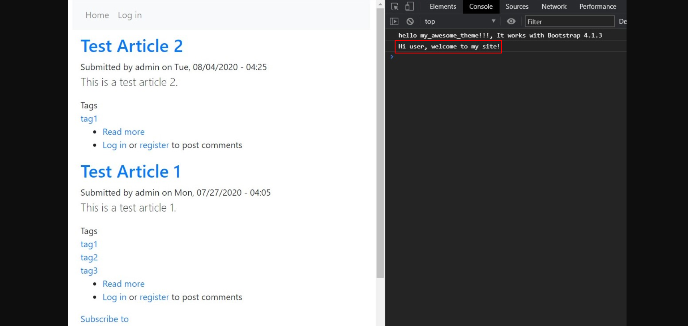
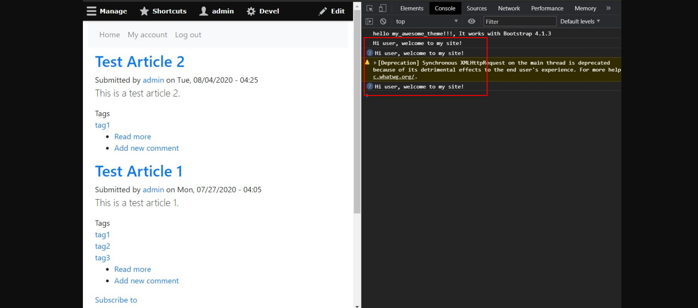
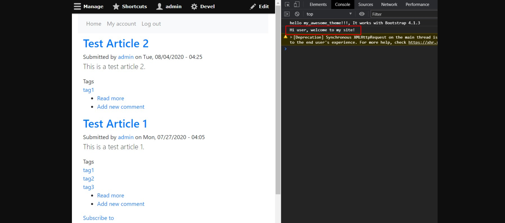

<!-- _class: lead -->
# 3.14 Javascript API (1)

---

前回のセクションで実装したJavascriptは、「DOMの読み込みを待ってから何かの処理を行う」という非常にシンプルなものでした。

しかし、実際の開発シーンではこのような簡単なユースケースではなく、「フレームワーク側で発生したイベントに応じて何かの処理を行う」ことも必要になります。

このセクションでは、Drupalの[Javascript API](https://www.drupal.org/docs/drupal-apis/javascript-api/javascript-api-overview) を使ってより複雑な制御ができるようにJavascriptのロード方法を修正します。

---

<!-- _class: lead -->
## 3.14.1 Drupal.behaviorsの基本的な実装

---

まずは前回のセクションで実装した `js/message.js` のコードをおさらいしましょう。

```js
(function($){
  $(document).ready(function(){
    console.log("Hi user, welcome to my site!");
  });
})(jQuery)
```

DOMの準備が終わったらコンソールにメッセージを表示しているだけです、簡単ですね。

これをDrupalの[Javascript API](https://www.drupal.org/docs/drupal-apis/javascript-api/javascript-api-overview) を使って書き換えてみましょう。

---

```js
Drupal.behaviors.welcomeMessage = {
  attach: function (context, settings) {
    console.log("Hi user, welcome to my site!");
  }
};
```

`Drupal.behaviors` に `attach` というプロパティを持つオブジェクトを登録すると、DOMがロードされた時とajaxコールされた時の両方で `attach` メソッドが実行されます。

`Drupal.behaviors` に登録するプロパティ名はユニークであればなんでも構いません。サンプルコードでは `welcomMessage` にしています。

名前空間で悩まないように、ユニークであることが保証されているモジュール名やライブラリ名を含めるのが簡単です。

---

見てわかる通り、このコードは `Drupal` というオブジェクトに依存しています。これは [web/core/misc/drupal.js](https://github.com/drupal/drupal/blob/8.8.0/core/misc/drupal.js#L8) で定義されています。

言い換えると、「このコードを持つライブラリはdrupal.jsを持つライブラリに依存している」ことになります。

この依存関係をコードで表現する方法は3.4章ですでに学んだとおりです。

`my_awesome_theme.libraries.yml` を開いて `welcome-message` の `dependencies` に次のように `core/drupal` への依存を追加してください。

---

```yml
welcome-message:
  js:
    js/message.js: {}
  dependencies:
    - core/jquery
    - core/drupal
```

これでコードの変更は終了です。もし、Drupalにログインしている場合はここでいったんログアウトしてください。その後、キャッシュをクリアしてからトップページにアクセスしましょう。次のようにコンソールにメッセージが表示されれば成功です。

---



---

<!-- _class: lead -->
## 3.14.2 attachメソッドの起動トリガーを理解する

---

これで終了です！で締めたいところですが、実は今の実装にはバグがあります。

管理者ユーザーでログインして、再度トップページにアクセスしてみてください。次のようにコンソールにメッセージが複数回表示されます。

---



---

これは、先ほど説明した通り `attach` メソッドがDOMがロードされた時に加え、ajaxコールされた時にも実行されるからです。

ここで少しコアのJavascriptのコードを見てみましょう。

[web/core/misc/drupal.js#L17](https://github.com/drupal/drupal/blob/8.8.0/core/misc/drupal.js#L17) の `Drupal.attachBehaviors` という関数で、`Drupal.behaviors` の全てのプロパティを走査し `attach` というキーに関数が登録されていれば実行しています。

先ほど実装した `Drupal.behaviors.welcomeMessage` の `attach` メソッドはここから実行されているわけですね。

---

次に、`Drupal.attachBehaviors` がどこから呼ばれているか見ていきましょう。該当箇所は数か所あります。

「DOMの準備が完了した時」のトリガーは [web/core/misc/drupal.init.js#L28](https://github.com/drupal/drupal/blob/8.8.0/core/misc/drupal.init.js#L28) です。

jQueryのAPIではなく [domready](https://github.com/ded/domready) というライブラリのAPIが使われていますが、やっていることは前のセクションで実装したコードと変わりありません。

---

もう一方の「ajaxコールされた時」とあっさり目に説明した方のトリガーは [web/core/misc/ajax.js#L560](https://github.com/drupal/drupal/blob/8.8.0/core/misc/ajax.js#L560) です。

この行が含まれている関数を見ると、`Drupal.AjaxCommands.prototype` の `insert` というプロパティとして宣言されています。

これは名前の通り、Drupalが何らかのDOM要素を動的に挿入する際に実行されます。

※ここを掘り下げていくとかなりバックエンド寄りの話になるので詳細は割愛します。。興味がある方は [Core AJAX Callback Commands](https://www.drupal.org/docs/drupal-apis/ajax-api/core-ajax-callback-commands) を参照してください。

---

重要なポイントは、「コアや他のモジュールがajaxでDOM要素を動的に挿入する度に `attach` メソッドが実行される」という点です。

つまり、`attach` メソッドの中で本当に一度しか実行したくないような処理を書く場合は、「どんな状況でattachメソッドが呼ばれたのか」を判断する必要があります。

この判断は、`attach` メソッドの引数の `context` を元に行うことができます。[web/core/misc/ajax.js#L560](https://github.com/drupal/drupal/blob/8.8.0/core/misc/ajax.js#L560) を見ると、`context` には新しく挿入されたノード (Drupalのノードではない点注意)が渡されていることが分かります。

---

これを利用して、ログインしていてもコンソールのログを1度しか出ないようにコードを修正しましょう。

`js/message.js` を次のように修正してください。
```js
(function($) {
  Drupal.behaviors.welcomeMessage = {
    attach: function(context, settings) {
      $('html', context).once('welcomeMessage').each(function() {
        console.log("Hi user, welcome to my site!");
      });
    }
  };
})(jQuery);
```

---

`context` に `html` が含まれている場合、つまり初回のDOMロードの時にだけコンソールにメッセージを出すように修正しています。

※このサンプルコードは実は若干無駄があります。`html` が含まれるイベントは一度しか発生しないため、`.once` は不要です。
しかし、例えばショッピングカートのように「商品を追加すると合計金額が変わる」ような機能をJavaScriptで実装する場合、同じcontextに対して複数回イベントが発生することがあるため、場合によっては `.once` を使ってコードが一度だけ実行されることを保証する必要が出てきます。

---

[jquery-once](https://github.com/RobLoach/jquery-once)に依存するように修正しているため、`core/jquery.once` への依存の定義も必要です。

`my_awesome_theme.libraries.yml` を開いて `welcome-message` の `dependencies` に次のように `core/jquery.once` への依存を追加してください。

---

```yml
welcome-message:
  js:
    js/message.js: {}
  dependencies:
    - core/jquery
    - core/drupal
    - core/jquery.once
```

これでコードの修正は終了です。今度は管理者ユーザーでログインしたままでキャッシュをクリアしてから、トップページにアクセスしてください。次のようにコンソールにメッセージが1回だけ表示されれば成功です。

---



---

## まとめ

このセクションでは、Drupalの[Javascript API](https://www.drupal.org/docs/drupal-apis/javascript-api/javascript-api-overview) を使ってより複雑な制御ができるようにJavascriptのロード方法を修正しました。

`attach` メソッドが呼ばれる条件をしっかり理解せずに実装してしまうと、特定の条件ではうまく動かないといったバグにつながります。

Javascriptの処理内容次第では、複数回実行される事でクリティカルな問題を引き起こすこともあります。十分に注意して実装するようにしましょう。
