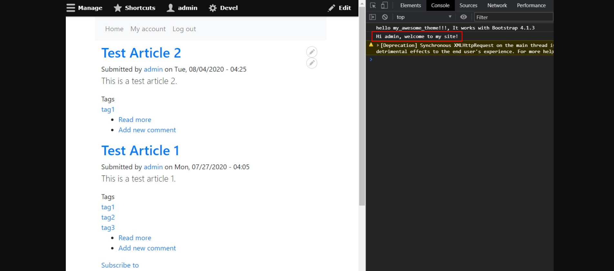

<!-- _class: lead -->
# 3.15 Javascript API (2)

---

ここ2回のセクションでは、JavaScriptが実行される条件を変更する方法を学んできました。

一方で、単に実行する条件を変更するだけではなく実行するコード自体にパラメータを与えたくなる場合もあります。

このセクションでは、[drupalSettings](https://www.drupal.org/node/2274843#configurable)を使いJavascriptをロードする際にPHP側からパラメータを渡す方法を解説します。

---

<!-- _class: lead -->
## 3.15.1 drupalSettings

---

前回のセクションで実装した `js/message.js` のコードをおさらいしましょう。

```js
(function($) {
  Drupal.behaviors.welcomeMessage = {
    attach: function(context, settings) {
      $('html', context).once('welcomeMessage').each(function() {
        console.log("Hi user, welcome to my site!");
      });
    }
  };
})(jQuery);
```

---

`attach` メソッドの2つ目の引数に `settings` がありますね。

Preprocessでライブラリをロードする際に、この引数を通してPHP側からパラメータを与えることができます。

これを利用して、メッセージ内容の `Hi user` の部分が `Hi {Drupalのユーザー名}` のように現在のユーザーに応じて変更されるようにしてみましょう。

`my_awesome_theme.theme` を開いて `my_awesome_theme_preprocess_page` を次のように変更してください。

---

```php
/**
 * Implements hook_preprocess_HOOK().
 */
function my_awesome_theme_preprocess_page(&$variables) {
  $route_name = \Drupal::routeMatch()->getRouteName();
  if ($route_name === 'view.frontpage.page_1') {
    $current_user = \Drupal::currentUser();
    $variables['#attached']['drupalSettings']['welcomeMessage']['userName'] = $current_user->getDisplayName();
    $variables['#attached']['library'][] = 'my_awesome_theme/welcome-message';
  }
}
```

`$current_user = \Drupal::currentUser();` で現在アクセスしているユーザーを取得しています。そして `$variables['#attached']['drupalSettings']['welcomeMessage']['userName']` にユーザー名(正確にはユーザーの表示名)をパラメータとして設定しています。

---

`$variables['#attached']['drupalSettings']` の値がそのままJavaScriptの `attach` メソッドの `settings` で利用可能です。

`$variables['#attached']['drupalSettings']` 以下の配列のキーは、JavaScirpt側では `settings` のプロパティにマッピングされます。

サンプルコードの例では `$variables['#attached']['drupalSettings']['welcomeMessage']['userName']` の値は、JavaScript側では `settings.welcomeMessage.userName` で参照できます。

---

配列のキーは自由に決定して構いませんが、例によってユニークになるように気を付ける必要があります。

また、そのままJavaScriptのプロパティに変換されるという性質上、プロパティとして利用不可能な文字(`-` など)を使うとPHPのコード上はエラーになりませんが、JavaScript側で目的の値にアクセスできなくなります。

---

仕組みが分かったところで、今度は `js/message.js` のコードを次のように変更してください。

```js
(function($) {
  Drupal.behaviors.welcomeMessage = {
    attach: function(context, settings) {
      $('html', context).once('welcomeMessage').each(function() {
        console.log(`Hi ${settings.welcomeMessage.userName}, welcome to my site!`);
      });
    }
  };
})(jQuery);
```

---

最後に、`my_awesome_theme.libraries.yml` を開いて `welcome-message` の `dependencies` に次のように `core/drupalSettings` への依存を追加してください。

```yml
welcome-message:
  js:
    js/message.js: {}
  dependencies:
    - core/jquery
    - core/drupal
    - core/jquery.once
    - core/drupalSettings
```

---

コードの修正はこれで完了です。

キャッシュをクリアしてからトップページにアクセスして、コンソールに表示されるメッセージにユーザー名が含まれていることを確認してください。



---

## まとめ

このセクションでは、このセクションでは、[drupalSettings](https://www.drupal.org/node/2274843#configurable)を使いJavaScriptをロードする際にPHP側からパラメータを渡す方法を解説しました。

簡単な実装でPHPバックエンドからJavaScriptのコードにパラメータを渡すことができるので、必要に応じて利用してください。
